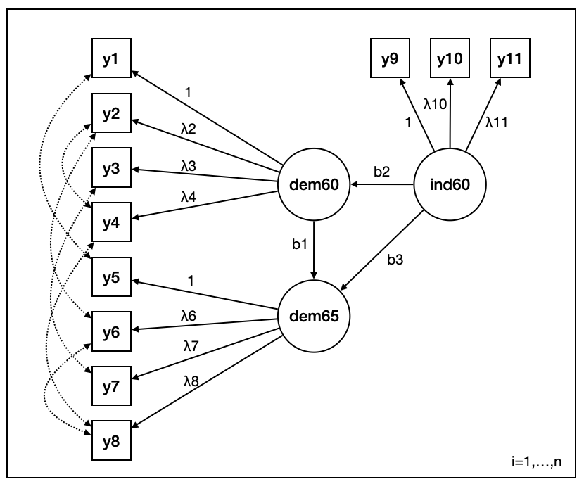

<!-- README.md is generated from README.Rmd. Please edit that file -->

```{r, include = FALSE}
knitr::opts_chunk$set(
  collapse = TRUE,
  comment = "#>",
  fig.path = "man/figures/README-",
  out.width = "100%"
)
library(INLAvaan)
library(lavaan)
library(tidyverse)
```

# `{INLAvaan}`

<!-- badges: start -->
[](https://lifecycle.r-lib.org/articles/stages.html#experimental)
<!-- badges: end -->

> Bayesian structural equation modelling with INLA.

Features to add (soon)

1. Dedicated `sem`, `efa`, `cfa` functions.
2. Model fit indices (xIC, RMSEA, etc.)
3. Ability to specify priors.
4. Ability to specify fixed parameter values. 
5. Specify different families for different observed variable. 
6. `{lavaan}` options such as `std.lv = TRUE` and `std.ov = TRUE` and the like. 

Experiments

- Scalability (large n/large p)

Long term plan (which require modifying the parser)

1. New kinds of latent variables, such as hidden Markov models. 
2. Multilevel-ish kind of models (2-3 levels). 
3. Add covariates 

## First impressions

The quintessential example of a structural equation model using Bollen's (1989) political democracy data.
This set includes data from 75 developing countries each assessed on four measures of democracy measured twice (1960 and 1965), and three measures of industrialization measured once (1960).
The following model is theorised.

```{r, echo = FALSE, out.width = "75%", fig.align = "center"}

```

<!--  -->

We can fit this in `{INLAvaan}` using the usual `{lavaan}` syntax as follows:

```{r}
myModel <- "
  # latent variables
  dem60 =~ y1 + y2 + y3 + y4
  dem65 =~ y5 + y6 + y7 + y8
  ind60 =~ x1 + x2 + x3

  # latent regressions
  dem60 ~ ind60
  dem65 ~ ind60 + dem60

  # residual covariances
  y1 ~~ y5
  y2 ~~ y4 + y6
  y3 ~~ y7
  y4 ~~ y8
  y6 ~~ y8
"

fit <- inlavaan(model = myModel, data = PoliticalDemocracy)
```

The parameter estimates can then be viewed using the summary method:

```{r}
summary(fit)
```
