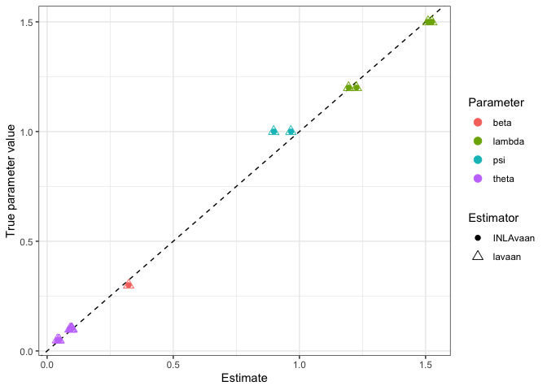

<!-- README.md is generated from README.Rmd. Please edit that file -->

# `{INLAvaan}`

<!-- badges: start -->

[](https://lifecycle.r-lib.org/articles/stages.html#experimental)
[](https://github.com/haziqj/INLAvaan/actions/workflows/R-CMD-check.yaml)
<!-- badges: end -->

> Bayesian structural equation modelling with INLA.

Soon-ish features

1.  Model fit indices (PPP, xIC, RMSEA, etc.)
2.  Prior specification.
3.  Fixed values and/or parameter constraints.
4.  Specify different families for different observed variable.
5.  Standardised coefficients.

Long term plan

1.  “non-iid” models, such as spatio-temporal models.
2.  Multilevel-ish kind of models (2-3 levels).
3.  Covariates.
4.  Multiple groups (yes, should be easy–but I’m lazy)

## First impressions

A simple two-factor SEM with six observed, correlated Gaussian
variables. Let $i=1,\dots,n$ index the subjects. Conditional on the
values of $k$th latent variable $\eta_{ki}$ for subject $i$, the six
measurement model equations are $$
\begin{gathered}
y_{1i} = \lambda_{11} \eta_{1i} \phantom{+ \lambda_{1} \eta_{2i}} + \epsilon_{1i}, \quad \epsilon_{1i} \sim N(0, \theta_{11}) \\
y_{2i} = \lambda_{21} \eta_{1i} \phantom{+ \lambda_{1} \eta_{2i}} + \epsilon_{2i}, \quad \epsilon_{2i} \sim N(0, \theta_{22}) \\
y_{3i} = \lambda_{31} \eta_{1i} \phantom{+ \lambda_{1} \eta_{2i}}  + \epsilon_{3i}, \quad \epsilon_{3i} \sim N(0, \theta_{33}) \\
y_{4i} = \phantom{\lambda_{11} \eta_{2i} +}  \lambda_{42} \eta_{2i} + \epsilon_{4i}, \quad \epsilon_{4i} \sim N(0, \theta_{44}) \\
y_{5i} = \phantom{\lambda_{11} \eta_{2i} +} \lambda_{52} \eta_{2i} + \epsilon_{5i}, \quad \epsilon_{5i} \sim N(0, \theta_{55}) \\
y_{6i} = \phantom{\lambda_{11} \eta_{2i} +} \lambda_{62} \eta_{2i} + \epsilon_{6i}, \quad \epsilon_{6i} \sim N(0, \theta_{66}) \\
\\
\operatorname{Cov}(\epsilon_{1i},\epsilon_{4i}) = \theta_{14} \\
\operatorname{Cov}(\epsilon_{2i},\epsilon_{5i}) = \theta_{25} \\
\operatorname{Cov}(\epsilon_{3i},\epsilon_{6i}) = \theta_{36} \\
\end{gathered}
$$

For identifiability, we set $\lambda_{11} = \lambda_{42} = 1$. The
structural part of the model are given by these equations: $$
\begin{gathered}
\eta_{1i} = \phantom{b\eta_{1i} +} \zeta_{1i}, \quad \zeta_{1i} \sim N(0, \psi_1) \\
\eta_{2i} = b\eta_{1i} + \zeta_{2i}, \quad \zeta_{2i} \sim N(0, \psi_2)
\end{gathered}
$$ Graphically, we can plot the following path diagram.


``` r
# {lavaan} textual model
mod <- "
  # Measurement model
  eta1 =~ y1 + y2 + y3
  eta2 =~ y4 + y5 + y6
  
  # Factor regression
  eta2 ~ eta1
  
  # Covariances
  y1 ~~ y4
  y2 ~~ y5
  y3 ~~ y6
"

# Data set
head(dat)
#>           y1         y2         y3           y4         y5         y6
#> 1 -0.6771018 -1.3108134 -0.9875201  0.522942715  0.4915199  1.2263578
#> 2 -0.3559992 -0.2015365  0.2699319  0.256713403  0.4474845  0.8960215
#> 3 -0.8150388 -0.8481679 -0.7874079 -1.391455989 -1.4111178 -1.7636925
#> 4  0.8414354  0.6107719  0.1485239  1.459696672  1.3686848  1.3729406
#> 5 -1.0031562 -1.0406267 -1.8892887 -0.001868695  0.5119621  0.3589420
#> 6  0.9342378  0.8599521  1.2570094  0.479322937  0.2044048  0.3461283
```

To fit this model using `{INLAvaan}`, use the familiar `{lavaan}`
syntax. The `i` in `isem` stands for `INLA` (following the convention of
`bsem` for `{blavaan}`).

``` r
library(INLAvaan)
fit <- isem(model = mod, data = dat)
summary(fit)
```

    #> INLAvaan 0.1.0.9003 ended normally after 23 seconds
    #> 
    #>   Estimator                                      BAYES
    #>   Optimization method                             INLA
    #>   Number of model parameters                        16
    #> 
    #>   Number of observations                          1000
    #> 
    #>   Statistic                                 MargLogLik         PPP
    #>   Value                                      -5152.616          NA
    #> 
    #> Parameter Estimates:
    #> 
    #> 
    #> Latent Variables:
    #>                    Estimate  Post.SD pi.lower pi.upper    Prior       
    #>   eta1 =~                                                             
    #>     y1                1.000                                           
    #>     y2                1.195    0.015    1.166    1.224    normal(0,10)
    #>     y3                1.510    0.017    1.476    1.543    normal(0,10)
    #>   eta2 =~                                                             
    #>     y4                1.000                                           
    #>     y5                1.226    0.014    1.199    1.253    normal(0,10)
    #>     y6                1.525    0.016    1.493    1.556    normal(0,10)
    #> 
    #> Regressions:
    #>                    Estimate  Post.SD pi.lower pi.upper    Prior       
    #>   eta2 ~                                                              
    #>     eta1              0.323    0.034    0.256    0.388    normal(0,10)
    #> 
    #> Covariances:
    #>                    Estimate  Post.SD pi.lower pi.upper    Prior       
    #>  .y1 ~~                                                               
    #>    .y4                0.047    0.004    0.040    0.053       beta(1,1)
    #>  .y2 ~~                                                               
    #>    .y5                0.048    0.005    0.039    0.055       beta(1,1)
    #>  .y3 ~~                                                               
    #>    .y6                0.041    0.005    0.030    0.050       beta(1,1)
    #> 
    #> Variances:
    #>                    Estimate  Post.SD pi.lower pi.upper    Prior       
    #>    .y1                0.094    0.006    0.083    0.105 gamma(1,.5)[sd]
    #>    .y2                0.096    0.006    0.086    0.108 gamma(1,.5)[sd]
    #>    .y3                0.089    0.008    0.072    0.104 gamma(1,.5)[sd]
    #>    .y4                0.095    0.006    0.084    0.108 gamma(1,.5)[sd]
    #>    .y5                0.095    0.007    0.084    0.110 gamma(1,.5)[sd]
    #>    .y6                0.092    0.009    0.076    0.106 gamma(1,.5)[sd]
    #>     eta1              0.899    0.043    0.816    0.987 gamma(1,.5)[sd]
    #>    .eta2              0.967    0.046    0.879    1.060 gamma(1,.5)[sd]

Compare model fit to `{lavaan}`:


