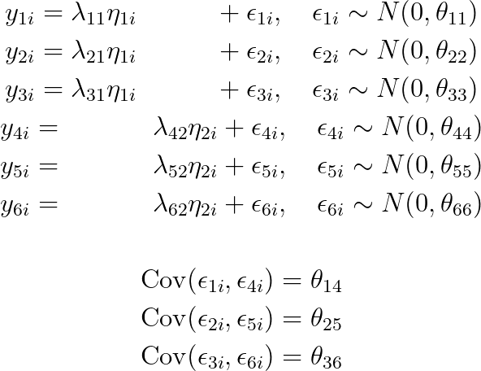
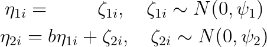
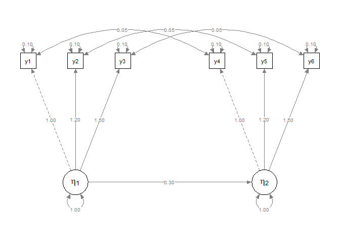
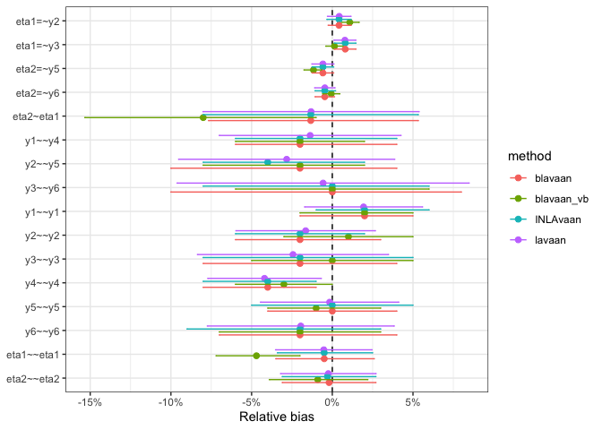

<!-- README.md is generated from README.Rmd. Please edit that file -->

## `{INLAvaan}`

<!-- badges: start -->

[](https://lifecycle.r-lib.org/articles/stages.html#experimental)
[](https://github.com/haziqj/INLAvaan/actions/workflows/R-CMD-check.yaml)
<!-- badges: end -->

> Bayesian structural equation modelling with INLA.

**Soon-ish features**

1.  Model fit indices (PPP, xIC, RMSEA, etc.)
2.  Prior specification.
3.  Fixed values and/or parameter constraints.
4.  Specify different families for different observed variable.
5.  Standardised coefficients.

**Long term plan**

1.  “Non-iid” models, such as spatio-temporal models.
2.  Multilevel-ish kind of models (2-3 levels).
3.  Covariates.
4.  Multiple groups (yes, should be easy–but I’m lazy)

## First impressions

A simple two-factor SEM with six observed, correlated Gaussian
variables. Let $i=1,\dots,n$ index the subjects. Conditional on the
values of $k$th latent variable $\eta_{ki}$ for subject $i$, the six
measurement model equations are

<br>
<p align="center">

</p>

<br> <!-- $$ --> <!-- \begin{gathered} -->
<!-- y_{1i} = \lambda_{11} \eta_{1i} \phantom{+ \lambda_{1} \eta_{2i}} + \epsilon_{1i}, \quad \epsilon_{1i} \sim N(0, \theta_{11}) \\ -->
<!-- y_{2i} = \lambda_{21} \eta_{1i} \phantom{+ \lambda_{1} \eta_{2i}} + \epsilon_{2i}, \quad \epsilon_{2i} \sim N(0, \theta_{22}) \\ -->
<!-- y_{3i} = \lambda_{31} \eta_{1i} \phantom{+ \lambda_{1} \eta_{2i}}  + \epsilon_{3i}, \quad \epsilon_{3i} \sim N(0, \theta_{33}) \\ -->
<!-- y_{4i} = \phantom{\lambda_{11} \eta_{2i} +}  \lambda_{42} \eta_{2i} + \epsilon_{4i}, \quad \epsilon_{4i} \sim N(0, \theta_{44}) \\ -->
<!-- y_{5i} = \phantom{\lambda_{11} \eta_{2i} +} \lambda_{52} \eta_{2i} + \epsilon_{5i}, \quad \epsilon_{5i} \sim N(0, \theta_{55}) \\ -->
<!-- y_{6i} = \phantom{\lambda_{11} \eta_{2i} +} \lambda_{62} \eta_{2i} + \epsilon_{6i}, \quad \epsilon_{6i} \sim N(0, \theta_{66}) \\ -->
<!-- \\ -->
<!-- \operatorname{Cov}(\epsilon_{1i},\epsilon_{4i}) = \theta_{14} \\ -->
<!-- \operatorname{Cov}(\epsilon_{2i},\epsilon_{5i}) = \theta_{25} \\ -->
<!-- \operatorname{Cov}(\epsilon_{3i},\epsilon_{6i}) = \theta_{36} \\ -->
<!-- \end{gathered} --> <!-- $$ -->

For identifiability, we set $\lambda_{11} = \lambda_{42} = 1$. The
structural part of the model are given by these equations:

<br>
<p align="center">

</p>

<br> <!-- $$ --> <!-- \begin{gathered} -->
<!-- \eta_{1i} = \phantom{b\eta_{1i} +} \zeta_{1i}, \quad \zeta_{1i} \sim N(0, \psi_1) \\ -->
<!-- \eta_{2i} = b\eta_{1i} + \zeta_{2i}, \quad \zeta_{2i} \sim N(0, \psi_2) -->
<!-- \end{gathered} --> <!-- $$ -->

Graphically, we can plot the following path diagram.



``` r
# {lavaan} textual model
mod <- "
  # Measurement model
  eta1 =~ y1 + y2 + y3
  eta2 =~ y4 + y5 + y6
  
  # Factor regression
  eta2 ~ eta1
  
  # Covariances
  y1 ~~ y4
  y2 ~~ y5
  y3 ~~ y6
"

# Data set
head(dat)
#>            y1          y2          y3          y4         y5          y6
#> 1 -0.78816847 -1.04766895 -1.31757241  2.47251897  2.5468111  3.55588539
#> 2  0.47235001  0.54766115  1.12077035 -0.62465473 -0.1370326 -0.60225679
#> 3  1.31160880  0.76570810  1.70572244 -0.05737735 -1.0706328 -0.85537459
#> 4  0.12135898  0.07167484  0.34341044  0.59949481  0.6504923  0.99522666
#> 5  0.05048414  0.27923558 -0.06536011  0.59133463 -0.2286695  0.04490988
#> 6  1.21238470  1.95439029  1.71687488  1.08895400  1.6013644  1.87918645
```

To fit this model using `{INLAvaan}`, use the familiar `{lavaan}`
syntax. The `i` in `isem` stands for `INLA` (following the convention of
`bsem` for `{blavaan}`).

``` r
library(INLAvaan)
fit <- isem(model = mod, data = dat)
summary(fit)
```

    #> INLAvaan 0.1.0.9005 ended normally after 16 seconds
    #> 
    #>   Estimator                                      BAYES
    #>   Optimization method                             INLA
    #>   Number of model parameters                        16
    #> 
    #>   Number of observations                          1000
    #> 
    #>   Statistic                                 MargLogLik         PPP
    #>   Value                                      -5265.531          NA
    #> 
    #> Parameter Estimates:
    #> 
    #> 
    #> Latent Variables:
    #>                    Estimate  Post.SD pi.lower pi.upper    Prior       
    #>   eta1 =~                                                             
    #>     y1                1.000                                           
    #>     y2                1.193    0.013    1.167    1.220    normal(0,10)
    #>     y3                1.494    0.016    1.464    1.525    normal(0,10)
    #>   eta2 =~                                                             
    #>     y4                1.000                                           
    #>     y5                1.186    0.014    1.159    1.213    normal(0,10)
    #>     y6                1.505    0.015    1.475    1.536    normal(0,10)
    #> 
    #> Regressions:
    #>                    Estimate  Post.SD pi.lower pi.upper    Prior       
    #>   eta2 ~                                                              
    #>     eta1              0.269    0.031    0.207    0.330    normal(0,10)
    #> 
    #> Covariances:
    #>                    Estimate  Post.SD pi.lower pi.upper    Prior       
    #>  .y1 ~~                                                               
    #>    .y4                0.044    0.004    0.036    0.052       beta(1,1)
    #>  .y2 ~~                                                               
    #>    .y5                0.052    0.005    0.044    0.062       beta(1,1)
    #>  .y3 ~~                                                               
    #>    .y6                0.046    0.006    0.036    0.056       beta(1,1)
    #> 
    #> Variances:
    #>                    Estimate  Post.SD pi.lower pi.upper    Prior       
    #>    .y1                0.095    0.006    0.086    0.108 gamma(1,.5)[sd]
    #>    .y2                0.102    0.006    0.090    0.112 gamma(1,.5)[sd]
    #>    .y3                0.098    0.009    0.081    0.116 gamma(1,.5)[sd]
    #>    .y4                0.101    0.005    0.091    0.110 gamma(1,.5)[sd]
    #>    .y5                0.105    0.007    0.092    0.120 gamma(1,.5)[sd]
    #>    .y6                0.082    0.010    0.065    0.103 gamma(1,.5)[sd]
    #>     eta1              1.075    0.051    0.977    1.179 gamma(1,.5)[sd]
    #>    .eta2              1.018    0.049    0.926    1.117 gamma(1,.5)[sd]

Compare model fit to `{lavaan}` and `{blavaan}` (MCMC sampling using
Stan 500 burnin and 1000 samples, as well as variational Bayes):



    #> Timing
    #>   INLAvaan     lavaan    blavaan blavaan_vb 
    #>     16.607      0.028      3.715      6.235

## Outro

``` r
sessioninfo::session_info()
#> ─ Session info ───────────────────────────────────────────────────────────────
#>  setting  value
#>  version  R version 4.3.1 (2023-06-16)
#>  os       macOS Sonoma 14.4.1
#>  system   aarch64, darwin20
#>  ui       X11
#>  language (EN)
#>  collate  en_US.UTF-8
#>  ctype    en_US.UTF-8
#>  tz       Asia/Riyadh
#>  date     2024-05-27
#>  pandoc   3.2 @ /opt/homebrew/bin/ (via rmarkdown)
#> 
#> ─ Packages ───────────────────────────────────────────────────────────────────
#>  package      * version    date (UTC) lib source
#>  abind          1.4-5      2016-07-21 [1] CRAN (R 4.3.0)
#>  arm            1.13-1     2022-08-28 [1] CRAN (R 4.3.0)
#>  backports      1.4.1      2021-12-13 [1] CRAN (R 4.3.0)
#>  base64enc      0.1-3      2015-07-28 [1] CRAN (R 4.3.0)
#>  bayesplot      1.10.0     2022-11-16 [1] CRAN (R 4.3.0)
#>  blavaan      * 0.5-2      2023-09-25 [1] CRAN (R 4.3.1)
#>  boot           1.3-28.1   2022-11-22 [1] CRAN (R 4.3.1)
#>  callr          3.7.3      2022-11-02 [1] CRAN (R 4.3.0)
#>  carData        3.0-5      2022-01-06 [1] CRAN (R 4.3.0)
#>  checkmate      2.2.0      2023-04-27 [1] CRAN (R 4.3.0)
#>  class          7.3-22     2023-05-03 [1] CRAN (R 4.3.1)
#>  classInt       0.4-10     2023-09-05 [1] CRAN (R 4.3.0)
#>  cli            3.6.1      2023-03-23 [1] CRAN (R 4.3.0)
#>  clue           0.3-65     2023-09-23 [1] CRAN (R 4.3.1)
#>  cluster        2.1.4      2022-08-22 [1] CRAN (R 4.3.1)
#>  coda           0.19-4     2020-09-30 [1] CRAN (R 4.3.0)
#>  codetools      0.2-19     2023-02-01 [1] CRAN (R 4.3.1)
#>  colorspace     2.1-0      2023-01-23 [1] CRAN (R 4.3.0)
#>  CompQuadForm   1.4.3      2017-04-12 [1] CRAN (R 4.3.0)
#>  corpcor        1.6.10     2021-09-16 [1] CRAN (R 4.3.0)
#>  crayon         1.5.2      2022-09-29 [1] CRAN (R 4.3.0)
#>  data.table     1.15.2     2024-02-29 [1] CRAN (R 4.3.1)
#>  DBI            1.2.2      2024-02-16 [1] CRAN (R 4.3.1)
#>  digest         0.6.33     2023-07-07 [1] CRAN (R 4.3.0)
#>  dplyr        * 1.1.3      2023-09-03 [1] CRAN (R 4.3.0)
#>  e1071          1.7-14     2023-12-06 [1] CRAN (R 4.3.1)
#>  evaluate       0.22       2023-09-29 [1] CRAN (R 4.3.1)
#>  fansi          1.0.4      2023-01-22 [1] CRAN (R 4.3.0)
#>  fastmap        1.1.1      2023-02-24 [1] CRAN (R 4.3.0)
#>  fBasics        4022.94    2023-03-04 [1] CRAN (R 4.3.0)
#>  fdrtool        1.2.17     2021-11-13 [1] CRAN (R 4.3.0)
#>  fmesher        0.1.4      2023-10-28 [1] CRAN (R 4.3.1)
#>  forcats      * 1.0.0      2023-01-29 [1] CRAN (R 4.3.0)
#>  foreign        0.8-85     2023-09-09 [1] CRAN (R 4.3.0)
#>  Formula        1.2-5      2023-02-24 [1] CRAN (R 4.3.0)
#>  future         1.33.0     2023-07-01 [1] CRAN (R 4.3.0)
#>  future.apply   1.11.0     2023-05-21 [1] CRAN (R 4.3.0)
#>  generics       0.1.3      2022-07-05 [1] CRAN (R 4.3.0)
#>  ggplot2      * 3.4.3      2023-08-14 [1] CRAN (R 4.3.0)
#>  glasso         1.11       2019-10-01 [1] CRAN (R 4.3.0)
#>  globals        0.16.2     2022-11-21 [1] CRAN (R 4.3.0)
#>  glue           1.6.2      2022-02-24 [1] CRAN (R 4.3.0)
#>  gridExtra      2.3        2017-09-09 [1] CRAN (R 4.3.0)
#>  gt             0.9.0      2023-03-31 [1] CRAN (R 4.3.0)
#>  gtable         0.3.4      2023-08-21 [1] CRAN (R 4.3.0)
#>  gtools         3.9.4      2022-11-27 [1] CRAN (R 4.3.0)
#>  Hmisc          5.1-1      2023-09-12 [1] CRAN (R 4.3.0)
#>  hms            1.1.3      2023-03-21 [1] CRAN (R 4.3.0)
#>  htmlTable      2.4.1      2022-07-07 [1] CRAN (R 4.3.0)
#>  htmltools      0.5.6      2023-08-10 [1] CRAN (R 4.3.0)
#>  htmlwidgets    1.6.2      2023-03-17 [1] CRAN (R 4.3.0)
#>  igraph         1.5.1      2023-08-10 [1] CRAN (R 4.3.0)
#>  INLA           24.05.01-1 2024-05-01 [1] local
#>  INLAvaan     * 0.1.0.9005 2024-05-27 [1] local
#>  inline         0.3.19     2021-05-31 [1] CRAN (R 4.3.0)
#>  jpeg           0.1-10     2022-11-29 [1] CRAN (R 4.3.0)
#>  jsonlite       1.8.7      2023-06-29 [1] CRAN (R 4.3.0)
#>  KernSmooth     2.23-22    2023-07-10 [1] CRAN (R 4.3.0)
#>  knitr          1.44       2023-09-11 [1] CRAN (R 4.3.0)
#>  kutils         1.73       2023-09-17 [1] CRAN (R 4.3.1)
#>  lattice        0.21-9     2023-10-01 [1] CRAN (R 4.3.1)
#>  lavaan       * 0.6-17     2023-12-20 [1] CRAN (R 4.3.1)
#>  lifecycle      1.0.3      2022-10-07 [1] CRAN (R 4.3.0)
#>  lisrelToR      0.1.5      2022-05-09 [1] CRAN (R 4.3.0)
#>  listenv        0.9.0      2022-12-16 [1] CRAN (R 4.3.0)
#>  lme4           1.1-34     2023-07-04 [1] CRAN (R 4.3.0)
#>  loo            2.6.0      2023-03-31 [1] CRAN (R 4.3.0)
#>  lubridate    * 1.9.3      2023-09-27 [1] CRAN (R 4.3.1)
#>  magrittr       2.0.3      2022-03-30 [1] CRAN (R 4.3.0)
#>  MASS           7.3-60     2023-05-04 [1] CRAN (R 4.3.1)
#>  Matrix         1.6-1.1    2023-09-18 [1] CRAN (R 4.3.1)
#>  matrixStats    1.0.0      2023-06-02 [1] CRAN (R 4.3.0)
#>  mi             1.1        2022-06-06 [1] CRAN (R 4.3.0)
#>  minqa          1.2.6      2023-09-11 [1] CRAN (R 4.3.0)
#>  mnormt         2.1.1      2022-09-26 [1] CRAN (R 4.3.0)
#>  modeest        2.4.0      2019-11-18 [1] CRAN (R 4.3.0)
#>  munsell        0.5.0      2018-06-12 [1] CRAN (R 4.3.0)
#>  mvtnorm        1.2-3      2023-08-25 [1] CRAN (R 4.3.0)
#>  nlme           3.1-163    2023-08-09 [1] CRAN (R 4.3.0)
#>  nloptr         2.0.3      2022-05-26 [1] CRAN (R 4.3.0)
#>  nnet           7.3-19     2023-05-03 [1] CRAN (R 4.3.1)
#>  nonnest2       0.5-6      2023-08-13 [1] CRAN (R 4.3.0)
#>  OpenMx         2.21.8     2023-04-05 [1] CRAN (R 4.3.0)
#>  openxlsx       4.2.5.2    2023-02-06 [1] CRAN (R 4.3.0)
#>  parallelly     1.36.0     2023-05-26 [1] CRAN (R 4.3.0)
#>  pbapply        1.7-2      2023-06-27 [1] CRAN (R 4.3.0)
#>  pbivnorm       0.6.0      2015-01-23 [1] CRAN (R 4.3.0)
#>  pillar         1.9.0      2023-03-22 [1] CRAN (R 4.3.0)
#>  pkgbuild       1.4.2      2023-06-26 [1] CRAN (R 4.3.0)
#>  pkgconfig      2.0.3      2019-09-22 [1] CRAN (R 4.3.0)
#>  plyr           1.8.9      2023-10-02 [1] CRAN (R 4.3.1)
#>  png            0.1-8      2022-11-29 [1] CRAN (R 4.3.0)
#>  prettyunits    1.2.0      2023-09-24 [1] CRAN (R 4.3.1)
#>  processx       3.8.2      2023-06-30 [1] CRAN (R 4.3.0)
#>  proxy          0.4-27     2022-06-09 [1] CRAN (R 4.3.0)
#>  ps             1.7.5      2023-04-18 [1] CRAN (R 4.3.0)
#>  psych          2.3.9      2023-09-26 [1] CRAN (R 4.3.1)
#>  purrr        * 1.0.2      2023-08-10 [1] CRAN (R 4.3.0)
#>  qgraph         1.9.5      2023-05-16 [1] CRAN (R 4.3.0)
#>  quadprog       1.5-8      2019-11-20 [1] CRAN (R 4.3.0)
#>  QuickJSR       1.0.6      2023-09-12 [1] CRAN (R 4.3.0)
#>  R6             2.5.1      2021-08-19 [1] CRAN (R 4.3.0)
#>  Rcpp         * 1.0.12     2024-01-09 [1] CRAN (R 4.3.1)
#>  RcppParallel   5.1.7      2023-02-27 [1] CRAN (R 4.3.0)
#>  readr        * 2.1.4      2023-02-10 [1] CRAN (R 4.3.0)
#>  reshape2       1.4.4      2020-04-09 [1] CRAN (R 4.3.0)
#>  rlang          1.1.1      2023-04-28 [1] CRAN (R 4.3.0)
#>  rmarkdown      2.25       2023-09-18 [1] CRAN (R 4.3.1)
#>  rmutil         1.1.10     2022-10-27 [1] CRAN (R 4.3.0)
#>  rockchalk      1.8.157    2022-08-06 [1] CRAN (R 4.3.0)
#>  rpart          4.1.19     2022-10-21 [1] CRAN (R 4.3.1)
#>  rstan          2.26.23    2023-09-08 [1] CRAN (R 4.3.0)
#>  rstantools     2.3.1.1    2023-07-18 [1] CRAN (R 4.3.0)
#>  rstudioapi     0.15.0     2023-07-07 [1] CRAN (R 4.3.0)
#>  sandwich       3.0-2      2022-06-15 [1] CRAN (R 4.3.0)
#>  scales         1.2.1      2022-08-20 [1] CRAN (R 4.3.0)
#>  sem            3.1-15     2022-04-10 [1] CRAN (R 4.3.0)
#>  semPlot      * 1.1.6      2022-08-10 [1] CRAN (R 4.3.0)
#>  semptools    * 0.2.10     2023-10-15 [1] CRAN (R 4.3.1)
#>  sessioninfo    1.2.2      2021-12-06 [1] CRAN (R 4.3.0)
#>  sf             1.0-15     2023-12-18 [1] CRAN (R 4.3.1)
#>  sp             2.1-0      2023-10-02 [1] CRAN (R 4.3.1)
#>  spatial        7.3-17     2023-07-20 [1] CRAN (R 4.3.0)
#>  stable         1.1.6      2022-03-02 [1] CRAN (R 4.3.0)
#>  stabledist     0.7-1      2016-09-12 [1] CRAN (R 4.3.0)
#>  StanHeaders    2.26.28    2023-09-07 [1] CRAN (R 4.3.0)
#>  statip         0.2.3      2019-11-17 [1] CRAN (R 4.3.0)
#>  stringi        1.7.12     2023-01-11 [1] CRAN (R 4.3.0)
#>  stringr      * 1.5.0      2022-12-02 [1] CRAN (R 4.3.0)
#>  tibble       * 3.2.1      2023-03-20 [1] CRAN (R 4.3.0)
#>  tidyr        * 1.3.0      2023-01-24 [1] CRAN (R 4.3.0)
#>  tidyselect     1.2.0      2022-10-10 [1] CRAN (R 4.3.0)
#>  tidyverse    * 2.0.0      2023-02-22 [1] CRAN (R 4.3.0)
#>  timechange     0.2.0      2023-01-11 [1] CRAN (R 4.3.0)
#>  timeDate       4022.108   2023-01-07 [1] CRAN (R 4.3.0)
#>  timeSeries     4031.107   2023-08-26 [1] CRAN (R 4.3.0)
#>  tmvnsim        1.0-2      2016-12-15 [1] CRAN (R 4.3.0)
#>  tzdb           0.4.0      2023-05-12 [1] CRAN (R 4.3.0)
#>  units          0.8-5      2023-11-28 [1] CRAN (R 4.3.1)
#>  utf8           1.2.3      2023-01-31 [1] CRAN (R 4.3.0)
#>  vctrs          0.6.3      2023-06-14 [1] CRAN (R 4.3.0)
#>  withr          2.5.1      2023-09-26 [1] CRAN (R 4.3.1)
#>  xfun           0.40       2023-08-09 [1] CRAN (R 4.3.0)
#>  XML            3.99-0.14  2023-03-19 [1] CRAN (R 4.3.0)
#>  xml2           1.3.5      2023-07-06 [1] CRAN (R 4.3.0)
#>  xtable         1.8-4      2019-04-21 [1] CRAN (R 4.3.0)
#>  yaml           2.3.7      2023-01-23 [1] CRAN (R 4.3.0)
#>  zip            2.3.0      2023-04-17 [1] CRAN (R 4.3.0)
#>  zoo            1.8-12     2023-04-13 [1] CRAN (R 4.3.0)
#> 
#>  [1] /Library/Frameworks/R.framework/Versions/4.3-arm64/Resources/library
#> 
#> ──────────────────────────────────────────────────────────────────────────────
```
