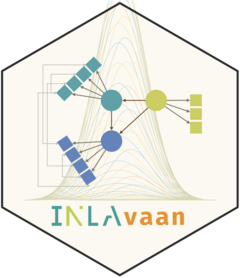
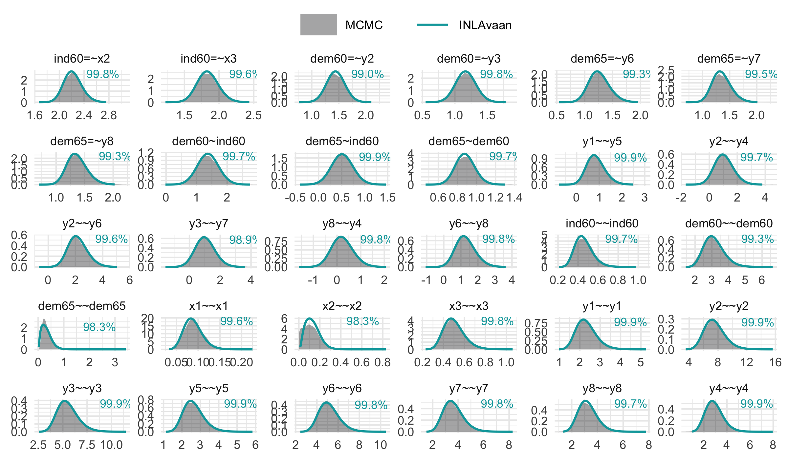

<!-- README.md is generated from README.Rmd. Please edit that file -->

# INLAvaan <a href="https://inlavaan.haziqj.ml"></a>

<!-- badges: start -->

[](https://lifecycle.r-lib.org/articles/stages.html#experimental)
[](https://github.com/haziqj/INLAvaan/actions/workflows/R-CMD-check.yaml)
[](https://app.codecov.io/gh/haziqj/INLAvaan?branch=main)
<!-- badges: end -->

> Efficient approximate Bayesian inference for Structural Equation
> Models.

While Markov Chain Monte Carlo (MCMC) methods remain the gold standard
for exact Bayesian inference, they can be prohibitively slow for
iterative model development. `{INLAvaan}` offers a rapid alternative for
<u>**la**</u>tent <u>**va**</u>riable <u>**an**</u>alysis, delivering
Bayesian results at (or near) the speed of frequentist estimators. It
achieves this through a custom, ground-up implementation of the
[Integrated Nested Laplace Approximation
(INLA)](https://www.r-inla.org), engineered specifically for the
[lavaan](https://lavaan.org) modelling framework.

## A Familiar Interface

`{INLAvaan}` is designed to fit seamlessly into your existing workflow.
If you are familiar with the (b)lavaan syntax, you can begin using
`{INLAvaan}` immediately.

As a first impression of the package, consider the canonical example of
SEM applied to the Industrialisation and Political Democracy data set of
Bollen (1989)[^1]:

``` r
model <- "
  # Latent variable definitions
     ind60 =~ x1 + x2 + x3
     dem60 =~ y1 + y2 + y3 + y4
     dem65 =~ y5 + y6 + y7 + y8

  # (Latent) regressions
    dem60 ~ ind60
    dem65 ~ ind60 + dem60

  # Residual correlations
    y1 ~~ y5
    y2 ~~ y4 + y6
    y3 ~~ y7
    y4 ~~ y8
    y6 ~~ y8
  
  # Custom priors on latent variances
    ind60 ~~ prior('gamma(1, 1)')*ind60
    dem60 ~~ prior('gamma(1,.9)')*dem60
    dem65 ~~ prior('gamma(1,.5)')*dem65
"
utils::data("PoliticalDemocracy", package = "lavaan")

fit <- asem(model, PoliticalDemocracy)
#> ℹ Using MVN log-likelihood.
#> ℹ Finding posterior mode.
#> ✔ Finding posterior mode. [111ms]
#> 
#> ℹ Computing the Hessian.
#> ✔ Computing the Hessian. [299ms]
#> 
#> ℹ Using skew normal approximation.
#> ⠙ Fitting skew normal to 0/31 marginals.
#> ⠹ Fitting skew normal to 1/31 marginals.
#> ⠸ Fitting skew normal to 4/31 marginals.
#> ⠼ Fitting skew normal to 8/31 marginals.
#> ⠴ Fitting skew normal to 11/31 marginals.
#> ⠦ Fitting skew normal to 15/31 marginals.
#> ⠧ Fitting skew normal to 17/31 marginals.
#> ⠇ Fitting skew normal to 21/31 marginals.
#> ⠏ Fitting skew normal to 24/31 marginals.
#> ⠋ Fitting skew normal to 27/31 marginals.
#> ⠙ Fitting skew normal to 29/31 marginals.
#> ✔ Fitting skew normal to 31/31 marginals. [2.1s]
#> 
#> ℹ Sampling posterior covariances.
#> ✔ Sampling posterior covariances. [136ms]
#> 
#> ⠙ Computing ppp and DIC.
#> ⠹ Computing ppp and DIC.
#> ⠸ Computing ppp and DIC.
#> ✔ Computing ppp and DIC. [1.1s]
#> 

summary(fit)
#> INLAvaan 0.2.0 ended normally after 77 iterations
#> 
#>   Estimator                                      BAYES
#>   Optimization method                           NLMINB
#>   Number of model parameters                        31
#> 
#>   Number of observations                            75
#> 
#> Model Test (User Model):
#> 
#>    Marginal log-likelihood                   -1641.277 
#>    PPP (Chi-square)                              0.496 
#> 
#> Information Criteria:
#> 
#>    Deviance (DIC)                             3158.453 
#>    Effective parameters (pD)                    31.083 
#> 
#> Parameter Estimates:
#> 
#>    Marginalisation method                     SKEWNORM
#> 
#> Latent Variables:
#>                    Estimate       SD     2.5%    97.5%    Prior       
#>   ind60 =~                                                            
#>     x1                1.000                                           
#>     x2                2.214    0.145    1.946    2.516    normal(0,10)
#>     x3                1.811    0.152    1.515    2.110    normal(0,10)
#>   dem60 =~                                                            
#>     y1                1.000                                           
#>     y2                1.355    0.206    0.975    1.784    normal(0,10)
#>     y3                1.113    0.156    0.816    1.430    normal(0,10)
#>     y4                1.348    0.163    1.039    1.681    normal(0,10)
#>   dem65 =~                                                            
#>     y5                1.000                                           
#>     y6                1.215    0.179    0.888    1.591    normal(0,10)
#>     y7                1.304    0.164    0.998    1.641    normal(0,10)
#>     y8                1.287    0.165    0.971    1.617    normal(0,10)
#> 
#> Regressions:
#>                    Estimate       SD     2.5%    97.5%    Prior       
#>   dem60 ~                                                             
#>     ind60             1.447    0.378    0.706    2.189    normal(0,10)
#>   dem65 ~                                                             
#>     ind60             0.553    0.241    0.076    1.022    normal(0,10)
#>     dem60             0.860    0.103    0.662    1.066    normal(0,10)
#> 
#> Covariances:
#>                    Estimate       SD     2.5%    97.5%    Prior       
#>  .y1 ~~                                                               
#>    .y5                0.297    0.364    0.033    1.457       beta(1,1)
#>  .y2 ~~                                                               
#>    .y4                0.246    0.718    0.037    2.849       beta(1,1)
#>    .y6                0.340    0.699    0.826    3.569       beta(1,1)
#>  .y3 ~~                                                               
#>    .y7                0.210    0.617   -0.257    2.165       beta(1,1)
#>  .y4 ~~                                                               
#>    .y8                0.103    0.442   -0.410    1.325       beta(1,1)
#>  .y6 ~~                                                               
#>    .y8                0.306    0.565    0.304    2.522       beta(1,1)
#> 
#> Variances:
#>                    Estimate       SD     2.5%    97.5%    Prior       
#>     ind60             0.472    0.094    0.320    0.687      gamma(1,1)
#>    .dem60             3.608    0.830    2.268    5.501     gamma(1,.9)
#>    .dem65             0.354    0.207    0.074    0.859     gamma(1,.5)
#>    .x1                0.086    0.021    0.052    0.133 gamma(1,.5)[sd]
#>    .x2                0.138    0.072    0.037    0.311 gamma(1,.5)[sd]
#>    .x3                0.495    0.098    0.335    0.718 gamma(1,.5)[sd]
#>    .y1                2.082    0.518    1.250    3.266 gamma(1,.5)[sd]
#>    .y2                7.886    1.517    5.405   11.329 gamma(1,.5)[sd]
#>    .y3                5.350    1.059    3.620    7.754 gamma(1,.5)[sd]
#>    .y4                3.349    0.843    2.000    5.281 gamma(1,.5)[sd]
#>    .y5                2.519    0.542    1.640    3.754 gamma(1,.5)[sd]
#>    .y6                5.268    1.004    3.627    7.548 gamma(1,.5)[sd]
#>    .y7                3.611    0.789    2.328    5.403 gamma(1,.5)[sd]
#>    .y8                3.452    0.778    2.197    5.228 gamma(1,.5)[sd]
```

## Validation Against MCMC

Computation speed is valuable only when accuracy is preserved. Our
method yields posterior distributions that are visually and numerically
comparable to those obtained via MCMC (e.g., via `{blavaan}`/Stan), but
at a fraction of the computational cost.

The figure below illustrates the posterior density overlap for the
example above. The percentages refer to (one minus) the [Jensen-Shannon
divergence](https://en.wikipedia.org/wiki/Jensen–Shannon_divergence),
which gives a measure of similarity between two probability
distributions.

``` r
# install.packages("blavaan")
library(blavaan)
fit_blav <- bsem(model, PoliticalDemocracy)
res <- INLAvaan:::compare_mcmc(fit_blav, INLAvaan = fit)
print(res$p_compare)
```



## Installation

Install the development version of `{INLAvaan}` from GitHub using:

``` r
# install.packages("pak")
pak::pak("haziqj/INLAvaan")
```

*Optionally*[^2], you may wish to install
[INLA](https://www.r-inla.org). Following the official instructions
given [here](https://www.r-inla.org/download-install), install the
package by running this command in R:

``` r
install.packages(
  "INLA",
  repos = c(getOption("repos"), 
            INLA = "https://inla.r-inla-download.org/R/stable"), 
  dep = TRUE
)
```

<!-- ## Political democracy data -->

<!-- The quintessential example for SEM is this model from Bollen (1989) to fit a political democracy data set. -->

<!-- Eleven observed variables are hypothesized to arise from three latent variables. -->

<!-- This set includes data from 75 developing countries each assessed on four measures of democracy measured twice (1960 and 1965), and three measures of industrialization measured once (1960).  -->

<!-- The eleven observed variables are: -->

<!-- -   `y1`: Freedom of the press, 1960 -->

<!-- -   `y2`: Freedom of political opposition, 1960 -->

<!-- -   `y3`: Fairness of elections, 1960 -->

<!-- -   `y4`: Effectiveness of elected legislature, 1960 -->

<!-- -   `y5`: Freedom of the press, 1965 -->

<!-- -   `y6`: Freedom of political opposition, 1965 -->

<!-- -   `y7`: Fairness of elections, 1965 -->

<!-- -   `y8`: Effectiveness of elected legislature, 1965 -->

<!-- -   `y9`: GNP per capita, 1960 -->

<!-- -   `y10`: Energy consumption per capita, 1960 -->

<!-- -   `y11`: Percentage of labor force in industry, 1960 -->

<!-- Variables `y1-y4` and `y5-y8` are typically used as indicators of the latent trait of "political democracy" in 1960 and 1965 respectively, whereas `y9-y11` are used as indicators of industrialization (1960). -->

<!-- It is theorised that industrialisation influences political democracy, and that political democracy in 1960 influences political democracy in 1965. -->

<!-- Since the items measure the same latent trait at two time points, there is an assumption that the residuals of these items will be correlated with each other. -->

<!-- The model is depicted in the figure below. -->

<!-- ```{r} -->

<!-- #| echo: false -->

<!-- knitr::include_graphics("https://lavaan.ugent.be/figures/sem.png") -->

<!-- ``` -->

<!-- The corresponding model in `{lavaan}` syntax is: -->

<!-- ```{r} -->

<!-- mod <- " -->

<!--   # latent variables -->

<!--   dem60 =~ y1 + y2 + y3 + y4 -->

<!--   dem65 =~ y5 + y6 + y7 + y8 -->

<!--   ind60 =~ x1 + x2 + x3 -->

<!--   # latent regressions -->

<!--   dem60 ~ ind60 -->

<!--   dem65 ~ ind60 + dem60 -->

<!--   # residual covariances -->

<!--   y1 ~~ y5 -->

<!--   y2 ~~ y4 + y6 -->

<!--   y3 ~~ y7 -->

<!--   y4 ~~ y8 -->

<!--   y6 ~~ y8 -->

<!-- " -->

<!-- ``` -->

<!-- We will fit this model using `{INLAvaan}` and compare the results with `{blavaan}`. -->

<!-- ```{r} -->

<!-- #| label: poldemfit -->

<!-- #| include: false -->

<!-- #| cache: true -->

<!-- data("PoliticalDemocracy", package = "lavaan") -->

<!-- poldemfit <- insem(mod, PoliticalDemocracy, meanstructure = !TRUE, bcontrol = list(num.threads = 6)) -->

<!-- library(future) -->

<!-- plan("multisession") -->

<!-- poldemfit_blav <- bsem( -->

<!--   model = mod,  -->

<!--   data = PoliticalDemocracy, -->

<!--   # meanstructure = TRUE, -->

<!--   n.chains = 3, -->

<!--   bcontrol = list(cores = 3) -->

<!--   # burnin = 5000, -->

<!--   # sample = 10000 -->

<!-- ) -->

<!-- ``` -->

<!-- ```{r} -->

<!-- #| eval: false -->

<!-- data("PoliticalDemocracy", package = "lavaan") -->

<!-- poldemfit <- insem(model = mod, data = PoliticalDemocracy) -->

<!-- summary(poldemfit) -->

<!-- ``` -->

<!-- ```{r} -->

<!-- #| echo: false -->

<!-- summary(poldemfit) # -->

<!-- ``` -->

<!-- ```{r} -->

<!-- #| label: fig-poldem -->

<!-- #| echo: false -->

<!-- # -->

<!-- garb <- capture.output(tmp <- summary(poldemfit)) -->

<!-- PE_inla <- tibble( -->

<!--   est = as.numeric(tmp[, "Estimate"]), -->

<!--   ci.lower = as.numeric(tmp[, "pi.lower"]), -->

<!--   ci.upper = as.numeric(tmp[, "pi.upper"]) -->

<!-- ) |> -->

<!--   mutate(method = "INLAvaan") -->

<!-- garb <- capture.output(tmp <- summary(poldemfit_blav)) -->

<!-- PE_blav <- tibble( -->

<!--   est = as.numeric(tmp[, "Estimate"]), -->

<!--   ci.lower = as.numeric(tmp[, "pi.lower"]), -->

<!--   ci.upper = as.numeric(tmp[, "pi.upper"]) -->

<!-- ) |> -->

<!--   mutate(method = "blavaan") -->

<!-- bind_rows( -->

<!--   PE_inla, PE_blav -->

<!-- ) |> -->

<!--   mutate( -->

<!--     free = rep(partable(poldemfit)$free, 2), -->

<!--     pxnames = rep(partable(poldemfit)$pxnames, 2), -->

<!--     type = gsub("\\[[^]]*\\]", "", pxnames) -->

<!--   ) |> -->

<!--   drop_na() |> -->

<!--   mutate(names = factor(rep(names(coef(poldemfit)), 2), levels = rev(names(coef(fit))))) |> -->

<!--   pivot_wider( -->

<!--     names_from = method, -->

<!--     values_from = c(est, ci.lower, ci.upper) -->

<!--   ) |> -->

<!--   ggplot(aes(est_INLAvaan, est_blavaan, col = type)) + -->

<!--   geom_abline(slope = 1, intercept = 0, linetype = 2) + -->

<!--   geom_point(size = 3) + -->

<!--   geom_errorbar(aes(xmin = ci.lower_INLAvaan, xmax = ci.upper_INLAvaan), width = 0.1, alpha = 0.3) + -->

<!--   geom_errorbar(aes(ymin = ci.lower_blavaan, ymax = ci.upper_blavaan), width = 0.1, alpha = 0.3) + -->

<!--   theme_bw() + -->

<!--   labs( -->

<!--     x = "{INLAvaan} estimates", -->

<!--     y = "{blavaan} estimates", -->

<!--     col = "Parameter\ntype", -->

<!--     title = "Comparison of the estimates for the Political Democracy example", -->

<!--     caption = "MCMC conducted using Stan (3 parallel chains, 500 burnin, and 1500 samples)." -->

<!--   ) -->

<!-- cli::cli_h2("Compare timing (seconds)") -->

<!-- list(poldemfit, poldemfit_blav) |> -->

<!--   set_names(c("INLAvaan", "blavaan")) |> -->

<!--   purrr::map_dbl(\(x) x@timing$total)  -->

<!-- ``` -->

## Citation

To cite package `{INLAvaan}` in publications use:

> Jamil, H (2025). *INLAvaan: Bayesian structural equation modelling
> with INLA* . R package version 0.2.0. URL:
> <https://inlavaan.haziqj.ml/>

A BibTeX entry for LaTeX users is:

``` bibtex
@Manual{,
    title = {INLAvaan: Bayesian structural equation modelling with INLA},
    author = {Haziq Jamil},
    year = {2025},
    note = {R package version 0.2.0},
    url = {https://inlavaan.haziqj.ml/},
  }
```

## License

The `{INLAvaan}` package is licensed under the
[GPL-3](https://www.gnu.org/licenses/gpl-3.0.en.html).

``` plaintext
INLAvaan: Bayesian structural equation modelling with INLA
Copyright (C) 2025- Haziq Jamil

This program is free software: you can redistribute it and/or modify
it under the terms of the GNU General Public License as published by
the Free Software Foundation, either version 3 of the License, or
(at your option) any later version.

This program is distributed in the hope that it will be useful,
but WITHOUT ANY WARRANTY; without even the implied warranty of
MERCHANTABILITY or FITNESS FOR A PARTICULAR PURPOSE.  See the
GNU General Public License for more details.

You should have received a copy of the GNU General Public License
along with this program.  If not, see <http://www.gnu.org/licenses/>.
```

By using this package, you agree to comply with both licenses: the GPL-3
license for the software and the CC BY 4.0 license for the data.

[^1]: Bollen, K. A. (1989). *Structural equations with latent variables*
    (pp. xiv, 514). John Wiley & Sons.
    <https://doi.org/10.1002/9781118619179>

[^2]: R-INLA dependency has been removed temporarily for v0.2-0.
