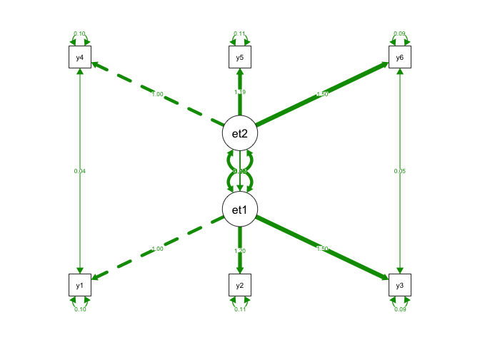
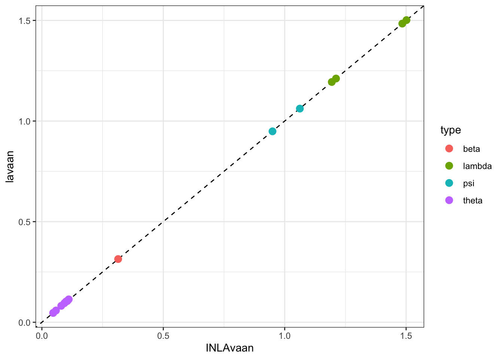

<!-- README.md is generated from README.Rmd. Please edit that file -->

# `{INLAvaan}`

<!-- badges: start -->

[](https://lifecycle.r-lib.org/articles/stages.html#experimental)
[](https://github.com/haziqj/INLAvaan/actions/workflows/R-CMD-check.yaml)
<!-- badges: end -->

> Bayesian structural equation modelling with INLA.

Soon-ish features

1.  Model fit indices (PPP, xIC, RMSEA, etc.)
2.  Prior specification.
3.  Fixed values and/or parameter constraints.
4.  Specify different families for different observed variable.
5.  Standardised coefficients.

Long term plan

1.  “non-iid” models, such as spatio-temporal models.
2.  Multilevel-ish kind of models (2-3 levels).
3.  Covariates.
4.  Multiple groups (yes, should be easy–but I’m lazy)

## First impressions

A simple two-factor SEM with 6 observed correlated Gaussian variables.



``` r
# {lavaan} textual model
mod <- "
  eta1 =~ y1 + y2 + y3
  eta2 =~ y4 + y5 + y6
  eta1 ~ eta2
  y1 ~~ y4
  y2 ~~ y5
  y3 ~~ y6
"

# Data set
head(dat)
#>            y1         y2         y3         y4         y5          y6
#> 1 -0.46595475 -0.2169502 -1.1923476 -0.4730320 -0.2424332 -0.45937615
#> 2  0.18878919 -0.2683014  0.6864480  1.5343856  1.4374534  2.12710675
#> 3 -0.32510705  0.2593740  0.2399220  0.9767745  1.7037937  2.07971033
#> 4  1.19637512  1.2886091  0.9637020  0.3411151  1.1409774  0.56150440
#> 5  0.01282364  0.2515086 -0.2485721  0.2410386  0.2646659 -0.09990905
#> 6  0.64180430  1.2179789  0.7048887  1.5380467  2.1399979  1.71068737
```

To fit this model using `{INLAvaan}`, use the familiar `{lavaan}`
syntax. The `i` in `isem` stands for `INLA` (following the convention of
`bsem` for `{blavaan}`).

``` r
library(INLAvaan)
fit <- isem(model = mod, data = dat)
summary(fit)
```

    #> INLAvaan 0.1.0.9003 ended normally after 20 seconds
    #> 
    #>   Estimator                                      BAYES
    #>   Optimization method                             INLA
    #>   Number of model parameters                        16
    #> 
    #>   Number of observations                          1000
    #> 
    #>   Statistic                                 MargLogLik         PPP
    #>   Value                                      -5216.398          NA
    #> 
    #> Parameter Estimates:
    #> 
    #> 
    #> Latent Variables:
    #>                    Estimate  Post.SD pi.lower pi.upper    Prior       
    #>   eta1 =~                                                             
    #>     y1                1.000                                           
    #>     y2                1.200    0.014    1.172    1.228    normal(0,10)
    #>     y3                1.498    0.016    1.468    1.529    normal(0,10)
    #>   eta2 =~                                                             
    #>     y4                1.000                                           
    #>     y5                1.193    0.014    1.165    1.221    normal(0,10)
    #>     y6                1.505    0.016    1.474    1.537    normal(0,10)
    #> 
    #> Regressions:
    #>                    Estimate  Post.SD pi.lower pi.upper    Prior       
    #>   eta1 ~                                                              
    #>     eta2              0.264    0.032    0.201    0.327    normal(0,10)
    #> 
    #> Covariances:
    #>                    Estimate  Post.SD pi.lower pi.upper    Prior       
    #>  .y1 ~~                                                               
    #>    .y4                0.044    0.004    0.037    0.051       beta(1,1)
    #>  .y2 ~~                                                               
    #>    .y5                0.057    0.004    0.049    0.065       beta(1,1)
    #>  .y3 ~~                                                               
    #>    .y6                0.051    0.006    0.040    0.063       beta(1,1)
    #> 
    #> Variances:
    #>                    Estimate  Post.SD pi.lower pi.upper    Prior       
    #>    .y1                0.095    0.006    0.083    0.107 gamma(1,.5)[sd]
    #>    .y2                0.111    0.007    0.100    0.127 gamma(1,.5)[sd]
    #>    .y3                0.088    0.009    0.072    0.104 gamma(1,.5)[sd]
    #>    .y4                0.095    0.006    0.085    0.105 gamma(1,.5)[sd]
    #>    .y5                0.105    0.007    0.092    0.120 gamma(1,.5)[sd]
    #>    .y6                0.093    0.009    0.079    0.113 gamma(1,.5)[sd]
    #>    .eta1              0.969    0.046    0.882    1.064 gamma(1,.5)[sd]
    #>     eta2              0.995    0.048    0.905    1.092 gamma(1,.5)[sd]

Compare model fit to `{lavaan}`:


