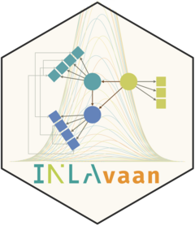

<!-- README.md is generated from README.Rmd. Please edit that file -->

# INLAvaan <a href="https://inlavaan.haziqj.ml"></a>

<!-- badges: start -->

[](https://lifecycle.r-lib.org/articles/stages.html#experimental)
[](https://github.com/haziqj/INLAvaan/actions/workflows/R-CMD-check.yaml)
[](https://app.codecov.io/gh/haziqj/INLAvaan?branch=main)
[](https://cran.r-project.org/package=INLAvaan)
[](https://cran.r-project.org/package=INLAvaan)
[](https://cran.r-project.org/package=INLAvaan)
[](https://github.com/haziqj/INLAvaan/stargazers)
<!-- badges: end -->

> Efficient approximate Bayesian inference for Structural Equation
> Models.

While Markov Chain Monte Carlo (MCMC) methods remain the gold standard
for exact Bayesian inference, they can be prohibitively slow for
iterative model development. `{INLAvaan}` offers a rapid alternative for
<u>**la**</u>tent <u>**va**</u>riable <u>**an**</u>alysis, delivering
Bayesian results at (or near) the speed of frequentist estimators. It
achieves this through a custom, ground-up implementation of the
[Integrated Nested Laplace Approximation
(INLA)](https://www.r-inla.org), engineered specifically for the
[lavaan](https://lavaan.ugent.be) modelling framework.

## A familiar interface

`{INLAvaan}` is designed to fit seamlessly into your existing workflow.
If you are familiar with the [(b)lavaan
syntax](https://lavaan.ugent.be/tutorial/syntax1.html), you can begin
using `{INLAvaan}` immediately.

As a first impression of the package, consider the canonical example of
SEM applied to the Industrialisation and Political Democracy data set of
Bollen (1989)[^1]:

``` r
library(INLAvaan)
mod_poldem <- "
  # Latent variable definitions
     ind60 =~ x1 + x2 + x3
     dem60 =~ y1 + y2 + y3
     dem65 =~ y5 + y6 + y7 + y8

  # Latent regressions
    dem60 ~ ind60
    dem65 ~ ind60 + dem60

  # Residual correlations
    y1 ~~ y5
    y2 ~~ y4 + y6
    y3 ~~ y7
    y4 ~~ y8
    y6 ~~ y8
  
  # Fixed loading
    dem60 =~ 1.5*y4
  
  # Custom priors on latent variances
    ind60 ~~ prior('gamma(1, 1)')*ind60
    dem60 ~~ prior('gamma(2, 1)')*dem60
    dem65 ~~ prior('gamma(1,.5)')*dem65
"
utils::data("PoliticalDemocracy", package = "lavaan")

fit <- asem(model = mod_poldem, data = PoliticalDemocracy)
#> ℹ Finding posterior mode.
#> ✔ Finding posterior mode. [37ms]
#> 
#> ℹ Computing the Hessian.
#> ✔ Computing the Hessian. [32ms]
#> 
#> ℹ Performing VB correction.
#> ✔ VB correction; mean |δ| = 0.156σ. [88ms]
#> 
#> ⠙ Fitting 0/30 skew-normal marginals.
#> ⠹ Fitting 6/30 skew-normal marginals.
#> ⠸ Fitting 19/30 skew-normal marginals.
#> ✔ Fitting 30/30 skew-normal marginals. [465ms]
#> 
#> ℹ Adjusting copula correlations (NORTA).
#> ✔ Adjusting copula correlations (NORTA). [100ms]
#> 
#> ⠙ Posterior sampling and summarising.
#> ⠹ Posterior sampling and summarising.
#> ✔ Posterior sampling and summarising. [277ms]
#> 

summary(fit)
#> INLAvaan 0.2.4.9000 ended normally after 80 iterations
#> 
#>   Estimator                                      BAYES
#>   Optimization method                           NLMINB
#>   Number of model parameters                        30
#> 
#>   Number of observations                            75
#> 
#> Model Test (User Model):
#> 
#>    Marginal log-likelihood                   -1651.234 
#>    PPP (Chi-square)                              0.526 
#> 
#> Information Criteria:
#> 
#>    Deviance (DIC)                             3156.868 
#>    Effective parameters (pD)                    29.028 
#> 
#> Parameter Estimates:
#> 
#>    Marginalisation method                     SKEWNORM
#>    VB correction                                  TRUE
#> 
#> Latent Variables:
#>                    Estimate       SD     2.5%    97.5%     NMAD    Prior       
#>   ind60 =~                                                                     
#>     x1                1.000                                                    
#>     x2                2.216    0.146    1.950    2.524    0.006    normal(0,10)
#>     x3                1.838    0.154    1.548    2.154    0.004    normal(0,10)
#>   dem60 =~                                                                     
#>     y1                1.000                                                    
#>     y2                1.443    0.169    1.117    1.779    0.001    normal(0,10)
#>     y3                1.168    0.156    0.868    1.478    0.001    normal(0,10)
#>   dem65 =~                                                                     
#>     y5                1.000                                                    
#>     y6                1.260    0.186    0.926    1.656    0.007    normal(0,10)
#>     y7                1.355    0.173    1.048    1.726    0.008    normal(0,10)
#>     y8                1.367    0.176    1.056    1.746    0.008    normal(0,10)
#>   dem60 =~                                                                     
#>     y4                1.500                                                    
#> 
#> Regressions:
#>                    Estimate       SD     2.5%    97.5%     NMAD    Prior       
#>   dem60 ~                                                                      
#>     ind60             1.373    0.347    0.702    2.063    0.001    normal(0,10)
#>   dem65 ~                                                                      
#>     ind60             0.516    0.233    0.066    0.982    0.001    normal(0,10)
#>     dem60             0.882    0.102    0.689    1.090    0.011    normal(0,10)
#> 
#> Covariances:
#>                    Estimate       SD     2.5%    97.5%     NMAD    Prior       
#>  .y1 ~~                                                                        
#>    .y5                0.331    0.399    0.164    1.728    0.005       beta(1,1)
#>  .y2 ~~                                                                        
#>    .y4                0.217    0.681   -0.202    2.473    0.004       beta(1,1)
#>    .y6                0.347    0.729    0.796    3.661    0.011       beta(1,1)
#>  .y3 ~~                                                                        
#>    .y7                0.225    0.647   -0.162    2.380    0.005       beta(1,1)
#>  .y8 ~~                                                                        
#>    .y4                0.070    0.449   -0.601    1.163    0.003       beta(1,1)
#>  .y6 ~~                                                                        
#>    .y8                0.307    0.571    0.270    2.506    0.005       beta(1,1)
#> 
#> Variances:
#>                    Estimate       SD     2.5%    97.5%     NMAD    Prior       
#>     ind60             0.458    0.089    0.311    0.657    0.003      gamma(1,1)
#>    .dem60             3.132    0.604    2.116    4.475    0.001      gamma(2,1)
#>    .dem65             0.325    0.190    0.058    0.771    0.037     gamma(1,.5)
#>    .x1                0.088    0.021    0.053    0.135    0.006 gamma(1,.5)[sd]
#>    .x2                0.131    0.066    0.031    0.279    0.031 gamma(1,.5)[sd]
#>    .x3                0.501    0.099    0.338    0.723    0.003 gamma(1,.5)[sd]
#>    .y1                2.321    0.496    1.496    3.430    0.004 gamma(1,.5)[sd]
#>    .y2                7.547    1.432    5.131   10.720    0.003 gamma(1,.5)[sd]
#>    .y3                5.518    1.071    3.739    7.922    0.002 gamma(1,.5)[sd]
#>    .y5                2.639    0.550    1.725    3.869    0.005 gamma(1,.5)[sd]
#>    .y6                5.158    0.957    3.542    7.279    0.002 gamma(1,.5)[sd]
#>    .y7                3.627    0.784    2.312    5.374    0.006 gamma(1,.5)[sd]
#>    .y8                3.247    0.731    1.997    4.852    0.007 gamma(1,.5)[sd]
#>    .y4                2.910    0.761    1.613    4.580    0.011 gamma(1,.5)[sd]
```

## Validation against MCMC

Computation speed is valuable only when accuracy is preserved. Our
method yields posterior distributions that are visually and numerically
comparable to those obtained via MCMC (e.g., via `{blavaan}`/Stan), but
at a fraction of the computational cost.

The figure below illustrates the posterior density overlap for the
example above. The percentages refer to the one minus the
[Jensen-Shannon
distance](https://en.wikipedia.org/wiki/Jensen–Shannon_divergence),
which gives a measure of similarity between two probability
distributions.

``` r
# install.packages("blavaan")
library(blavaan)
fit_blav <- bsem(model = mod_poldem, data = PoliticalDemocracy, seed = 2026)
res <- INLAvaan:::compare_mcmc(fit_blav, INLAvaan = fit)
print(res$p_compare)
```


## Installation

Install the CRAN version of `{INLAvaan}` using:

``` r
install.packages("INLAvaan")
```

Alternatively, install the development version of `{INLAvaan}` from
GitHub using:

``` r
# install.packages("pak")
pak::pak("haziqj/INLAvaan")
```

*Optionally*[^2], you may wish to install
[INLA](https://www.r-inla.org). Following the official instructions
given [here](https://www.r-inla.org/download-install), install the
package by running this command in R:

``` r
install.packages(
  "INLA",
  repos = c(getOption("repos"), 
            INLA = "https://inla.r-inla-download.org/R/stable"), 
  dep = TRUE
)
```

## Citation

There are two papers related to `{INLAvaan}` and its underlying
methodology. To cite `{INLAvaan}` in publications, consider citing both.

To cite the methodological contribution exclusively, please use:

> Jamil, H., & Rue, H. (2026). *Approximate Bayesian inference for
> structural equation models using integrated nested Laplace
> approximations* (2603.25690 \[stat.ME\]). arXiv.
> <https://doi.org/10.48550/arXiv.2603.25690>

To cite the software implementation and workflows, please use:

> Jamil, H., & Rue, H. (2026). *Implementation and workflows for
> INLA-based approximate Bayesian structural equation modelling*
> (2604.00671 \[stat.CO\]). arXiv.
> <https://doi.org/10.48550/arXiv.2604.00671>

BibTeX entries for LaTeX users:

    @Misc{jamil2026approximate,
      title = {Approximate Bayesian inference for structural equation models using integrated nested Laplace approximations},
      author = {Haziq Jamil and Håvard Rue},
      year = {2026},
      number = {2603.25690 [stat.ME]},
      eprint = {2603.25690},
      primaryclass = {stat.ME},
      publisher = {arXiv},
      doi = {10.48550/arXiv.2603.25690},
      archiveprefix = {arXiv},
      copyright = {Creative Commons Attribution Non Commercial Share Alike 4.0 International},
    }

    @Misc{jamil2026implementation,
      title = {Implementation and workflows for INLA-based approximate Bayesian structural equation modelling},
      author = {Haziq Jamil and Håvard Rue},
      year = {2026},
      number = {2604.00671 [stat.CO]},
      eprint = {2604.00671},
      primaryclass = {stat.CO},
      publisher = {arXiv},
      doi = {10.48550/arXiv.2604.00671},
      archiveprefix = {arXiv},
      copyright = {Creative Commons Attribution Non Commercial Share Alike 4.0 International},
    }

## License

The `{INLAvaan}` package is licensed under the
[GPL-3](https://www.gnu.org/licenses/gpl-3.0.en.html).

``` plaintext
INLAvaan: Bayesian Latent Variable Analysis using INLA
Copyright (C) 2026 Haziq Jamil

This program is free software: you can redistribute it and/or modify
it under the terms of the GNU General Public License as published by
the Free Software Foundation, either version 3 of the License, or
(at your option) any later version.

This program is distributed in the hope that it will be useful,
but WITHOUT ANY WARRANTY; without even the implied warranty of
MERCHANTABILITY or FITNESS FOR A PARTICULAR PURPOSE.  See the
GNU General Public License for more details.

You should have received a copy of the GNU General Public License
along with this program.  If not, see <http://www.gnu.org/licenses/>.
```

<!-- By using this package, you agree to comply with both licenses:  -->

<!-- the GPL-3 license for the software and the CC BY 4.0 license for the data. -->

[^1]: Bollen, K. A. (1989). *Structural equations with latent variables*
    (pp. xiv, 514). John Wiley & Sons.
    <https://doi.org/10.1002/9781118619179>

[^2]: R-INLA dependency has been removed temporarily from v0.2.0.
