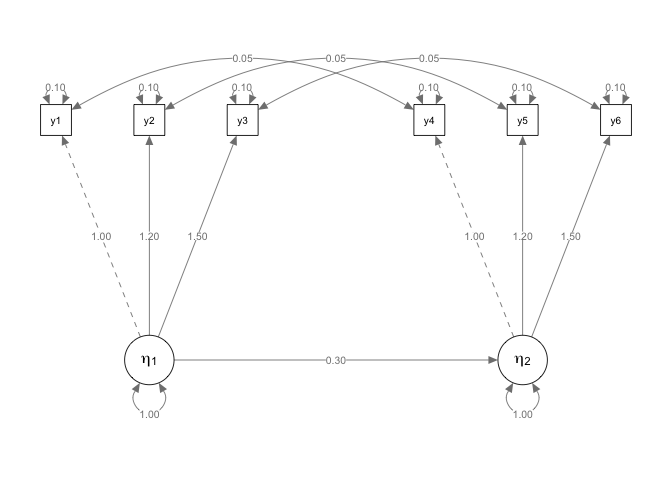
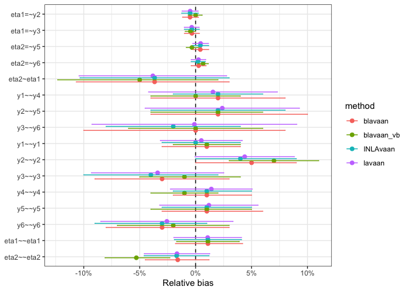

<!-- README.md is generated from README.Rmd. Please edit that file -->

## `{INLAvaan}`

<!-- badges: start -->

[](https://lifecycle.r-lib.org/articles/stages.html#experimental)
[](https://github.com/haziqj/INLAvaan/actions/workflows/R-CMD-check.yaml)
[](https://app.codecov.io/gh/haziqj/INLAvaan?branch=main)
<!-- badges: end -->

> Bayesian structural equation modelling with INLA.

**Soon-ish features**

1.  Model fit indices (PPP, xIC, RMSEA, etc.)
2.  Prior specification.
3.  Fixed values and/or parameter constraints.
4.  Specify different families for different observed variable.
5.  Standardised coefficients.

**Long term plan**

1.  “Non-iid” models, such as spatio-temporal models.
2.  Multilevel-ish kind of models (2-3 levels).
3.  Covariates.
4.  Multigroup analysis (in principle this is simple, but I have bigger
    plans for this).
5.  Missing data imputation.

## Installation

You need a working installation of [INLA](https://www.r-inla.org).
Following the official instructions given
[here](https://www.r-inla.org/download-install), run this command in R:

``` r
install.packages(
  "INLA",
  repos = c(getOption("repos"), 
            INLA = "https://inla.r-inla-download.org/R/stable"), 
  dep = TRUE
)
```

Then, you can install the development version of `{INLAvaan}` from
GitHub with:

``` r
# install.packages("pak")
pak::pak("haziqj/INLAvaan")
```

## First impressions

A simple two-factor SEM with six observed, correlated Gaussian
variables. Let $i=1,\dots,n$ index the subjects. Conditional on the
values of $k$th latent variable $\eta_{ki}$ for subject $i$, the six
measurement model equations are

<br>
<p align="center">

</p>

<br> <!-- $$ --> <!-- \begin{gathered} -->
<!-- y_{1i} = \lambda_{11} \eta_{1i} \phantom{+ \lambda_{1} \eta_{2i}} + \epsilon_{1i}, \quad \epsilon_{1i} \sim N(0, \theta_{11}) \\ -->
<!-- y_{2i} = \lambda_{21} \eta_{1i} \phantom{+ \lambda_{1} \eta_{2i}} + \epsilon_{2i}, \quad \epsilon_{2i} \sim N(0, \theta_{22}) \\ -->
<!-- y_{3i} = \lambda_{31} \eta_{1i} \phantom{+ \lambda_{1} \eta_{2i}}  + \epsilon_{3i}, \quad \epsilon_{3i} \sim N(0, \theta_{33}) \\ -->
<!-- y_{4i} = \phantom{\lambda_{11} \eta_{2i} +}  \lambda_{42} \eta_{2i} + \epsilon_{4i}, \quad \epsilon_{4i} \sim N(0, \theta_{44}) \\ -->
<!-- y_{5i} = \phantom{\lambda_{11} \eta_{2i} +} \lambda_{52} \eta_{2i} + \epsilon_{5i}, \quad \epsilon_{5i} \sim N(0, \theta_{55}) \\ -->
<!-- y_{6i} = \phantom{\lambda_{11} \eta_{2i} +} \lambda_{62} \eta_{2i} + \epsilon_{6i}, \quad \epsilon_{6i} \sim N(0, \theta_{66}) \\ -->
<!-- \\ -->
<!-- \operatorname{Cov}(\epsilon_{1i},\epsilon_{4i}) = \theta_{14} \\ -->
<!-- \operatorname{Cov}(\epsilon_{2i},\epsilon_{5i}) = \theta_{25} \\ -->
<!-- \operatorname{Cov}(\epsilon_{3i},\epsilon_{6i}) = \theta_{36} \\ -->
<!-- \end{gathered} --> <!-- $$ -->

For identifiability, we set $\lambda_{11} = \lambda_{42} = 1$. The
structural part of the model are given by these equations:

<br>
<p align="center">

</p>

<br> <!-- $$ --> <!-- \begin{gathered} -->
<!-- \eta_{1i} = \phantom{b\eta_{1i} +} \zeta_{1i}, \quad \zeta_{1i} \sim N(0, \psi_1) \\ -->
<!-- \eta_{2i} = b\eta_{1i} + \zeta_{2i}, \quad \zeta_{2i} \sim N(0, \psi_2) -->
<!-- \end{gathered} --> <!-- $$ -->

Graphically, we can plot the following path diagram.



``` r
# {lavaan} textual model
mod <- "
  # Measurement model
  eta1 =~ y1 + y2 + y3
  eta2 =~ y4 + y5 + y6
  
  # Factor regression
  eta2 ~ eta1
  
  # Covariances
  y1 ~~ y4
  y2 ~~ y5
  y3 ~~ y6
"

# Data set
dplyr::glimpse(dat)
#> Rows: 10,000
#> Columns: 6
#> $ y1 <dbl> -1.26736639, -2.31884913, 1.71420679, 2.01369694, 1.37071214, -0.95…
#> $ y2 <dbl> -1.3071645, -2.4263002, 1.9387949, 2.9101688, 1.7358113, -1.6660828…
#> $ y3 <dbl> -2.2831840, -2.2597714, 2.3922723, 3.1412267, 2.1247038, -1.3562886…
#> $ y4 <dbl> -0.18661779, -1.42605096, 2.49517728, -1.17149170, -1.01596946, 0.0…
#> $ y5 <dbl> -0.6070868, -1.9211147, 2.9405287, -1.0167702, -0.4167566, -1.00124…
#> $ y6 <dbl> -1.2278010, -2.2398984, 3.2180808, -1.8873268, -1.2123784, -0.60215…
```

To fit this model using `{INLAvaan}`, use the familiar `{lavaan}`
syntax. The `i` in `isem` stands for `INLA` (following the convention of
`bsem` for `{blavaan}`).

``` r
library(INLAvaan)
fit <- isem(model = mod, data = dat)
summary(fit)
```

    #> INLAvaan 0.1.0.9012 ended normally after 34 seconds
    #> 
    #>   Estimator                                      BAYES
    #>   Optimization method                             INLA
    #>   Number of model parameters                        16
    #> 
    #>   Number of observations                         10000
    #> 
    #>   Statistic                                 MargLogLik         PPP
    #>   Value                                     -52033.656          NA
    #> 
    #> Parameter Estimates:
    #> 
    #> 
    #> Latent Variables:
    #>                    Estimate  Post.SD pi.lower pi.upper    Prior       
    #>   eta1 =~                                                             
    #>     y1                1.000                                           
    #>     y2                1.203    0.004    1.194    1.212    normal(0,10)
    #>     y3                1.496    0.005    1.485    1.505    normal(0,10)
    #>   eta2 =~                                                             
    #>     y4                1.000                                           
    #>     y5                1.199    0.004    1.191    1.207    normal(0,10)
    #>     y6                1.503    0.005    1.493    1.512    normal(0,10)
    #> 
    #> Regressions:
    #>                    Estimate  Post.SD pi.lower pi.upper    Prior       
    #>   eta2 ~                                                              
    #>     eta1              0.306    0.010    0.286    0.326    normal(0,10)
    #> 
    #> Covariances:
    #>                    Estimate  Post.SD pi.lower pi.upper    Prior       
    #>  .y1 ~~                                                               
    #>    .y4                0.048    0.001    0.046    0.051       beta(1,1)
    #>  .y2 ~~                                                               
    #>    .y5                0.049    0.001    0.046    0.051       beta(1,1)
    #>  .y3 ~~                                                               
    #>    .y6                0.053    0.002    0.050    0.057       beta(1,1)
    #> 
    #> Variances:
    #>                    Estimate  Post.SD pi.lower pi.upper    Prior       
    #>    .y1                0.100    0.002    0.096    0.103 gamma(1,.5)[sd]
    #>    .y2                0.100    0.002    0.096    0.104 gamma(1,.5)[sd]
    #>    .y3                0.103    0.003    0.097    0.108 gamma(1,.5)[sd]
    #>    .y4                0.098    0.002    0.094    0.101 gamma(1,.5)[sd]
    #>    .y5                0.098    0.002    0.094    0.103 gamma(1,.5)[sd]
    #>    .y6                0.105    0.003    0.099    0.111 gamma(1,.5)[sd]
    #>     eta1              1.009    0.015    0.980    1.040 gamma(1,.5)[sd]
    #>    .eta2              0.987    0.015    0.959    1.017 gamma(1,.5)[sd]

Compare model fit to `{lavaan}` and `{blavaan}` (MCMC sampling using
Stan on a single thread obtaining 1000 burnin and 2000 samples, as well
as variational Bayes):



    #> 
    #> ── Compare timing (seconds) ──
    #> 
    #>   INLAvaan     lavaan    blavaan blavaan_vb 
    #>     34.968      0.028    127.584     92.434

A little experiment to see how sample size affects run time:


## Political democracy data

The quintessential example for SEM is this model from Bollen (1989) to
fit a political democracy data set. Eleven observed variables are
hypothesized to arise from three latent variables. This set includes
data from 75 developing countries each assessed on four measures of
democracy measured twice (1960 and 1965), and three measures of
industrialization measured once (1960). The eleven observed variables
are:

- `y1`: Freedom of the press, 1960
- `y2`: Freedom of political opposition, 1960
- `y3`: Fairness of elections, 1960
- `y4`: Effectiveness of elected legislature, 1960
- `y5`: Freedom of the press, 1965
- `y6`: Freedom of political opposition, 1965
- `y7`: Fairness of elections, 1965
- `y8`: Effectiveness of elected legislature, 1965
- `y9`: GNP per capita, 1960
- `y10`: Energy consumption per capita, 1960
- `y11`: Percentage of labor force in industry, 1960

Variables `y1-y4` and `y5-y8` are typically used as indicators of the
latent trait of “political democracy” in 1960 and 1965 respectively,
whereas `y9-y11` are used as indicators of industrialization (1960). It
is theorised that industrialisation influences political democracy, and
that political democracy in 1960 influences political democracy in 1965.
Since the items measure the same latent trait at two time points, there
is an assumption that the residuals of these items will be correlated
with each other. The model is depicted in the figure below.


The corresponding model in `{lavaan}` syntax is:

``` r
mod <- "
  # latent variables
  dem60 =~ y1 + y2 + y3 + y4
  dem65 =~ y5 + y6 + y7 + y8
  ind60 =~ x1 + x2 + x3

  # latent regressions
  dem60 ~ ind60
  dem65 ~ ind60 + dem60

  # residual covariances
  y1 ~~ y5
  y2 ~~ y4 + y6
  y3 ~~ y7
  y4 ~~ y8
  y6 ~~ y8
"
```

We will fit this model using `{INLAvaan}` and compare the results with
`{blavaan}`.

``` r
data("PoliticalDemocracy", package = "lavaan")
poldemfit <- isem(model = mod, data = PoliticalDemocracy)
summary(poldemfit)
```

    #> INLAvaan 0.1.0.9012 ended normally after 9 seconds
    #> 
    #>   Estimator                                      BAYES
    #>   Optimization method                             INLA
    #>   Number of model parameters                        31
    #> 
    #>   Number of observations                            75
    #> 
    #>   Statistic                                 MargLogLik         PPP
    #>   Value                                      -1607.444          NA
    #> 
    #> Parameter Estimates:
    #> 
    #> 
    #> Latent Variables:
    #>                    Estimate  Post.SD pi.lower pi.upper    Prior       
    #>   dem60 =~                                                            
    #>     y1                1.000                                           
    #>     y2                1.256    0.184    0.894    1.620    normal(0,10)
    #>     y3                1.056    0.149    0.764    1.349    normal(0,10)
    #>     y4                1.262    0.150    0.967    1.558    normal(0,10)
    #>   dem65 =~                                                            
    #>     y5                1.000                                           
    #>     y6                1.189    0.172    0.850    1.529    normal(0,10)
    #>     y7                1.281    0.162    0.963    1.599    normal(0,10)
    #>     y8                1.267    0.164    0.944    1.591    normal(0,10)
    #>   ind60 =~                                                            
    #>     x1                1.000                                           
    #>     x2                2.186    0.138    1.923    2.465    normal(0,10)
    #>     x3                1.816    0.152    1.520    2.118    normal(0,10)
    #> 
    #> Regressions:
    #>                    Estimate  Post.SD pi.lower pi.upper    Prior       
    #>   dem60 ~                                                             
    #>     ind60             1.478    0.398    0.691    2.259    normal(0,10)
    #>   dem65 ~                                                             
    #>     ind60             0.562    0.230    0.106    1.011    normal(0,10)
    #>     dem60             0.847    0.097    0.662    1.043    normal(0,10)
    #> 
    #> Covariances:
    #>                    Estimate  Post.SD pi.lower pi.upper    Prior       
    #>  .y1 ~~                                                               
    #>    .y5                0.622    0.331   -0.042    1.234       beta(1,1)
    #>  .y2 ~~                                                               
    #>    .y4                1.372    0.604    0.306    2.743       beta(1,1)
    #>    .y6                2.183    0.664    1.025    3.479       beta(1,1)
    #>  .y3 ~~                                                               
    #>    .y7                0.770    0.560   -0.447    1.879       beta(1,1)
    #>  .y4 ~~                                                               
    #>    .y8                0.337    0.461   -0.594    1.259       beta(1,1)
    #>  .y6 ~~                                                               
    #>    .y8                1.427    0.488    0.502    2.339       beta(1,1)
    #> 
    #> Variances:
    #>                    Estimate  Post.SD pi.lower pi.upper    Prior       
    #>    .y1                2.026    0.486    1.151    3.186 gamma(1,.5)[sd]
    #>    .y2                7.436    1.375    5.257   10.529 gamma(1,.5)[sd]
    #>    .y3                5.242    0.950    3.629    7.278 gamma(1,.5)[sd]
    #>    .y4                3.368    0.788    2.065    5.190 gamma(1,.5)[sd]
    #>    .y5                2.435    0.525    1.602    3.590 gamma(1,.5)[sd]
    #>    .y6                5.128    0.951    3.671    7.163 gamma(1,.5)[sd]
    #>    .y7                3.733    0.797    2.441    5.373 gamma(1,.5)[sd]
    #>    .y8                3.464    0.791    2.149    5.219 gamma(1,.5)[sd]
    #>    .x1                0.087    0.021    0.055    0.130 gamma(1,.5)[sd]
    #>    .x2                0.112    0.058    0.028    0.233 gamma(1,.5)[sd]
    #>    .x3                0.481    0.091    0.329    0.690 gamma(1,.5)[sd]
    #>    .dem60             4.118    0.982    2.518    6.356 gamma(1,.5)[sd]
    #>    .dem65             0.104    0.180   -0.002    0.560 gamma(1,.5)[sd]
    #>     ind60             0.462    0.090    0.310    0.662 gamma(1,.5)[sd]


    #> 
    #> ── Compare timing (seconds) ──
    #> 
    #> INLAvaan  blavaan 
    #>    9.004   19.669

## Outro

``` r
sessioninfo::session_info(info = "all")
#> ─ Session info ───────────────────────────────────────────────────────────────
#>  setting  value
#>  version  R version 4.4.0 (2024-04-24)
#>  os       macOS Sonoma 14.4.1
#>  system   aarch64, darwin20
#>  ui       X11
#>  language (EN)
#>  collate  en_US.UTF-8
#>  ctype    en_US.UTF-8
#>  tz       Asia/Riyadh
#>  date     2024-05-30
#>  pandoc   3.2 @ /opt/homebrew/bin/ (via rmarkdown)
#> 
#> ─ Packages ───────────────────────────────────────────────────────────────────
#>  package      * version     date (UTC) lib source
#>  abind          1.4-5       2016-07-21 [1] CRAN (R 4.4.0)
#>  arm            1.14-4      2024-04-01 [1] CRAN (R 4.4.0)
#>  backports      1.5.0       2024-05-23 [1] CRAN (R 4.4.0)
#>  base64enc      0.1-3       2015-07-28 [1] CRAN (R 4.4.0)
#>  bayesplot      1.11.1      2024-02-15 [1] CRAN (R 4.4.0)
#>  blavaan      * 0.5-4       2024-04-15 [1] CRAN (R 4.4.0)
#>  boot           1.3-30      2024-02-26 [1] CRAN (R 4.4.0)
#>  carData        3.0-5       2022-01-06 [1] CRAN (R 4.4.0)
#>  checkmate      2.3.1       2023-12-04 [1] CRAN (R 4.4.0)
#>  class          7.3-22      2023-05-03 [1] CRAN (R 4.4.0)
#>  classInt       0.4-10      2023-09-05 [1] CRAN (R 4.4.0)
#>  cli            3.6.2       2023-12-11 [1] CRAN (R 4.4.0)
#>  clue           0.3-65      2023-09-23 [1] CRAN (R 4.4.0)
#>  cluster        2.1.6       2023-12-01 [1] CRAN (R 4.4.0)
#>  coda           0.19-4.1    2024-01-31 [1] CRAN (R 4.4.0)
#>  codetools      0.2-20      2024-03-31 [1] CRAN (R 4.4.0)
#>  colorspace     2.1-0       2023-01-23 [1] CRAN (R 4.4.0)
#>  CompQuadForm   1.4.3       2017-04-12 [1] CRAN (R 4.4.0)
#>  corpcor        1.6.10      2021-09-16 [1] CRAN (R 4.4.0)
#>  curl           5.2.1       2024-03-01 [1] CRAN (R 4.4.0)
#>  data.table     1.15.4      2024-03-30 [1] CRAN (R 4.4.0)
#>  DBI            1.2.2       2024-02-16 [1] CRAN (R 4.4.0)
#>  Deriv          4.1.3       2021-02-24 [1] CRAN (R 4.4.0)
#>  digest         0.6.35      2024-03-11 [1] CRAN (R 4.4.0)
#>  dplyr        * 1.1.4       2023-11-17 [1] CRAN (R 4.4.0)
#>  e1071          1.7-14      2023-12-06 [1] CRAN (R 4.4.0)
#>  evaluate       0.23        2023-11-01 [1] CRAN (R 4.4.0)
#>  fansi          1.0.6       2023-12-08 [1] CRAN (R 4.4.0)
#>  farver         2.1.2       2024-05-13 [1] CRAN (R 4.4.0)
#>  fastmap        1.2.0       2024-05-15 [1] CRAN (R 4.4.0)
#>  fBasics        4032.96     2023-11-03 [1] CRAN (R 4.4.0)
#>  fdrtool        1.2.17      2021-11-13 [1] CRAN (R 4.4.0)
#>  fmesher        0.1.5       2023-12-20 [1] CRAN (R 4.4.0)
#>  forcats      * 1.0.0       2023-01-29 [1] CRAN (R 4.4.0)
#>  foreign        0.8-86      2023-11-28 [1] CRAN (R 4.4.0)
#>  Formula        1.2-5       2023-02-24 [1] CRAN (R 4.4.0)
#>  future       * 1.33.2      2024-03-26 [1] CRAN (R 4.4.0)
#>  future.apply   1.11.2      2024-03-28 [1] CRAN (R 4.4.0)
#>  generics       0.1.3       2022-07-05 [1] CRAN (R 4.4.0)
#>  ggplot2      * 3.5.1       2024-04-23 [1] CRAN (R 4.4.0)
#>  glasso         1.11        2019-10-01 [1] CRAN (R 4.4.0)
#>  globals        0.16.3      2024-03-08 [1] CRAN (R 4.4.0)
#>  glue           1.7.0       2024-01-09 [1] CRAN (R 4.4.0)
#>  gridExtra      2.3         2017-09-09 [1] CRAN (R 4.4.0)
#>  gt             0.10.1      2024-01-17 [1] CRAN (R 4.4.0)
#>  gtable         0.3.5       2024-04-22 [1] CRAN (R 4.4.0)
#>  gtools         3.9.5       2023-11-20 [1] CRAN (R 4.4.0)
#>  highr          0.11        2024-05-26 [1] CRAN (R 4.4.0)
#>  Hmisc          5.1-2       2024-03-11 [1] CRAN (R 4.4.0)
#>  hms            1.1.3       2023-03-21 [1] CRAN (R 4.4.0)
#>  htmlTable      2.4.2       2023-10-29 [1] CRAN (R 4.4.0)
#>  htmltools      0.5.8.1     2024-04-04 [1] CRAN (R 4.4.0)
#>  htmlwidgets    1.6.4       2023-12-06 [1] CRAN (R 4.4.0)
#>  igraph         2.0.3       2024-03-13 [1] CRAN (R 4.4.0)
#>  INLA           24.05.27-2  2024-05-27 [1] local
#>  INLAvaan     * 0.1.0.9012  2024-05-30 [1] local
#>  inline         0.3.19      2021-05-31 [1] CRAN (R 4.4.0)
#>  jpeg           0.1-10      2022-11-29 [1] CRAN (R 4.4.0)
#>  jsonlite       1.8.8       2023-12-04 [1] CRAN (R 4.4.0)
#>  KernSmooth     2.23-22     2023-07-10 [1] CRAN (R 4.4.0)
#>  knitr          1.46        2024-04-06 [1] CRAN (R 4.4.0)
#>  kutils         1.73        2023-09-17 [1] CRAN (R 4.4.0)
#>  labeling       0.4.3       2023-08-29 [1] CRAN (R 4.4.0)
#>  lattice        0.22-6      2024-03-20 [1] CRAN (R 4.4.0)
#>  lavaan       * 0.6-17      2023-12-20 [1] CRAN (R 4.4.0)
#>  lifecycle      1.0.4       2023-11-07 [1] CRAN (R 4.4.0)
#>  lisrelToR      0.3         2024-02-07 [1] CRAN (R 4.4.0)
#>  listenv        0.9.1       2024-01-29 [1] CRAN (R 4.4.0)
#>  lme4           1.1-35.3    2024-04-16 [1] CRAN (R 4.4.0)
#>  loo            2.7.0       2024-02-24 [1] CRAN (R 4.4.0)
#>  lubridate    * 1.9.3       2023-09-27 [1] CRAN (R 4.4.0)
#>  magrittr       2.0.3       2022-03-30 [1] CRAN (R 4.4.0)
#>  MASS           7.3-60.2    2024-04-24 [1] local
#>  Matrix         1.7-0       2024-03-22 [1] CRAN (R 4.4.0)
#>  MatrixModels   0.5-3       2023-11-06 [1] CRAN (R 4.4.0)
#>  matrixStats    1.3.0       2024-04-11 [1] CRAN (R 4.4.0)
#>  mgcv           1.9-1       2023-12-21 [1] CRAN (R 4.4.0)
#>  mi             1.1         2022-06-06 [1] CRAN (R 4.4.0)
#>  minqa          1.2.7       2024-05-20 [1] CRAN (R 4.4.0)
#>  mnormt         2.1.1       2022-09-26 [1] CRAN (R 4.4.0)
#>  modeest        2.4.0       2019-11-18 [1] CRAN (R 4.4.0)
#>  munsell        0.5.1       2024-04-01 [1] CRAN (R 4.4.0)
#>  mvtnorm        1.2-5       2024-05-21 [1] CRAN (R 4.4.0)
#>  nlme           3.1-164     2023-11-27 [1] CRAN (R 4.4.0)
#>  nloptr         2.0.3       2022-05-26 [1] CRAN (R 4.4.0)
#>  nnet           7.3-19      2023-05-03 [1] CRAN (R 4.4.0)
#>  nonnest2       0.5-7       2024-05-06 [1] CRAN (R 4.4.0)
#>  OpenMx         2.21.11     2023-11-28 [1] CRAN (R 4.4.0)
#>  openxlsx       4.2.5.2     2023-02-06 [1] CRAN (R 4.4.0)
#>  parallelly     1.37.1      2024-02-29 [1] CRAN (R 4.4.0)
#>  pbapply        1.7-2       2023-06-27 [1] CRAN (R 4.4.0)
#>  pbivnorm       0.6.0       2015-01-23 [1] CRAN (R 4.4.0)
#>  pillar         1.9.0       2023-03-22 [1] CRAN (R 4.4.0)
#>  pkgbuild       1.4.4       2024-03-17 [1] CRAN (R 4.4.0)
#>  pkgconfig      2.0.3       2019-09-22 [1] CRAN (R 4.4.0)
#>  plyr           1.8.9       2023-10-02 [1] CRAN (R 4.4.0)
#>  png            0.1-8       2022-11-29 [1] CRAN (R 4.4.0)
#>  proxy          0.4-27      2022-06-09 [1] CRAN (R 4.4.0)
#>  psych          2.4.3       2024-03-18 [1] CRAN (R 4.4.0)
#>  purrr        * 1.0.2       2023-08-10 [1] CRAN (R 4.4.0)
#>  qgraph         1.9.8       2023-11-03 [1] CRAN (R 4.4.0)
#>  quadprog       1.5-8       2019-11-20 [1] CRAN (R 4.4.0)
#>  QuickJSR       1.1.3       2024-01-31 [1] CRAN (R 4.4.0)
#>  R6             2.5.1       2021-08-19 [1] CRAN (R 4.4.0)
#>  Rcpp         * 1.0.12      2024-01-09 [1] CRAN (R 4.4.0)
#>  RcppParallel   5.1.7       2023-02-27 [1] CRAN (R 4.4.0)
#>  readr        * 2.1.5       2024-01-10 [1] CRAN (R 4.4.0)
#>  reshape2       1.4.4       2020-04-09 [1] CRAN (R 4.4.0)
#>  rlang          1.1.3       2024-01-10 [1] CRAN (R 4.4.0)
#>  rmarkdown      2.27        2024-05-17 [1] CRAN (R 4.4.0)
#>  rmutil         1.1.10      2022-10-27 [1] CRAN (R 4.4.0)
#>  rockchalk      1.8.157     2022-08-06 [1] CRAN (R 4.4.0)
#>  rpart          4.1.23      2023-12-05 [1] CRAN (R 4.4.0)
#>  rstan          2.32.6      2024-03-05 [1] CRAN (R 4.4.0)
#>  rstantools     2.4.0       2024-01-31 [1] CRAN (R 4.4.0)
#>  rstudioapi     0.16.0      2024-03-24 [1] CRAN (R 4.4.0)
#>  runjags        2.2.2-4     2024-03-10 [1] CRAN (R 4.4.0)
#>  sandwich       3.1-0       2023-12-11 [1] CRAN (R 4.4.0)
#>  scales         1.3.0       2023-11-28 [1] CRAN (R 4.4.0)
#>  sem            3.1-15      2022-04-10 [1] CRAN (R 4.4.0)
#>  semPlot      * 1.1.6       2022-08-10 [1] CRAN (R 4.4.0)
#>  semptools    * 0.2.10      2023-10-15 [1] CRAN (R 4.4.0)
#>  sessioninfo    1.2.2       2021-12-06 [1] CRAN (R 4.4.0)
#>  sf             1.0-16      2024-03-24 [1] CRAN (R 4.4.0)
#>  sp             2.1-4       2024-04-30 [1] CRAN (R 4.4.0)
#>  spatial        7.3-17      2023-07-20 [1] CRAN (R 4.4.0)
#>  stable         1.1.6       2022-03-02 [1] CRAN (R 4.4.0)
#>  stabledist     0.7-1       2016-09-12 [1] CRAN (R 4.4.0)
#>  StanHeaders    2.32.8      2024-05-21 [1] CRAN (R 4.4.0)
#>  statip         0.2.3       2019-11-17 [1] CRAN (R 4.4.0)
#>  stringi        1.8.4       2024-05-06 [1] CRAN (R 4.4.0)
#>  stringr      * 1.5.1       2023-11-14 [1] CRAN (R 4.4.0)
#>  tibble       * 3.2.1       2023-03-20 [1] CRAN (R 4.4.0)
#>  tidyr        * 1.3.1       2024-01-24 [1] CRAN (R 4.4.0)
#>  tidyselect     1.2.1       2024-03-11 [1] CRAN (R 4.4.0)
#>  tidyverse    * 2.0.0       2023-02-22 [1] CRAN (R 4.4.0)
#>  timechange     0.3.0       2024-01-18 [1] CRAN (R 4.4.0)
#>  timeDate       4032.109    2023-12-14 [1] CRAN (R 4.4.0)
#>  timeSeries     4032.109    2024-01-14 [1] CRAN (R 4.4.0)
#>  tmvnsim        1.0-2       2016-12-15 [1] CRAN (R 4.4.0)
#>  tzdb           0.4.0       2023-05-12 [1] CRAN (R 4.4.0)
#>  units          0.8-5       2023-11-28 [1] CRAN (R 4.4.0)
#>  utf8           1.2.4       2023-10-22 [1] CRAN (R 4.4.0)
#>  V8             4.4.2       2024-02-15 [1] CRAN (R 4.4.0)
#>  vctrs          0.6.5       2023-12-01 [1] CRAN (R 4.4.0)
#>  withr          3.0.0       2024-01-16 [1] CRAN (R 4.4.0)
#>  xfun           0.44        2024-05-15 [1] CRAN (R 4.4.0)
#>  XML            3.99-0.16.1 2024-01-22 [1] CRAN (R 4.4.0)
#>  xml2           1.3.6       2023-12-04 [1] CRAN (R 4.4.0)
#>  xtable         1.8-4       2019-04-21 [1] CRAN (R 4.4.0)
#>  yaml           2.3.8       2023-12-11 [1] CRAN (R 4.4.0)
#>  zip            2.3.1       2024-01-27 [1] CRAN (R 4.4.0)
#>  zoo            1.8-12      2023-04-13 [1] CRAN (R 4.4.0)
#> 
#>  [1] /Library/Frameworks/R.framework/Versions/4.4-arm64/Resources/library
#> 
#> ─ External software ──────────────────────────────────────────────────────────
#>  setting        value
#>  cairo          1.17.6
#>  cairoFT
#>  pango          1.50.14
#>  png            1.6.40
#>  jpeg           9.5
#>  tiff           LIBTIFF, Version 4.5.0
#>  tcl            8.6.13
#>  curl           8.4.0
#>  zlib           1.2.12
#>  bzlib          1.0.8, 13-Jul-2019
#>  xz             5.4.4
#>  deflate
#>  PCRE           10.42 2022-12-11
#>  ICU            74.1
#>  TRE            TRE 0.8.0 R_fixes (BSD)
#>  iconv          Apple or GNU libiconv 1.11
#>  readline       5.2
#>  BLAS           /Library/Frameworks/R.framework/Versions/4.4-arm64/Resources/lib/libRblas.0.dylib
#>  lapack         /Library/Frameworks/R.framework/Versions/4.4-arm64/Resources/lib/libRlapack.dylib
#>  lapack_version 3.12.0
#> 
#> ─ Python configuration ───────────────────────────────────────────────────────
#>  Python is not available
#> 
#> ──────────────────────────────────────────────────────────────────────────────
```
