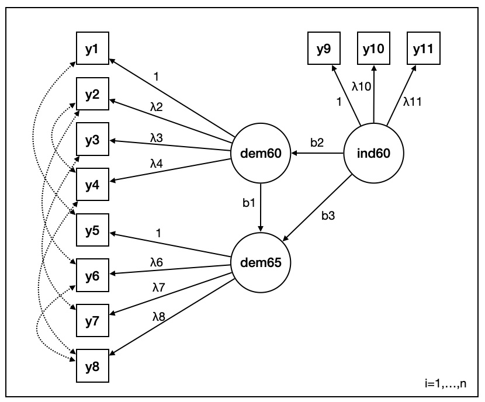

<!-- README.md is generated from README.Rmd. Please edit that file -->

# `{INLAvaan}`

<!-- badges: start -->

[](https://lifecycle.r-lib.org/articles/stages.html#experimental)
<!-- badges: end -->

Bayesian structural equation modelling with INLA.

## First impression

The quintessential example of a structural equation model using Bollen’s
(1989) political democracy data. This set includes data from 75
developing countries each assessed on four measures of democracy
measured twice (1960 and 1965), and three measures of industrialization
measured once (1960). The following model is theorised.



We can fit this using `{INLAvaan}` as follows:

``` r
myModel <- "
  # latent variables
  dem60 =~ y1 + y2 + y3 + y4
  dem65 =~ y5 + y6 + y7 + y8
  ind60 =~ x1 + x2 + x3

  # latent regressions
  dem60 ~ ind60
  dem65 ~ ind60 + dem60

  # residual covariances
  y1 ~~ y5
  y2 ~~ y4 + y6
  y3 ~~ y7
  y4 ~~ y8
  y6 ~~ y8
"

fit <- inlavaan(model = myModel, data = PoliticalDemocracy)
#> ⠙ Diving into the probability pool... 1 done (53/s) | 20ms⠹ Diving into the probability pool... 2 done (55/s) | 37ms⠸ Diving into the probability pool... 3 done (52/s) | 58ms⠼ Diving into the probability pool... 4 done (42/s) | 97msThe legacy packages maptools, rgdal, and rgeos, underpinning the sp package,
#> which was just loaded, were retired in October 2023.
#> Please refer to R-spatial evolution reports for details, especially
#> https://r-spatial.org/r/2023/05/15/evolution4.html.
#> It may be desirable to make the sf package available;
#> package maintainers should consider adding sf to Suggests:.
#> ⠼ Diving into the probability pool... 4 done (0.47/s) | 8.6s
```

The parameter estimates can be viewed using the summary method:

``` r
summary(fit)
#> 
#> ── INLAvaan fit ────────────────────────────────────────────────────────────────
#> • Total time taken: 7.7s
#> • Number of observations: 75
#> • Number of model parameters: 42
#> • Marginal log-likelihood: -1778.837
#> 
#> ── Latent variables ──
#> 
#>                     Post. Mean   Post. SD   2.5% CI   97.5% CI
#> dem60   =~   y1          1.000                                
#>         =~   y2          1.129      0.151     0.833      1.426
#>         =~   y3          1.027      0.130     0.772      1.284
#>         =~   y4          1.103      0.123     0.861      1.346
#> dem65   =~   y5          1.000                                
#>         =~   y6          1.000      0.316     0.377      1.623
#>         =~   y7          1.000      0.316     0.377      1.623
#>         =~   y8          1.000      0.316     0.378      1.623
#> ind60   =~   x1          1.000                                
#>         =~   x2          2.083      0.097     1.893      2.274
#>         =~   x3          1.571      0.126     1.324      1.821
#> ── Covariances ──
#>                  Post. Mean   Post. SD   2.5% CI   97.5% CI
#> y1   ~~   y5          0.000                                
#> y2   ~~   y4          2.663                                
#>      ~~   y6          2.636                                
#> y3   ~~   y7          0.000                                
#> y4   ~~   y8          0.000                                
#> y6   ~~   y8          2.012
#> ── Regressions ──
#>                       Post. Mean   Post. SD   2.5% CI   97.5% CI
#> dem60   ~    ind60         0.960      0.221     0.524      1.393
#> dem65   ~    ind60         1.387      0.211     0.972      1.802
#>         ~    dem60         0.941      0.084     0.775      1.108
#> ── Intercepts ──
#>                    Post. Mean   Post. SD   2.5% CI   97.5% CI
#>           .y1           5.054      0.091     4.875      5.233
#>           .y2           4.791      0.173     4.453      5.130
#>           .y3           3.557      0.155     3.253      3.861
#>           .y4           5.462      0.294     4.885      6.039
#>           .y5           4.253      0.449     3.372      5.133
#>           .y6           6.560      0.366     5.842      7.278
#>           .y7           4.449      0.360     3.743      5.155
#>           .y8           5.133      0.305     4.536      5.731
#>           .x1           2.975      0.367     2.256      3.694
#>           .x2           6.193      0.341     5.524      6.862
#>           .x3           4.040      0.343     3.368      4.713
#>           dem60         0.000                                
#>           dem65         0.000                                
#>           ind60         0.000
#> ── Variances ──
#>                    Post. Mean   Post. SD   2.5% CI   97.5% CI
#>           .y1           1.558                                
#>           .y2           9.303                                
#>           .y3           4.877                                
#>           .y4           3.917                                
#>           .y5           2.056                                
#>           .y6           5.510                                
#>           .y7           3.768                                
#>           .y8           4.138                                
#>           .x1           0.112                                
#>           .x2           0.000                                
#>           .x3           0.548                                
#>           dem60         4.646      0.981     3.029      4.538
#>           dem65         0.000      0.000     0.000      0.000
#>           ind60         0.524      0.098     0.358      0.514
```
