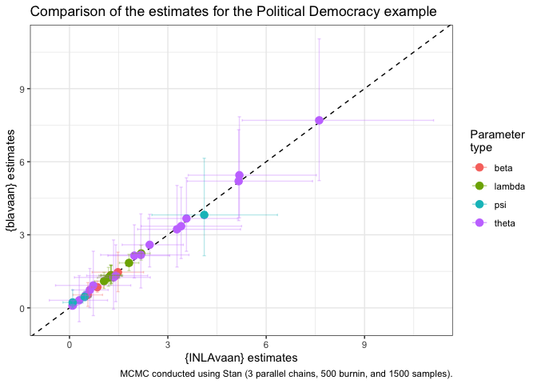

<!-- README.md is generated from README.Rmd. Please edit that file -->

## `{INLAvaan}`

<!-- badges: start -->

[](https://lifecycle.r-lib.org/articles/stages.html#experimental)
[](https://github.com/haziqj/INLAvaan/actions/workflows/R-CMD-check.yaml)
[](https://app.codecov.io/gh/haziqj/INLAvaan?branch=main)
<!-- badges: end -->

> Bayesian structural equation modelling with INLA.

## Installation

You need a working installation of [INLA](https://www.r-inla.org).
Following the official instructions given
[here](https://www.r-inla.org/download-install), run this command in R:

``` r
install.packages(
  "INLA",
  repos = c(getOption("repos"), 
            INLA = "https://inla.r-inla-download.org/R/stable"), 
  dep = TRUE
)
```

Then, you can install the development version of `{INLAvaan}` from
GitHub with:

``` r
# install.packages("pak")
pak::pak("haziqj/INLAvaan")
```

## First impressions

A simple two-factor SEM with six observed, correlated Gaussian
variables. Let $i=1,\dots,n$ index the subjects. Conditional on the
values of $k$-th latent variable $\eta_{ki}$ for subject $i$, the six
measurement model equations are

<br>
<p align="center">


</p>

<br> <!-- $$ --> <!-- \begin{gathered} -->
<!-- y_{1i} = \lambda_{11} \eta_{1i} \phantom{+ \lambda_{1} \eta_{2i}} + \epsilon_{1i}, \quad \epsilon_{1i} \sim N(0, \theta_{11}) \\ -->
<!-- y_{2i} = \lambda_{21} \eta_{1i} \phantom{+ \lambda_{1} \eta_{2i}} + \epsilon_{2i}, \quad \epsilon_{2i} \sim N(0, \theta_{22}) \\ -->
<!-- y_{3i} = \lambda_{31} \eta_{1i} \phantom{+ \lambda_{1} \eta_{2i}}  + \epsilon_{3i}, \quad \epsilon_{3i} \sim N(0, \theta_{33}) \\ -->
<!-- y_{4i} = \phantom{\lambda_{11} \eta_{2i} +}  \lambda_{42} \eta_{2i} + \epsilon_{4i}, \quad \epsilon_{4i} \sim N(0, \theta_{44}) \\ -->
<!-- y_{5i} = \phantom{\lambda_{11} \eta_{2i} +} \lambda_{52} \eta_{2i} + \epsilon_{5i}, \quad \epsilon_{5i} \sim N(0, \theta_{55}) \\ -->
<!-- y_{6i} = \phantom{\lambda_{11} \eta_{2i} +} \lambda_{62} \eta_{2i} + \epsilon_{6i}, \quad \epsilon_{6i} \sim N(0, \theta_{66}) \\ -->
<!-- \\ -->
<!-- \operatorname{Cov}(\epsilon_{1i},\epsilon_{4i}) = \theta_{14} \\ -->
<!-- \operatorname{Cov}(\epsilon_{2i},\epsilon_{5i}) = \theta_{25} \\ -->
<!-- \operatorname{Cov}(\epsilon_{3i},\epsilon_{6i}) = \theta_{36} \\ -->
<!-- \end{gathered} --> <!-- $$ -->

For identifiability, we set $\lambda_{11} = \lambda_{42} = 1$. The
structural part of the model are given by these equations:

<br>
<p align="center">


</p>

<br> <!-- $$ --> <!-- \begin{gathered} -->
<!-- \eta_{1i} = \phantom{b\eta_{1i} +} \zeta_{1i}, \quad \zeta_{1i} \sim N(0, \psi_1) \\ -->
<!-- \eta_{2i} = b\eta_{1i} + \zeta_{2i}, \quad \zeta_{2i} \sim N(0, \psi_2) -->
<!-- \end{gathered} --> <!-- $$ -->

Graphically, we can plot the following path diagram.


``` r
# {lavaan} textual model
mod <- "
  # Measurement model
  eta1 =~ y1 + y2 + y3
  eta2 =~ y4 + y5 + y6
  
  # Factor regression
  eta2 ~ eta1
  
  # Covariances
  y1 ~~ y4
  y2 ~~ y5
  y3 ~~ y6
"

# Data set
dplyr::glimpse(dat)
#> Rows: 10,000
#> Columns: 6
#> $ y1 <dbl> 1.405644714, 0.551689304, -0.532712991, 1.424944117, -2.101411677, …
#> $ y2 <dbl> 1.15303449, -0.33405112, -1.21701461, 2.12863514, -2.80239978, -0.0…
#> $ y3 <dbl> 1.96505806, 0.62220629, -1.36392759, 1.72270082, -3.15971089, 0.204…
#> $ y4 <dbl> 1.25682819, 0.09983187, -0.19718917, 1.07029367, -1.08366061, -1.15…
#> $ y5 <dbl> 0.5850486, 0.2067220, -0.3399342, 1.5394410, -1.3430185, -2.4372935…
#> $ y6 <dbl> 0.7731751, 0.1696966, -0.5939405, 1.6651219, -0.7237086, -2.3924036…
```

To fit this model using `{INLAvaan}`, use the familiar `{lavaan}`
syntax. The `i` in `isem` stands for `INLA` (following the convention of
`bsem` for `{blavaan}`).

``` r
library(INLAvaan)
fit <- isem(model = mod, data = dat)
summary(fit)
```

    #> INLAvaan 0.1.0.9013 ended normally after 2 minutes 59 seconds
    #> 
    #>   Estimator                                      BAYES
    #>   Optimization method                             INLA
    #>   Number of model parameters                        16
    #> 
    #>   Number of observations                         10000
    #> 
    #>   Statistic                                 MargLogLik         PPP
    #>   Value                                     -52127.763          NA
    #> 
    #> Parameter Estimates:
    #> 
    #> 
    #> Latent Variables:
    #>                    Estimate  Post.SD pi.lower pi.upper    Prior       
    #>   eta1 =~                                                             
    #>     y1                1.000                                           
    #>     y2                1.201    0.004    1.192    1.209    normal(0,10)
    #>     y3                1.501    0.005    1.491    1.511    normal(0,10)
    #>   eta2 =~                                                             
    #>     y4                1.000                                           
    #>     y5                1.204    0.004    1.195    1.212    normal(0,10)
    #>     y6                1.507    0.005    1.497    1.516    normal(0,10)
    #> 
    #> Regressions:
    #>                    Estimate  Post.SD pi.lower pi.upper    Prior       
    #>   eta2 ~                                                              
    #>     eta1              0.305    0.010    0.285    0.324    normal(0,10)
    #> 
    #> Covariances:
    #>                    Estimate  Post.SD pi.lower pi.upper    Prior       
    #>  .y1 ~~                                                               
    #>    .y4                0.049    0.001    0.046    0.051       beta(1,1)
    #>  .y2 ~~                                                               
    #>    .y5                0.049    0.001    0.047    0.052       beta(1,1)
    #>  .y3 ~~                                                               
    #>    .y6                0.053    0.002    0.049    0.057       beta(1,1)
    #> 
    #> Variances:
    #>                    Estimate  Post.SD pi.lower pi.upper    Prior       
    #>    .y1                0.099    0.002    0.096    0.103 gamma(1,.5)[sd]
    #>    .y2                0.102    0.002    0.098    0.107 gamma(1,.5)[sd]
    #>    .y3                0.101    0.003    0.095    0.107 gamma(1,.5)[sd]
    #>    .y4                0.099    0.002    0.095    0.103 gamma(1,.5)[sd]
    #>    .y5                0.104    0.002    0.099    0.108 gamma(1,.5)[sd]
    #>    .y6                0.100    0.003    0.094    0.106 gamma(1,.5)[sd]
    #>     eta1              1.004    0.015    0.974    1.034 gamma(1,.5)[sd]
    #>    .eta2              0.980    0.015    0.951    1.009 gamma(1,.5)[sd]

Compare model fit to `{lavaan}` and `{blavaan}` (MCMC sampling using
Stan on a single thread obtaining 1000 burnin and 2000 samples, as well
as variational Bayes):


    #> 
    #> ── Compare timing (seconds) ──
    #> 
    #>   INLAvaan     lavaan    blavaan blavaan_vb 
    #>     179.30       0.11     293.61     404.90

A little experiment to see how sample size affects run time:


## Political democracy data

The quintessential example for SEM is this model from Bollen (1989) to
fit a political democracy data set. Eleven observed variables are
hypothesized to arise from three latent variables. This set includes
data from 75 developing countries each assessed on four measures of
democracy measured twice (1960 and 1965), and three measures of
industrialization measured once (1960). The eleven observed variables
are:

- `y1`: Freedom of the press, 1960
- `y2`: Freedom of political opposition, 1960
- `y3`: Fairness of elections, 1960
- `y4`: Effectiveness of elected legislature, 1960
- `y5`: Freedom of the press, 1965
- `y6`: Freedom of political opposition, 1965
- `y7`: Fairness of elections, 1965
- `y8`: Effectiveness of elected legislature, 1965
- `y9`: GNP per capita, 1960
- `y10`: Energy consumption per capita, 1960
- `y11`: Percentage of labor force in industry, 1960

Variables `y1-y4` and `y5-y8` are typically used as indicators of the
latent trait of “political democracy” in 1960 and 1965 respectively,
whereas `y9-y11` are used as indicators of industrialization (1960). It
is theorised that industrialisation influences political democracy, and
that political democracy in 1960 influences political democracy in 1965.
Since the items measure the same latent trait at two time points, there
is an assumption that the residuals of these items will be correlated
with each other. The model is depicted in the figure below.


The corresponding model in `{lavaan}` syntax is:

``` r
mod <- "
  # latent variables
  dem60 =~ y1 + y2 + y3 + y4
  dem65 =~ y5 + y6 + y7 + y8
  ind60 =~ x1 + x2 + x3

  # latent regressions
  dem60 ~ ind60
  dem65 ~ ind60 + dem60

  # residual covariances
  y1 ~~ y5
  y2 ~~ y4 + y6
  y3 ~~ y7
  y4 ~~ y8
  y6 ~~ y8
"
```

We will fit this model using `{INLAvaan}` and compare the results with
`{blavaan}`.

``` r
data("PoliticalDemocracy", package = "lavaan")
poldemfit <- isem(model = mod, data = PoliticalDemocracy)
summary(poldemfit)
```

    #> INLAvaan 0.1.0.9013 ended normally after 28 seconds
    #> 
    #>   Estimator                                      BAYES
    #>   Optimization method                             INLA
    #>   Number of model parameters                        31
    #> 
    #>   Number of observations                            75
    #> 
    #>   Statistic                                 MargLogLik         PPP
    #>   Value                                      -1607.438          NA
    #> 
    #> Parameter Estimates:
    #> 
    #> 
    #> Latent Variables:
    #>                    Estimate  Post.SD pi.lower pi.upper    Prior       
    #>   dem60 =~                                                            
    #>     y1                1.000                                           
    #>     y2                1.257    0.184    0.896    1.621    normal(0,10)
    #>     y3                1.055    0.148    0.764    1.348    normal(0,10)
    #>     y4                1.261    0.150    0.967    1.556    normal(0,10)
    #>   dem65 =~                                                            
    #>     y5                1.000                                           
    #>     y6                1.187    0.171    0.850    1.525    normal(0,10)
    #>     y7                1.280    0.161    0.962    1.598    normal(0,10)
    #>     y8                1.266    0.164    0.944    1.589    normal(0,10)
    #>   ind60 =~                                                            
    #>     x1                1.000                                           
    #>     x2                2.184    0.137    1.923    2.463    normal(0,10)
    #>     x3                1.817    0.151    1.521    2.117    normal(0,10)
    #> 
    #> Regressions:
    #>                    Estimate  Post.SD pi.lower pi.upper    Prior       
    #>   dem60 ~                                                             
    #>     ind60             1.478    0.397    0.697    2.259    normal(0,10)
    #>   dem65 ~                                                             
    #>     ind60             0.559    0.229    0.105    1.008    normal(0,10)
    #>     dem60             0.849    0.097    0.664    1.045    normal(0,10)
    #> 
    #> Covariances:
    #>                    Estimate  Post.SD pi.lower pi.upper    Prior       
    #>  .y1 ~~                                                               
    #>    .y5                0.589    0.316   -0.075    1.123       beta(1,1)
    #>  .y2 ~~                                                               
    #>    .y4                1.363    0.629    0.239    2.693       beta(1,1)
    #>    .y6                2.276    0.689    0.852    3.770       beta(1,1)
    #>  .y3 ~~                                                               
    #>    .y7                0.756    0.570   -0.488    1.956       beta(1,1)
    #>  .y4 ~~                                                               
    #>    .y8                0.357    0.442   -0.394    1.246       beta(1,1)
    #>  .y6 ~~                                                               
    #>    .y8                1.470    0.492    0.621    2.459       beta(1,1)
    #> 
    #> Variances:
    #>                    Estimate  Post.SD pi.lower pi.upper    Prior       
    #>    .y1                1.998    0.493    1.191    3.090 gamma(1,.5)[sd]
    #>    .y2                7.586    1.397    5.391   10.466 gamma(1,.5)[sd]
    #>    .y3                5.288    1.055    3.648    7.635 gamma(1,.5)[sd]
    #>    .y4                3.329    0.844    1.978    5.199 gamma(1,.5)[sd]
    #>    .y5                2.405    0.532    1.616    3.696 gamma(1,.5)[sd]
    #>    .y6                5.184    0.957    3.638    7.433 gamma(1,.5)[sd]
    #>    .y7                3.543    0.773    2.376    5.212 gamma(1,.5)[sd]
    #>    .y8                3.507    0.788    2.238    5.185 gamma(1,.5)[sd]
    #>    .x1                0.090    0.022    0.056    0.136 gamma(1,.5)[sd]
    #>    .x2                0.110    0.058    0.026    0.233 gamma(1,.5)[sd]
    #>    .x3                0.474    0.089    0.328    0.658 gamma(1,.5)[sd]
    #>    .dem60             4.110    0.979    2.515    6.344 gamma(1,.5)[sd]
    #>    .dem65             0.098    0.181   -0.044    0.466 gamma(1,.5)[sd]
    #>     ind60             0.463    0.090    0.311    0.662 gamma(1,.5)[sd]



    #> 
    #> ── Compare timing (seconds) ──
    #> 
    #> INLAvaan  blavaan 
    #>    28.33    68.83

## Citation

To cite package `{INLAvaan}` in publications use:

> Jamil, H (2025). *INLAvaan: Bayesian structural equation modelling
> with INLA *. <https://haziqj.github.io/inlavaan/>.

A BibTeX entry for LaTeX users is:

``` bibtex
@Manual{,
    title = {INLAvaan: Bayesian structural equation modelling with INLA},
    author = {Haziq Jamil},
    year = {2025},
    url = {https://haziqj.ml/inlavaan/},
  }
```

## License

The `{INLAvaan}` package is licensed under the
[GPL-3](https://www.gnu.org/licenses/gpl-3.0.en.html).

``` plaintext
INLAvaan: Bayesian structural equation modelling with INLA
Copyright (C) 2025- Haziq Jamil

This program is free software: you can redistribute it and/or modify
it under the terms of the GNU General Public License as published by
the Free Software Foundation, either version 3 of the License, or
(at your option) any later version.

This program is distributed in the hope that it will be useful,
but WITHOUT ANY WARRANTY; without even the implied warranty of
MERCHANTABILITY or FITNESS FOR A PARTICULAR PURPOSE.  See the
GNU General Public License for more details.

You should have received a copy of the GNU General Public License
along with this program.  If not, see <http://www.gnu.org/licenses/>.
```

By using this package, you agree to comply with both licenses: the GPL-3
license for the software and the CC BY 4.0 license for the data.

## Outro

``` r
sessioninfo::session_info(info = "all")
#> Warning in system2("quarto", "-V", stdout = TRUE, env = paste0("TMPDIR=", :
#> running command '"quarto"
#> TMPDIR=C:/Users/Alvin/AppData/Local/Temp/RtmpUzkzgh/file5fdc51da419f -V' had
#> status 1
#> ─ Session info ───────────────────────────────────────────────────────────────
#>  setting  value
#>  version  R version 4.5.0 (2025-04-11 ucrt)
#>  os       Windows 11 x64 (build 26100)
#>  system   x86_64, mingw32
#>  ui       RTerm
#>  language (EN)
#>  collate  English_United Kingdom.utf8
#>  ctype    English_United Kingdom.utf8
#>  tz       Asia/Riyadh
#>  date     2025-09-07
#>  pandoc   3.4 @ C:/Program Files/RStudio/resources/app/bin/quarto/bin/tools/ (via rmarkdown)
#>  quarto   NA @ C:\\PROGRA~1\\RStudio\\RESOUR~1\\app\\bin\\quarto\\bin\\quarto.exe
#> 
#> ─ Packages ───────────────────────────────────────────────────────────────────
#>  ! package      * version    date (UTC) lib source
#>    abind          1.4-8      2024-09-12 [1] CRAN (R 4.5.0)
#>    arm            1.14-4     2024-04-01 [1] CRAN (R 4.5.1)
#>    backports      1.5.0      2024-05-23 [1] CRAN (R 4.5.0)
#>    base64enc      0.1-3      2015-07-28 [1] CRAN (R 4.5.0)
#>    bayesplot      1.14.0     2025-08-31 [1] CRAN (R 4.5.1)
#>    blavaan      * 0.5-8      2025-01-08 [1] CRAN (R 4.5.1)
#>    boot           1.3-31     2024-08-28 [2] CRAN (R 4.5.0)
#>    carData        3.0-5      2022-01-06 [1] CRAN (R 4.5.1)
#>    checkmate      2.3.2      2024-07-29 [1] CRAN (R 4.5.1)
#>    class          7.3-23     2025-01-01 [2] CRAN (R 4.5.0)
#>    classInt       0.4-11     2025-01-08 [1] CRAN (R 4.5.0)
#>    cli            3.6.5      2025-04-23 [1] CRAN (R 4.5.0)
#>    clue           0.3-66     2024-11-13 [1] CRAN (R 4.5.1)
#>    cluster        2.1.8.1    2025-03-12 [2] CRAN (R 4.5.0)
#>    coda           0.19-4.1   2024-01-31 [1] CRAN (R 4.5.1)
#>    codetools      0.2-20     2024-03-31 [2] CRAN (R 4.5.0)
#>    colorspace     2.1-1      2024-07-26 [1] CRAN (R 4.4.1)
#>    CompQuadForm   1.4.4      2025-07-13 [1] CRAN (R 4.5.1)
#>    corpcor        1.6.10     2021-09-16 [1] CRAN (R 4.5.0)
#>    curl           6.2.2      2025-03-24 [1] CRAN (R 4.5.0)
#>    data.table     1.17.0     2025-02-22 [1] CRAN (R 4.5.0)
#>    DBI            1.2.3      2024-06-02 [1] CRAN (R 4.4.1)
#>    digest         0.6.37     2024-08-19 [1] CRAN (R 4.5.0)
#>    dplyr        * 1.1.4      2023-11-17 [1] CRAN (R 4.4.1)
#>    e1071          1.7-16     2024-09-16 [1] CRAN (R 4.4.1)
#>    evaluate       1.0.3      2025-01-10 [1] CRAN (R 4.5.0)
#>    farver         2.1.2      2024-05-13 [1] CRAN (R 4.4.1)
#>    fastmap        1.2.0      2024-05-15 [1] CRAN (R 4.5.0)
#>    fBasics        4041.97    2024-08-19 [1] CRAN (R 4.5.1)
#>    fdrtool        1.2.18     2024-08-20 [1] CRAN (R 4.5.0)
#>    fmesher        0.5.0      2025-07-07 [1] CRAN (R 4.5.1)
#>    forcats      * 1.0.0      2023-01-29 [1] CRAN (R 4.4.1)
#>    foreign        0.8-90     2025-03-31 [2] CRAN (R 4.5.0)
#>    Formula        1.2-5      2023-02-24 [1] CRAN (R 4.5.0)
#>    future         1.49.0     2025-05-09 [1] CRAN (R 4.5.0)
#>    future.apply   1.20.0     2025-06-06 [1] CRAN (R 4.5.1)
#>    generics       0.1.4      2025-05-09 [1] CRAN (R 4.5.0)
#>    ggplot2      * 3.5.2      2025-04-09 [1] CRAN (R 4.5.0)
#>    glasso         1.11       2019-10-01 [1] CRAN (R 4.5.0)
#>    globals        0.18.0     2025-05-08 [1] CRAN (R 4.5.0)
#>    glue           1.8.0      2024-09-30 [1] CRAN (R 4.5.0)
#>    gridExtra      2.3        2017-09-09 [1] CRAN (R 4.5.0)
#>    gt             1.0.0      2025-04-05 [1] CRAN (R 4.5.0)
#>    gtable         0.3.6      2024-10-25 [1] CRAN (R 4.4.2)
#>    gtools         3.9.5      2023-11-20 [1] CRAN (R 4.5.1)
#>    Hmisc          5.2-3      2025-03-16 [1] CRAN (R 4.5.1)
#>    hms            1.1.3      2023-03-21 [1] CRAN (R 4.4.1)
#>    htmlTable      2.4.3      2024-07-21 [1] CRAN (R 4.5.1)
#>    htmltools      0.5.8.1    2024-04-04 [1] CRAN (R 4.5.0)
#>    htmlwidgets    1.6.4      2023-12-06 [1] CRAN (R 4.4.1)
#>    igraph         2.1.4      2025-01-23 [1] CRAN (R 4.5.1)
#>    INLA           25.06.07   2025-06-11 [1] local
#>    INLAvaan     * 0.1.0.9013 2025-09-07 [1] Github (haziqj/INLAvaan@fdc71fc)
#>    inline         0.3.21     2025-01-09 [1] CRAN (R 4.5.1)
#>    jpeg           0.1-11     2025-03-21 [1] CRAN (R 4.5.0)
#>    jsonlite       2.0.0      2025-03-27 [1] CRAN (R 4.5.0)
#>    KernSmooth     2.23-26    2025-01-01 [2] CRAN (R 4.5.0)
#>    knitr          1.50       2025-03-16 [1] CRAN (R 4.5.0)
#>    kutils         1.73       2023-09-17 [1] CRAN (R 4.5.1)
#>    labeling       0.4.3      2023-08-29 [1] CRAN (R 4.4.0)
#>    lattice        0.22-6     2024-03-20 [2] CRAN (R 4.5.0)
#>    lavaan       * 0.6-19     2024-09-26 [1] CRAN (R 4.5.1)
#>    lifecycle      1.0.4      2023-11-07 [1] CRAN (R 4.5.0)
#>    lisrelToR      0.3        2024-02-07 [1] CRAN (R 4.5.0)
#>    listenv        0.9.1      2024-01-29 [1] CRAN (R 4.4.3)
#>    lme4           1.1-37     2025-03-26 [1] CRAN (R 4.5.1)
#>    loo            2.8.0      2024-07-03 [1] CRAN (R 4.5.1)
#>    lubridate    * 1.9.4      2024-12-08 [1] CRAN (R 4.5.0)
#>    magrittr       2.0.3      2022-03-30 [1] CRAN (R 4.4.1)
#>    MASS           7.3-65     2025-02-28 [2] CRAN (R 4.5.0)
#>    Matrix         1.7-3      2025-03-11 [2] CRAN (R 4.5.0)
#>    matrixStats    1.5.0      2025-01-07 [1] CRAN (R 4.5.1)
#>    mgcv           1.9-1      2023-12-21 [2] CRAN (R 4.5.0)
#>    mi             1.1        2022-06-06 [1] CRAN (R 4.5.1)
#>    minqa          1.2.8      2024-08-17 [1] CRAN (R 4.5.1)
#>    mnormt         2.1.1      2022-09-26 [1] CRAN (R 4.5.0)
#>    modeest        2.4.0      2019-11-18 [1] CRAN (R 4.5.1)
#>    mvtnorm        1.3-3      2025-01-10 [1] CRAN (R 4.5.0)
#>    nlme           3.1-168    2025-03-31 [2] CRAN (R 4.5.0)
#>    nloptr         2.2.1      2025-03-17 [1] CRAN (R 4.5.1)
#>    nnet           7.3-20     2025-01-01 [2] CRAN (R 4.5.0)
#>    nonnest2       0.5-8      2024-08-28 [1] CRAN (R 4.5.1)
#>    OpenMx         2.22.7     2025-05-23 [1] CRAN (R 4.5.1)
#>    openxlsx       4.2.8      2025-01-25 [1] CRAN (R 4.5.1)
#>    parallelly     1.44.0     2025-05-07 [1] CRAN (R 4.5.0)
#>    pbapply        1.7-2      2023-06-27 [1] CRAN (R 4.5.1)
#>    pbivnorm       0.6.0      2015-01-23 [1] CRAN (R 4.5.0)
#>    pillar         1.10.2     2025-04-05 [1] CRAN (R 4.5.0)
#>    pkgbuild       1.4.7      2025-03-24 [1] CRAN (R 4.5.0)
#>    pkgconfig      2.0.3      2019-09-22 [1] CRAN (R 4.4.1)
#>    plyr           1.8.9      2023-10-02 [1] CRAN (R 4.4.1)
#>    png            0.1-8      2022-11-29 [1] CRAN (R 4.4.0)
#>    proxy          0.4-27     2022-06-09 [1] CRAN (R 4.4.1)
#>    psych          2.5.6      2025-06-23 [1] CRAN (R 4.5.1)
#>    purrr        * 1.0.4      2025-02-05 [1] CRAN (R 4.5.0)
#>    qgraph         1.9.8      2023-11-03 [1] CRAN (R 4.5.1)
#>    quadprog       1.5-8      2019-11-20 [1] CRAN (R 4.4.0)
#>    QuickJSR       1.8.0      2025-06-09 [1] CRAN (R 4.5.1)
#>    R6             2.6.1      2025-02-15 [1] CRAN (R 4.5.0)
#>    rbibutils      2.3        2024-10-04 [1] CRAN (R 4.5.1)
#>    RColorBrewer   1.1-3      2022-04-03 [1] CRAN (R 4.4.0)
#>    Rcpp         * 1.0.14     2025-01-12 [1] CRAN (R 4.5.0)
#>  D RcppParallel   5.1.10     2025-01-24 [1] CRAN (R 4.5.1)
#>    Rdpack         2.6.4      2025-04-09 [1] CRAN (R 4.5.1)
#>    readr        * 2.1.5      2024-01-10 [1] CRAN (R 4.4.1)
#>    reformulas     0.4.1      2025-04-30 [1] CRAN (R 4.5.1)
#>    reshape2       1.4.4      2020-04-09 [1] CRAN (R 4.5.1)
#>    rlang          1.1.6      2025-04-11 [1] CRAN (R 4.5.0)
#>    rmarkdown      2.29       2024-11-04 [1] CRAN (R 4.5.0)
#>    rmutil         1.1.10     2022-10-27 [1] CRAN (R 4.5.0)
#>    rockchalk      1.8.157    2022-08-06 [1] CRAN (R 4.5.1)
#>    rpart          4.1.24     2025-01-07 [2] CRAN (R 4.5.0)
#>    rstan          2.32.7     2025-03-10 [1] CRAN (R 4.5.1)
#>    rstantools     2.5.0      2025-09-01 [1] CRAN (R 4.5.1)
#>    rstudioapi     0.17.1     2024-10-22 [1] CRAN (R 4.4.2)
#>    sandwich       3.1-1      2024-09-15 [1] CRAN (R 4.5.1)
#>    scales         1.4.0      2025-04-24 [1] CRAN (R 4.5.0)
#>    sem            3.1-16     2024-08-28 [1] CRAN (R 4.5.1)
#>    semPlot      * 1.1.6      2022-08-10 [1] CRAN (R 4.5.1)
#>    semptools    * 0.3.2      2025-07-12 [1] CRAN (R 4.5.1)
#>    sessioninfo    1.2.3      2025-02-05 [1] CRAN (R 4.5.0)
#>    sf             1.0-20     2025-03-24 [1] CRAN (R 4.5.0)
#>    spatial        7.3-18     2025-01-01 [2] CRAN (R 4.5.0)
#>    stable         1.1.6      2022-03-02 [1] CRAN (R 4.5.0)
#>    stabledist     0.7-2      2024-08-17 [1] CRAN (R 4.5.1)
#>    StanHeaders    2.32.10    2024-07-15 [1] CRAN (R 4.5.1)
#>    statip         0.2.3      2019-11-17 [1] CRAN (R 4.5.1)
#>    stringi        1.8.7      2025-03-27 [1] CRAN (R 4.5.0)
#>    stringr      * 1.5.1      2023-11-14 [1] CRAN (R 4.4.1)
#>    tibble       * 3.2.1      2023-03-20 [1] CRAN (R 4.4.1)
#>    tidyr        * 1.3.1      2024-01-24 [1] CRAN (R 4.4.1)
#>    tidyselect     1.2.1      2024-03-11 [1] CRAN (R 4.4.1)
#>    tidyverse    * 2.0.0      2023-02-22 [1] CRAN (R 4.4.3)
#>    timechange     0.3.0      2024-01-18 [1] CRAN (R 4.4.1)
#>    timeDate       4041.110   2024-09-22 [1] CRAN (R 4.4.2)
#>    timeSeries     4041.111   2024-09-22 [1] CRAN (R 4.5.1)
#>    tmvnsim        1.0-2      2016-12-15 [1] CRAN (R 4.5.0)
#>    tzdb           0.5.0      2025-03-15 [1] CRAN (R 4.5.0)
#>    units          0.8-7      2025-03-11 [1] CRAN (R 4.5.0)
#>    V8             6.0.3      2025-03-26 [1] CRAN (R 4.5.0)
#>    vctrs          0.6.5      2023-12-01 [1] CRAN (R 4.4.1)
#>    withr          3.0.2      2024-10-28 [1] CRAN (R 4.4.2)
#>    xfun           0.52       2025-04-02 [1] CRAN (R 4.5.0)
#>    XML            3.99-0.18  2025-01-01 [1] CRAN (R 4.5.0)
#>    xml2           1.3.8      2025-03-14 [1] CRAN (R 4.5.0)
#>    xtable         1.8-4      2019-04-21 [1] CRAN (R 4.5.0)
#>    yaml           2.3.10     2024-07-26 [1] CRAN (R 4.5.0)
#>    zip            2.3.3      2025-05-13 [1] CRAN (R 4.5.0)
#>    zoo            1.8-14     2025-04-10 [1] CRAN (R 4.5.0)
#> 
#>  [1] C:/Users/Alvin/AppData/Local/R/win-library/4.5
#>  [2] C:/Program Files/R/R-4.5.0/library
#> 
#>  * ── Packages attached to the search path.
#>  D ── DLL MD5 mismatch, broken installation.
#> 
#> ─ External software ──────────────────────────────────────────────────────────
#>  setting        value
#>  cairo          1.18.2
#>  cairoFT
#>  pango
#>  png            1.6.47
#>  jpeg           9.6
#>  tiff           LIBTIFF, Version 4.7.0
#>  tcl            8.6.16
#>  curl           8.12.1
#>  zlib           1.3.1
#>  bzlib          1.0.8, 13-Jul-2019
#>  xz             5.6.4
#>  deflate        1.23
#>  PCRE           10.45 2025-02-05
#>  ICU            76.1
#>  TRE            TRE 0.8.0 R_fixes (BSD)
#>  iconv          win_iconv
#>  readline
#>  BLAS
#>  lapack
#>  lapack_version 3.12.1
#> 
#> ─ Python configuration ───────────────────────────────────────────────────────
#>  Python is not available
#> 
#> ──────────────────────────────────────────────────────────────────────────────
```
