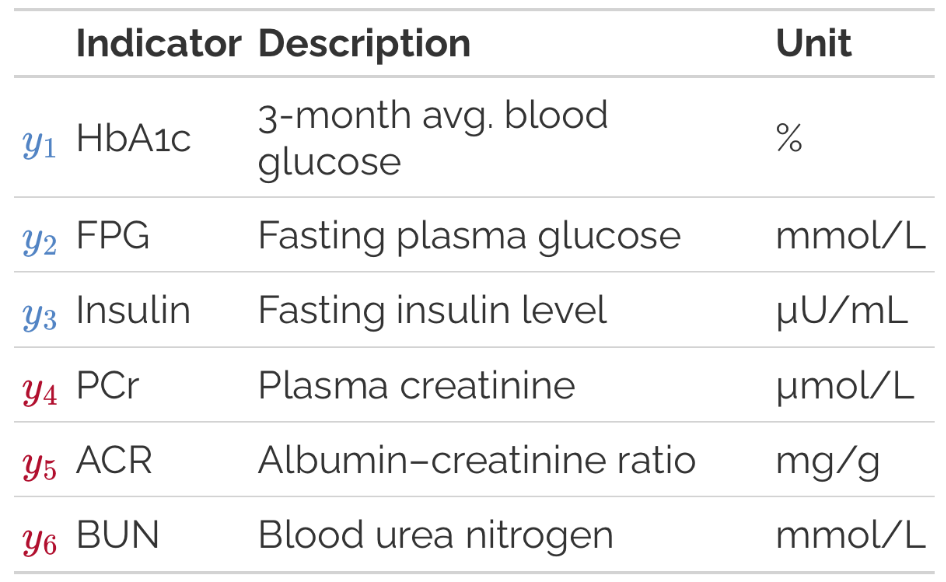
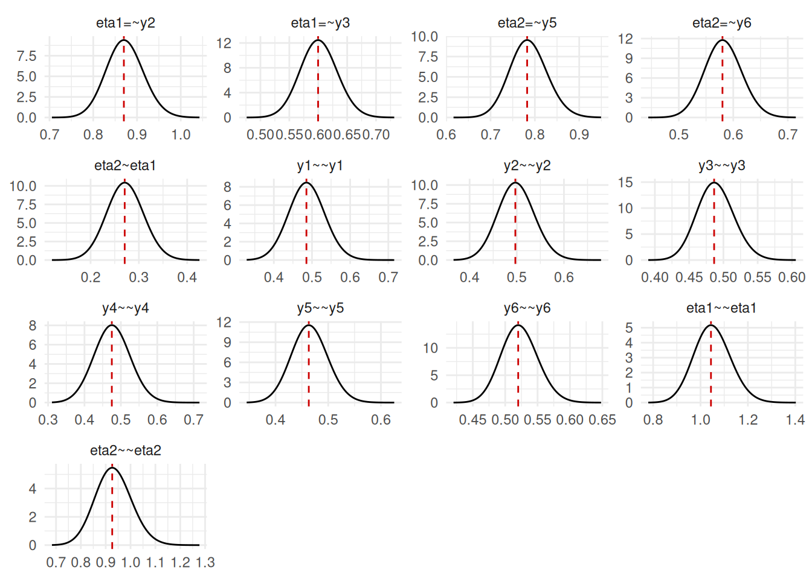

# Get started

## Introduction

SEMs are ubiquitous in the social sciences, psychology, ecology, and
other fields. The INLAvaan package provides a user-friendly interface
for fitting Bayesian SEMs using Integrated Nested Laplace Approximations
(INLA, [Rue, Martino, and Chopin 2009](#ref-rue2009approximate)). This
vignette will guide you through the basics of using INLAvaan to fit a
simple SEM. Before we begin make sure you have installed the INLAvaan
package from GitHub by running the commands below.

``` r
# Run this if you have not yet installed INLAvaan
install.packages("pak")
pak::pak("haziqj/INLAvaan")

# Load all libraries for this example
library(INLAvaan)
library(tidyverse)
library(lavaan)
```

## Motivating example

To motivate the use of SEMs, consider the introductory example in Song
and Lee ([2012](#ref-song2012basic)): *Does poorer glycemic control lead
to greater severity of kidney disease?* We observe three indicators of
glycemic control ($y_{1}$, $y_{2}$, $y_{3}$) and three indicators of
kidney disease severity ($y_{4}$, $y_{5}$, $y_{6}$).



Rather than fitting separate regression models for each indicator, SEM
allows us to model the relationship between the latent constructs
themselves, providing a clearer and more coherent representation of the
underlying processes. The hypothesised SEM is illustrated by the figure
below:


## Data

For the two-factor SEM we described above, it is easy to simulate some
data using the [lavaan](https://lavaan.ugent.be) package to do so. The
code is below:

``` r
pop_mod <- "
  eta1 =~ 1*y1 + 0.8*y2 + 0.6*y3
  eta2 =~ 1*y4 + 0.8*y5 + 0.6*y6
  eta2 ~ 0.3*eta1
  
  # Variances
  y1 ~~ 0.5*y1
  y2 ~~ 0.5*y2
  y3 ~~ 0.5*y3
  y4 ~~ 0.5*y4
  y5 ~~ 0.5*y5
  y6 ~~ 0.5*y6
  eta1 ~~ 1*eta1
  eta2 ~~ 1*eta2
"
set.seed(123)
dat <- lavaan::simulateData(pop_mod, sample.nobs = 1000)
glimpse(dat)
#> Rows: 1,000
#> Columns: 6
#> $ y1 <dbl> 1.1455803, 1.4947024, -1.2456403, -0.1086872, 1.0923138, -1.2380598…
#> $ y2 <dbl> 0.91137657, 0.72401293, -1.25960940, 0.76466115, 2.19814346, -2.548…
#> $ y3 <dbl> 0.921500064, -0.207810400, -0.485685595, -0.699851026, 1.305249049,…
#> $ y4 <dbl> -0.14207811, -0.37935984, -0.96230121, 0.38055295, -2.82223505, -1.…
#> $ y5 <dbl> 0.22887213, -0.49975381, -0.94007870, -1.22195516, -1.55233455, -0.…
#> $ y6 <dbl> -0.43559523, -0.21900233, -2.15905213, 0.48356421, 0.83857184, -1.0…
```

From the code above, note the true values of the parameters, including
the factor loadings $\Lambda$, regression coefficient $\beta$ between
the two latent variables, as well as the residual and latent variances
$\Theta$ and $\Psi$ respectively.

## Model fit

Now that we have simulated some data, we can fit the SEM using INLAvaan.
The model syntax is similar to that of
[lavaan](https://lavaan.ugent.be), making it easy to specify the model.
For further details on the model syntax, refer to the [lavaan
website](https://lavaan.ugent.be/tutorial/syntax1.html).
[INLAvaan](https://inlavaan.haziqj.ml/) provides mirror functions for
the main model fitting functions in [lavaan](https://lavaan.ugent.be):

- [`acfa()`](https://inlavaan.haziqj.ml/reference/acfa.md) mirrors
  [`lavaan::cfa()`](https://rdrr.io/pkg/lavaan/man/cfa.html) for
  confirmatory factor analysis; and
- [`asem()`](https://inlavaan.haziqj.ml/reference/asem.md) mirrors
  [`lavaan::sem()`](https://rdrr.io/pkg/lavaan/man/sem.html) for
  structural equation models;
- [`agrowth()`](https://inlavaan.haziqj.ml/reference/agrowth.md) mirrors
  [`lavaan::growth()`](https://rdrr.io/pkg/lavaan/man/growth.html) for
  latent growth curve models.

The code to fit the SEM model is below:

``` r
mod <- "
  eta1 =~ y1 + y2 + y3
  eta2 =~ y4 + y5 + y6
  eta2 ~ eta1
"
fit <- asem(mod, dat)
#> ℹ Finding posterior mode.
#> ✔ Finding posterior mode. [84ms]
#> 
#> ℹ Computing the Hessian.
#> ✔ Computing the Hessian. [90ms]
#> 
#> ℹ Performing VB correction.
#> ✔ VB correction; mean |δ| = 0.003σ. [126ms]
#> 
#> ⠙ Fitting skew normal to 0/13 marginals.
#> ✔ Fitting skew normal to 13/13 marginals. [354ms]
#> 
#> ⠙ Computing ppp and DIC.
#> ⠹ Computing ppp and DIC.
#> ✔ Computing ppp and DIC. [344ms]
#> 
```

[INLAvaan](https://inlavaan.haziqj.ml/) computes an approximation to the
posterior density by way of a Laplace approximation ([Tierney, Kass, and
Kadane 1989](#ref-tierney1989fully)). The joint mode and the Hessian
needs to be computed, which gives a Gaussian distribution for the joint
posterior of the parameters. The default method for optimisation is
[`stats::nlminb()`](https://rdrr.io/r/stats/nlminb.html), but other
optimisers can be used by specifying `optim_method = "ucminf"` for the
[ucminf](https://github.com/hdakpo/ucminf) package or
`optim_method = "optim"` to call the
[`stats::optim()`](https://rdrr.io/r/stats/optim.html) function with
method `"BFGS"`.

From this, marginal posterior distributions for each parameter can be
obtained by one of several ways, including 1) Skew normal fitting
(`marginal_method = "skewnorm"`, the default method, see [Chiuchiolo,
Van Niekerk, and Rue 2023](#ref-chiuchiolo2023joint)); 2) Two-piece
asymmetric Gaussian fitting (`marginal_method = "asymgaus"`, see
[Martins et al. 2013](#ref-martins2013bayesian)); 3) Direct
marginalisation of the joint Gaussian posterior
(`marginal_method = "marggaus"`); and 4) Sampling from the joint
Gaussian posterior (`marginal_method = "sampling"`).

Once the marginal posterior distributions have been obtained, we can
further use these to compute any derived quantities of interest via
copula sampling. The posterior predictive p-values ([Gelman, Meng, and
Stern 1996](#ref-gelman1996posterior)) and Deviance Information
Criterion (DIC, [Spiegelhalter et al.
2002](#ref-spiegelhalter2002bayesian)) are computed this way. Often, the
posterior sampling takes longer than the model fitting itself, so the
number of samples can be controlled via the `nsamp` argument (default is
`nsamp = 1000`) or can be skipped altoghether (`test = "none"`).

## Methods

The resulting object is of class `INLAvaan`, a subclass of `lavaan`
objects.

``` r
str(fit, 1)
#> Formal class 'INLAvaan' [package "INLAvaan"] with 21 slots
fit
#> INLAvaan 0.2.2 ended normally after 62 iterations
#> 
#>   Estimator                                      BAYES
#>   Optimization method                           NLMINB
#>   Number of model parameters                        13
#> 
#>   Number of observations                          1000
#> 
#> Model Test (User Model):
#> 
#>    Marginal log-likelihood                   -8068.939 
#>    PPP (Chi-square)                              0.110
```

As a result, most of the methods that work for `lavaan` objects will
also work for `INLAvaan` objects. The most common ones are probably
[`coef()`](https://rdrr.io/r/stats/coef.html) and
[`summary()`](https://rdrr.io/r/base/summary.html).

``` r
# Inspect coefficients
coef(fit)
#>   eta1=~y2   eta1=~y3   eta2=~y5   eta2=~y6  eta2~eta1     y1~~y1     y2~~y2 
#>      0.873      0.602      0.786      0.583      0.273      0.484      0.498 
#>     y3~~y3     y4~~y4     y5~~y5     y6~~y6 eta1~~eta1 eta2~~eta2 
#>      0.489      0.472      0.464      0.522      1.048      0.930

# Summary of results
summary(fit)
#> INLAvaan 0.2.2 ended normally after 62 iterations
#> 
#>   Estimator                                      BAYES
#>   Optimization method                           NLMINB
#>   Number of model parameters                        13
#> 
#>   Number of observations                          1000
#> 
#> Model Test (User Model):
#> 
#>    Marginal log-likelihood                   -8068.939 
#>    PPP (Chi-square)                              0.110 
#> 
#> Information Criteria:
#> 
#>    Deviance (DIC)                            16064.870 
#>    Effective parameters (pD)                    29.514 
#> 
#> Parameter Estimates:
#> 
#>    Marginalisation method                     SKEWNORM
#>    VB correction                                  TRUE
#> 
#> Latent Variables:
#>                    Estimate       SD     2.5%    97.5%     NMAD    Prior       
#>   eta1 =~                                                                      
#>     y1                1.000                                                    
#>     y2                0.873    0.043    0.791    0.959    0.006    normal(0,10)
#>     y3                0.602    0.032    0.540    0.666    0.003    normal(0,10)
#>   eta2 =~                                                                      
#>     y4                1.000                                                    
#>     y5                0.786    0.042    0.706    0.872    0.009    normal(0,10)
#>     y6                0.583    0.034    0.517    0.651    0.003    normal(0,10)
#> 
#> Regressions:
#>                    Estimate       SD     2.5%    97.5%     NMAD    Prior       
#>   eta2 ~                                                                       
#>     eta1              0.273    0.038    0.198    0.348    0.001    normal(0,10)
#> 
#> Variances:
#>                    Estimate       SD     2.5%    97.5%     NMAD    Prior       
#>    .y1                0.484    0.047    0.692    0.392    0.007 gamma(1,.5)[sd]
#>    .y2                0.498    0.039    0.575    0.423    0.003 gamma(1,.5)[sd]
#>    .y3                0.489    0.027    0.543    0.438    0.001 gamma(1,.5)[sd]
#>    .y4                0.472    0.050    0.705    0.374    0.007 gamma(1,.5)[sd]
#>    .y5                0.464    0.035    0.533    0.397    0.003 gamma(1,.5)[sd]
#>    .y6                0.522    0.028    0.580    0.469    0.001 gamma(1,.5)[sd]
#>     eta1              1.048    0.077    1.205    0.902    0.003 gamma(1,.5)[sd]
#>    .eta2              0.930    0.073    1.079    0.793    0.004 gamma(1,.5)[sd]
```

It’s possible to request posterior medians and modes in the summary
output by specifying `postmedian = TRUE` or `postmode = TRUE` in the
[`summary()`](https://rdrr.io/r/base/summary.html) function.

### Predictions

Predicted values for the latent variables can be obtained using the
[`predict()`](https://rdrr.io/r/stats/predict.html) function. This is
done by sampling from the posterior distributions of the latent
variables given the observed data. In the future, this function will
also allow for out-of-sample predictions and also to retrieve
predictions for observed variables.

``` r
eta_preds <- predict(fit, nsamp = 100)
#> Sampling latent variables ■■■■■                             13% | ETA: 18s
#> Sampling latent variables ■■■■■■■■■                         27% | ETA: 15s
#> Sampling latent variables ■■■■■■■■■■■■■■                    43% | ETA: 12s
#> Sampling latent variables ■■■■■■■■■■■■■■■■■■■               59% | ETA:  8s
#> Sampling latent variables ■■■■■■■■■■■■■■■■■■■■■■■           75% | ETA:  5s
#> Sampling latent variables ■■■■■■■■■■■■■■■■■■■■■■■■■■■■      91% | ETA:  2s
#> Sampling latent variables ■■■■■■■■■■■■■■■■■■■■■■■■■■■■■■■  100% | ETA:  0s
#> 
length(eta_preds)
#> [1] 100
head(eta_preds[[1]])
#>            eta1        eta2
#> [1,]  1.4412189 -0.11777882
#> [2,]  0.8616485  0.44521428
#> [3,] -1.7524740 -2.10852946
#> [4,]  0.2066948  0.04426201
#> [5,]  1.1072669 -1.40206128
#> [6,] -1.9130300  0.05980869
```

This is an S3 object with a summary method that provides posterior means
and credible intervals for the latent variables. Alternatively, the user
is welcome to perform their own summary statistics on the list of
posterior samples returned by
[`predict()`](https://rdrr.io/r/stats/predict.html).

``` r
summ_eta <- summary(eta_preds)
str(summ_eta)
#> List of 6
#>  $ group_id: NULL
#>  $ Mean    : num [1:1000, 1:2] 0.9792 0.7271 -1.0924 0.0718 1.2558 ...
#>   ..- attr(*, "dimnames")=List of 2
#>   .. ..$ : NULL
#>   .. ..$ : chr [1:2] "eta1" "eta2"
#>  $ SD      : num [1:1000, 1:2] 0.43 0.431 0.346 0.425 0.411 ...
#>   ..- attr(*, "dimnames")=List of 2
#>   .. ..$ : NULL
#>   .. ..$ : chr [1:2] "eta1" "eta2"
#>  $ 2.5%    : num [1:1000, 1:2] 0.312 -0.191 -1.757 -0.783 0.362 ...
#>   ..- attr(*, "dimnames")=List of 2
#>   .. ..$ : NULL
#>   .. ..$ : chr [1:2] "eta1" "eta2"
#>  $ 50%     : num [1:1000, 1:2] 0.962 0.726 -1.083 0.154 1.301 ...
#>   ..- attr(*, "dimnames")=List of 2
#>   .. ..$ : NULL
#>   .. ..$ : chr [1:2] "eta1" "eta2"
#>  $ 97.5%   : num [1:1000, 1:2] 1.777 1.496 -0.433 0.772 2.021 ...
#>   ..- attr(*, "dimnames")=List of 2
#>   .. ..$ : NULL
#>   .. ..$ : chr [1:2] "eta1" "eta2"
#>  - attr(*, "class")= chr "summary.predict.inlavaan_internal"
head(summ_eta$Mean)
#>            eta1        eta2
#> [1,]  0.9792451 -0.02605514
#> [2,]  0.7270787 -0.32712264
#> [3,] -1.0924047 -1.22297745
#> [4,]  0.0718414 -0.09399247
#> [5,]  1.2557852 -1.38512381
#> [6,] -1.8214321 -0.80575646
```

### Plot

A simple plot method is provided to view the marginal posterior
distributions of the parameters. The vertical lines indicate the
posterior mode.

``` r
plot(fit)
```



## Model comparison

In addition to several global fit indices (i.e. PPP, DIC), it is
possible to compare models by way of Bayes factors using the
[`compare()`](https://inlavaan.haziqj.ml/reference/compare.md) function.
This function takes two `INLAvaan` objects and computes the Bayes factor
using the Laplace approximations to the marginal likelihoods.

``` r
mod2 <- "
  # A model with uncorrelated factors
  eta1 =~ y1 + y2 + y3
  eta2 =~ y4 + y5 + y6
  eta1 ~~ 0*eta2
"
fit2 <- asem(mod2, dat)
#> ℹ Finding posterior mode.
#> ✔ Finding posterior mode. [56ms]
#> 
#> ℹ Computing the Hessian.
#> ✔ Computing the Hessian. [77ms]
#> 
#> ℹ Performing VB correction.
#> ✔ VB correction; mean |δ| = 0.003σ. [107ms]
#> 
#> ⠙ Fitting skew normal to 0/12 marginals.
#> ✔ Fitting skew normal to 12/12 marginals. [379ms]
#> 
#> ⠙ Computing ppp and DIC.
#> ✔ Computing ppp and DIC. [332ms]
#> 
compare(fit, fit2)
#> Bayesian Model Comparison (INLAvaan)
#> Models ordered by marginal log-likelihood
#> 
#>  Model No.params Marg.Loglik      DIC       pD   logBF
#>    fit        13   -8068.939 16064.87 29.51350   0.000
#>   fit2        12   -8088.754 16123.89 32.95948 -19.815
```

As a note, there have been several criticisms of the use of Bayes
factors for model comparison, particularly in the context of SEMs
([Tendeiro and Kiers 2019](#ref-tendeiro2019review); [Schad et al.
2023](#ref-schad2023workflow)). The
[blavaan](https://ecmerkle.github.io/blavaan/) package is able to
implement [WAICs and
LOOs](https://ecmerkle.github.io/blavaan/articles/model_comparison.html)
as alternative model comparison metrics, and these will hopefully also
be implemented in future versions of
[INLAvaan](https://inlavaan.haziqj.ml/).

## Setting priors

The [INLAvaan](https://inlavaan.haziqj.ml/) package uses the same prior
specification syntax as [blavaan](https://ecmerkle.github.io/blavaan/)
([Merkle and Rosseel 2018](#ref-merkle2018blavaan); [Merkle et al.
2021](#ref-merkle2021efficient)), as detailed
[here](https://ecmerkle.github.io/blavaan/articles/prior.html).
Essentially, there are two ways to set priors for model parameters: 1)
Globally for all parameters of a certain type (e.g., all factor
loadings, all regression coefficients, etc.); and 2) Individually for
specific parameters in the model syntax.

The default global priors are derived from
[blavaan](https://ecmerkle.github.io/blavaan/):

``` r
blavaan::dpriors()
#>                nu             alpha            lambda              beta 
#>    "normal(0,32)"    "normal(0,10)"    "normal(0,10)"    "normal(0,10)" 
#>             theta               psi               rho             ibpsi 
#> "gamma(1,.5)[sd]" "gamma(1,.5)[sd]"       "beta(1,1)" "wishart(3,iden)" 
#>               tau 
#>   "normal(0,1.5)"
```

Note that, [INLAvaan](https://inlavaan.haziqj.ml/) uses the SRS
decomposition on variance matrices, and consequently places priors on
**correlations** instead of *covariances*. If, instead we wished to set
global priors, say a Gamma distribution on **variances** instead of
**standard deviations** (default), then we would do the following:

``` r
DP <- blavaan::dpriors(theta = "gamma(1,1)", psi = "gamma(1,1)")
DP
#>                nu             alpha            lambda              beta 
#>    "normal(0,32)"    "normal(0,10)"    "normal(0,10)"    "normal(0,10)" 
#>             theta               psi               rho             ibpsi 
#>      "gamma(1,1)"      "gamma(1,1)"       "beta(1,1)" "wishart(3,iden)" 
#>               tau 
#>   "normal(0,1.5)"
## fit <- asem(mod, dat, dpriors = DP)  # not run
```

To set individual priors for specific parameters, we can do so in the
model syntax itself. For instance, to set a normal prior with mean 1 and
standard deviation 3 for the factor loading of `y3` on `eta1`, and a
normal prior with mean 0 and standard deviation 0.5 for the regression
coefficient from `eta1` to `eta2`, we would specify the model as
follows:

``` r
mod <- "
  eta1 =~ y1 + y2 + prior('normal(1,3)')*y3
  eta2 =~ y4 + y5 + y6
  eta2 ~ prior('normal(0,.5)')*eta1
"
## fit <- asem(mod, dat)  # not run
```

## Dependency on R-INLA

Dependency on R-INLA has been temporarily removed for tThe current
version of [INLAvaan](https://inlavaan.haziqj.ml/) (v0.2-0). For a wide
class LVMs and SEMs where the latent variables are unstructured and
independent, the current implementation is sufficient. However, future
versions of [INLAvaan](https://inlavaan.haziqj.ml/) will re-introduce
dependency on R-INLA to allow for more complex latent structures, such
as spatial and temporal dependencies.

## References

Chiuchiolo, Cristian, Janet Van Niekerk, and Håvard Rue. 2023. “Joint
Posterior Inference for Latent Gaussian Models with R-INLA.” *Journal of
Statistical Computation and Simulation* 93 (5): 723–52.
<https://doi.org/10.1080/00949655.2022.2117813>.

Gelman, Andrew, Xiao-Li Meng, and Hal Stern. 1996. “Posterior Predictive
Assessment of Model Fitness Via Realized Discrepancies.” *Statistica
Sinica* 6 (4): 733–60. <https://www.jstor.org/stable/24306036>.

Martins, Thiago G., Daniel Simpson, Finn Lindgren, and Håvard Rue. 2013.
“Bayesian Computing with INLA: New Features.” *Computational Statistics
& Data Analysis* 67 (November): 68–83.
<https://doi.org/10.1016/j.csda.2013.04.014>.

Merkle, Edgar C., Ellen Fitzsimmons, James Uanhoro, and Ben Goodrich.
2021. “Efficient Bayesian Structural Equation Modeling in Stan.”
*Journal of Statistical Software* 100 (November): 1–22.
<https://doi.org/10.18637/jss.v100.i06>.

Merkle, Edgar C., and Yves Rosseel. 2018. “blavaan: Bayesian Structural
Equation Models via Parameter Expansion.” *Journal of Statistical
Software* 85 (June): 1–30. <https://doi.org/10.18637/jss.v085.i04>.

Rue, Håvard, Sara Martino, and Nicolas Chopin. 2009. “Approximate
Bayesian Inference for Latent Gaussian Models by Using Integrated Nested
Laplace Approximations.” *Journal of the Royal Statistical Society
Series B: Statistical Methodology* 71 (2): 319–92.
<https://doi.org/10.1111/j.1467-9868.2008.00700.x>.

Schad, Daniel J., Bruno Nicenboim, Paul-Christian Bürkner, Michael
Betancourt, and Shravan Vasishth. 2023. “Workflow Techniques for the
Robust Use of Bayes Factors.” *Psychological Methods* 28 (6): 1404–26.
<https://doi.org/10.1037/met0000472>.

Song, Xin‐Yuan, and Sik‐Yum Lee. 2012. *Basic and Advanced Bayesian
Structural Equation Modeling: With Applications in the Medical and
Behavioral Sciences*. 1st ed. Wiley Series in Probability and
Statistics. Wiley. <https://doi.org/10.1002/9781118358887>.

Spiegelhalter, David J, Nicola G Best, Bradley P Carlin, and Angelika
Van Der Linde. 2002. “Bayesian Measures of Model Complexity and Fit.”
*Journal of the Royal Statistical Society Series B: Statistical
Methodology* 64 (4): 583–639.

Tendeiro, Jorge N., and Henk A. L. Kiers. 2019. “A Review of Issues
about Null Hypothesis Bayesian Testing.” *Psychological Methods* 24 (6):
774–95. <https://doi.org/10.1037/met0000221>.

Tierney, Luke, Robert E. Kass, and Joseph B. Kadane. 1989. “Fully
Exponential Laplace Approximations to Expectations and Variances of
Nonpositive Functions.” *Journal of the American Statistical
Association* 84 (407): 710–16.
<https://doi.org/10.1080/01621459.1989.10478824>.
