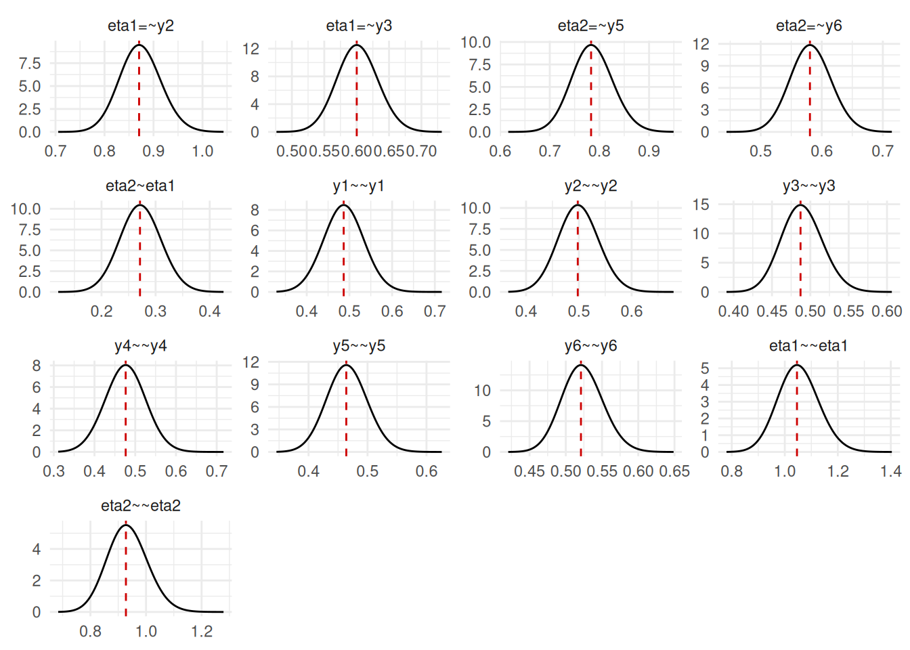

# Get started

## Introduction

SEMs are ubiquitous in the social sciences, psychology, ecology, and
other fields. The [INLAvaan](https://inlavaan.haziqj.ml/) package
([Jamil and Rue 2026b](#ref-jamil2026implementation)) provides a
user-friendly interface for fitting Bayesian SEMs using Integrated
Nested Laplace Approximations (INLA, [Rue et al.
2009](#ref-rue2009approximate)), based on a bespoke approximate Bayesian
inference framework for SEMs ([Jamil and Rue
2026a](#ref-jamil2026approximate)). This vignette will guide you through
the basics of using [INLAvaan](https://inlavaan.haziqj.ml/) to fit a
simple SEM. Before we begin make sure you have installed the INLAvaan
package from GitHub by running the commands below.

``` r

# Load all libraries for this example
library(INLAvaan)
library(tidyverse)
library(lavaan)
```

## Motivating example

To motivate the use of SEMs, consider the introductory example in Song
and Lee ([2012](#ref-song2012basic)): *Does poorer glycemic control lead
to greater severity of kidney disease?* We observe three indicators of
glycemic control ($`y_1`$, $`y_2`$, $`y_3`$) and three indicators of
kidney disease severity ($`y_4`$, $`y_5`$, $`y_6`$).

|         | **Indicator** | **Description**            | **Unit** |
|---------|---------------|----------------------------|----------|
| $`y_1`$ | HbA1c         | 3-month avg. blood glucose | %        |
| $`y_2`$ | FPG           | Fasting plasma glucose     | mmol/L   |
| $`y_3`$ | Insulin       | Fasting insulin level      | μU/mL    |
| $`y_4`$ | PCr           | Plasma creatinine          | μmol/L   |
| $`y_5`$ | ACR           | Albumin–creatinine ratio   | mg/g     |
| $`y_6`$ | BUN           | Blood urea nitrogen        | mmol/L   |

Rather than fitting separate regression models for each indicator, SEM
allows us to model the relationship between the latent constructs
themselves, providing a clearer and more coherent representation of the
underlying processes. The hypothesised SEM is illustrated by the figure
below:


## Data

For the two-factor SEM we described above, it is easy to simulate some
data using the [lavaan](https://lavaan.ugent.be) package to do so. The
code is below:

``` r

pop_mod <- "
  eta1 =~ 1*y1 + 0.8*y2 + 0.6*y3
  eta2 =~ 1*y4 + 0.8*y5 + 0.6*y6
  eta2 ~ 0.3*eta1
  
  # Variances
  y1 ~~ 0.5*y1
  y2 ~~ 0.5*y2
  y3 ~~ 0.5*y3
  y4 ~~ 0.5*y4
  y5 ~~ 0.5*y5
  y6 ~~ 0.5*y6
  eta1 ~~ 1*eta1
  eta2 ~~ 1*eta2
"
set.seed(123)
dat <- lavaan::simulateData(pop_mod, sample.nobs = 1000)
str(dat)
#> 'data.frame':    1000 obs. of  6 variables:
#>  $ y1: num  1.319 0.773 -1.658 -0.616 2.763 ...
#>  $ y2: num  0.813 0.684 -0.957 0.43 1.167 ...
#>  $ y3: num  0.764 1.048 -0.203 0.592 -0.105 ...
#>  $ y4: num  -0.316 -0.593 -2.1 0.713 -0.547 ...
#>  $ y5: num  0.318 -0.729 -0.158 -1.239 -2.798 ...
#>  $ y6: num  -0.2639 0.4425 -1.3055 -0.0481 -1.2926 ...
```

From the code above, note the true values of the parameters, including
the factor loadings $`\Lambda`$, regression coefficient $`\beta`$
between the two latent variables, as well as the residual and latent
variances $`\Theta`$ and $`\Psi`$ respectively.

## Model fit

Now that we have simulated some data, we can fit the SEM using INLAvaan.
The model syntax is similar to that of
[lavaan](https://lavaan.ugent.be), making it easy to specify the model.
For further details on the model syntax, refer to the [lavaan
website](https://lavaan.ugent.be/tutorial/syntax1.html).
[INLAvaan](https://inlavaan.haziqj.ml/) provides mirror functions for
the main model fitting functions in [lavaan](https://lavaan.ugent.be):

- [`acfa()`](https://inlavaan.haziqj.ml/reference/acfa.md) mirrors
  [`lavaan::cfa()`](https://rdrr.io/pkg/lavaan/man/cfa.html) for
  confirmatory factor analysis; and
- [`asem()`](https://inlavaan.haziqj.ml/reference/asem.md) mirrors
  [`lavaan::sem()`](https://rdrr.io/pkg/lavaan/man/sem.html) for
  structural equation models;
- [`agrowth()`](https://inlavaan.haziqj.ml/reference/agrowth.md) mirrors
  [`lavaan::growth()`](https://rdrr.io/pkg/lavaan/man/growth.html) for
  latent growth curve models.

The code to fit the SEM model is below:

``` r

mod <- "
  eta1 =~ y1 + y2 + y3
  eta2 =~ y4 + y5 + y6
  eta2 ~ eta1
"
fit <- asem(mod, dat)
#> ℹ Mode finding and Hessian computation.
#> ✔ Posterior mode and Hessian. [346ms]
#> 
#> ℹ Performing VB correction.
#> ✔ VB correction; mean |δ| = 0.057σ. [202ms]
#> 
#> ⠙ Fitting 0/13 skew-normal marginals.
#> ✔ Fit 13/13 skew-normal marginals. [689ms]
#> 
#> ℹ Adjusting copula correlations (NORTA).
#> ✔ Adjust copula correlations (NORTA). [89ms]
#> 
#> ⠙ Posterior sampling and summarising.
#> ⠹ Computing WAIC.
#> ✔ Summarise 1000 posterior draws. [1.4s]
#> 
#> ℹ Fit measures: PPP, DIC, LOO, WAIC.
```

As with [`lavaan::sem()`](https://rdrr.io/pkg/lavaan/man/sem.html), this
model is fitted without a mean structure by default
(`meanstructure = FALSE`). Rather than profiling the means out as lavaan
does, [INLAvaan](https://inlavaan.haziqj.ml/) assigns the saturated
means flat priors and marginalises them analytically, which keeps the
likelihood a proper Bayesian object. Intercepts can instead be modelled
explicitly with `meanstructure = TRUE`. See the [mean structures
article](https://inlavaan.haziqj.ml/articles/meanstructure.html) for how
the two treatments relate and when model comparisons across them are
meaningful.

[INLAvaan](https://inlavaan.haziqj.ml/) computes an approximation to the
posterior density by way of a Laplace approximation ([Tierney et al.
1989](#ref-tierney1989fully); [Jamil and Rue
2026a](#ref-jamil2026approximate)). The joint mode and the Hessian needs
to be computed, which gives a Gaussian distribution for the joint
posterior of the parameters. The default method for optimisation is
[`stats::nlminb()`](https://rdrr.io/r/stats/nlminb.html), but other
optimisers can be used by specifying `optim_method = "ucminf"` for the
[ucminf](https://github.com/hdakpo/ucminf) package or
`optim_method = "optim"` to call the
[`stats::optim()`](https://rdrr.io/r/stats/optim.html) function with
method `"BFGS"`.

From this, marginal posterior distributions for each parameter can be
obtained by one of several ways, including 1) Skew normal fitting
(`marginal_method = "skewnorm"`, the default method, see [Chiuchiolo et
al. 2023](#ref-chiuchiolo2023joint)); 2) Two-piece asymmetric Gaussian
fitting (`marginal_method = "asymgaus"`, see [Martins et al.
2013](#ref-martins2013bayesian)); 3) Direct marginalisation of the joint
Gaussian posterior (`marginal_method = "marggaus"`); and 4) Sampling
from the joint Gaussian posterior (`marginal_method = "sampling"`).

Once the marginal posterior distributions have been obtained, we can
further use these to compute any derived quantities of interest via
copula sampling. The posterior predictive p-values ([Gelman et al.
1996](#ref-gelman1996posterior)) and Deviance Information Criterion
(DIC, [Spiegelhalter et al. 2002](#ref-spiegelhalter2002bayesian)) are
computed this way. Under the default `test = "standard"`, leave-one-out
cross-validation and WAIC results (see the model comparison section
below) are also computed at fit time and stored with the fit, whenever
the model supports them and the additional cost is small. Often, the
posterior sampling takes longer than the model fitting itself, so the
number of samples can be controlled via the `nsamp` argument (default is
`nsamp = 1000`), or the post-fitting computations can be skipped
altogether (`test = "none"`).

## Methods

The resulting object is of class `INLAvaan`, a subclass of `lavaan`
objects.

``` r

str(fit, 1)
#> Formal class 'INLAvaan' [package "INLAvaan"] with 21 slots
fit
#> INLAvaan 0.3.0.9000 ended normally after 67 iterations
#> 
#>   Estimator                                      BAYES
#>   Optimization method                           NLMINB
#>   Number of model parameters                        13
#> 
#>   Number of observations                          1000
#> 
#> Model Test (User Model):
#> 
#>    Marginal log-likelihood                   -8087.543 
#>    PPP (Chi-square)                              0.123
```

As a result, most of the methods that work for `lavaan` objects will
also work for `INLAvaan` objects. The most common ones are probably
[`coef()`](https://inlavaan.haziqj.ml/reference/INLAvaan-class.md) and
[`summary()`](https://inlavaan.haziqj.ml/reference/INLAvaan-class.md).

``` r

# Inspect coefficients
coef(fit)
#>   eta1=~y2   eta1=~y3   eta2=~y5   eta2=~y6  eta2~eta1     y1~~y1     y2~~y2 
#>      0.766      0.593      0.791      0.602      0.259      0.437      0.500 
#>     y3~~y3     y4~~y4     y5~~y5     y6~~y6 eta1~~eta1 eta2~~eta2 
#>      0.501      0.457      0.519      0.513      1.163      0.913

# Summary of results
summary(fit)
#> INLAvaan 0.3.0.9000 ended normally after 67 iterations
#> 
#>   Estimator                                      BAYES
#>   Optimization method                           NLMINB
#>   Number of model parameters                        13
#> 
#>   Number of observations                          1000
#> 
#> Model Test (User Model):
#> 
#>    Marginal log-likelihood                   -8087.543 
#>    PPP (Chi-square)                              0.123 
#> 
#> Information Criteria:
#> 
#>    Deviance (DIC)                            16069.118 
#>    Effective parameters (pD)                    13.035 
#> 
#> Parameter Estimates:
#> 
#>    Marginalisation method                     SKEWNORM
#>    VB correction                                  TRUE
#> 
#> Latent Variables:
#>                    Estimate       SD     2.5%    97.5%     NMAD    Prior       
#>   eta1 =~                                                                      
#>     y1                1.000                                                    
#>     y2                0.766    0.037    0.695    0.840    0.005    normal(0,10)
#>     y3                0.593    0.030    0.534    0.653    0.003    normal(0,10)
#>   eta2 =~                                                                      
#>     y4                1.000                                                    
#>     y5                0.791    0.044    0.708    0.879    0.007    normal(0,10)
#>     y6                0.602    0.036    0.534    0.673    0.005    normal(0,10)
#> 
#> Regressions:
#>                    Estimate       SD     2.5%    97.5%     NMAD    Prior       
#>   eta2 ~                                                                       
#>     eta1              0.259    0.037    0.187    0.333    0.002    normal(0,10)
#> 
#> Variances:
#>                    Estimate       SD     2.5%    97.5%     NMAD    Prior       
#>    .y1                0.437    0.049    0.341    0.534    0.006 gamma(1,.5)[sd]
#>    .y2                0.500    0.035    0.433    0.570    0.002 gamma(1,.5)[sd]
#>    .y3                0.501    0.028    0.449    0.557    0.000 gamma(1,.5)[sd]
#>    .y4                0.457    0.051    0.358    0.556    0.007 gamma(1,.5)[sd]
#>    .y5                0.519    0.037    0.449    0.594    0.002 gamma(1,.5)[sd]
#>    .y6                0.513    0.029    0.459    0.571    0.000 gamma(1,.5)[sd]
#>     eta1              1.163    0.082    1.008    1.329    0.003 gamma(1,.5)[sd]
#>    .eta2              0.913    0.070    0.780    1.056    0.004 gamma(1,.5)[sd]
```

It’s possible to request posterior medians and modes in the summary
output by specifying `postmedian = TRUE` or `postmode = TRUE` in the
[`summary()`](https://inlavaan.haziqj.ml/reference/INLAvaan-class.md)
function.

### Predictions

Predicted values for the latent variables can be obtained using the
[`predict()`](https://inlavaan.haziqj.ml/reference/predict.md) function.
This is done by sampling from the posterior distributions of the latent
variables given the observed data. The function also supports
predictions for observed variables (e.g. `type = "ov"`) and missing data
imputation, respecting multilevel structure if present.

``` r

eta_preds <- predict(fit, nsamp = 100)
length(eta_preds)
#> [1] 100
head(eta_preds[[1]])
#>            eta1       eta2
#> [1,]  1.3121619 -0.6441638
#> [2,]  0.8282709  0.1906127
#> [3,] -0.9596638 -1.3655457
#> [4,]  0.4597376 -0.2669545
#> [5,]  2.6767500 -1.9580049
#> [6,] -1.6853639 -0.8621866
```

This is an S3 object with a summary method that provides posterior means
and credible intervals for the latent variables. Alternatively, the user
is welcome to perform their own summary statistics on the list of
posterior samples returned by
[`predict()`](https://inlavaan.haziqj.ml/reference/predict.md).

``` r

summ_eta <- summary(eta_preds)
str(summ_eta)
#> List of 7
#>  $ group_id: NULL
#>  $ Mean    : num [1:1000, 1:2] 1.0126 0.7891 -1.1834 -0.0165 1.5151 ...
#>   ..- attr(*, "dimnames")=List of 2
#>   .. ..$ : NULL
#>   .. ..$ : chr [1:2] "eta1" "eta2"
#>  $ SD      : num [1:1000, 1:2] 0.474 0.429 0.463 0.426 0.424 ...
#>   ..- attr(*, "dimnames")=List of 2
#>   .. ..$ : NULL
#>   .. ..$ : chr [1:2] "eta1" "eta2"
#>  $ 2.5%    : num [1:1000, 1:2] 0.242518 0.000188 -2.218305 -0.84535 0.739938 ...
#>   ..- attr(*, "dimnames")=List of 2
#>   .. ..$ : NULL
#>   .. ..$ : chr [1:2] "eta1" "eta2"
#>  $ 50%     : num [1:1000, 1:2] 0.9402 0.7719 -1.1422 -0.0583 1.54 ...
#>   ..- attr(*, "dimnames")=List of 2
#>   .. ..$ : NULL
#>   .. ..$ : chr [1:2] "eta1" "eta2"
#>  $ 97.5%   : num [1:1000, 1:2] 2.035 1.709 -0.432 0.812 2.476 ...
#>   ..- attr(*, "dimnames")=List of 2
#>   .. ..$ : NULL
#>   .. ..$ : chr [1:2] "eta1" "eta2"
#>  $ Mode    : num [1:1000, 1:2] 0.887 0.783 -1.054 -0.105 1.552 ...
#>   ..- attr(*, "dimnames")=List of 2
#>   .. ..$ : NULL
#>   .. ..$ : chr [1:2] "eta1" "eta2"
#>  - attr(*, "class")= chr "summary.predict.inlavaan_internal"
head(summ_eta$Mean)
#>             eta1        eta2
#> [1,]  1.01258344 -0.02554947
#> [2,]  0.78910529 -0.31072360
#> [3,] -1.18336025 -1.31371021
#> [4,] -0.01653989 -0.02200646
#> [5,]  1.51506585 -1.39225929
#> [6,] -1.82622142 -0.98909416
```

### Predictive checks

The generative side of the model is exposed by
[`sampling()`](https://inlavaan.haziqj.ml/reference/sampling.md), which
draws parameters, latent variables, or observed variables from the
posterior (or prior) generative SEM, and by
[`simulate()`](https://inlavaan.haziqj.ml/reference/simulate.md), which
produces complete replicate data sets from the fitted model.

``` r

yrep <- simulate(fit, nsim = 1, seed = 1)
head(yrep[[1]])
#>           y1         y2         y3          y4         y5          y6
#> 1  1.5679385  0.8827172  0.7631336 -1.23900712 -1.6062390  0.01279656
#> 2 -1.4739535 -0.9360022 -2.0045420 -1.29879078 -2.2035645 -0.91358024
#> 3  3.3207961  1.5550146  1.1964581 -0.07288805 -0.9709731  1.00237240
#> 4  0.4784914  0.6555458  0.4348603 -1.60925181 -0.3261864  1.35692936
#> 5  2.0142140  1.2003548  1.6534184  1.43431550  1.8564701  1.92471103
#> 6  0.3214047 -0.9952219  0.1368011  0.77905599  0.7094502  1.31313172
```

Comparing such replicates with the observed data is the basis of prior
and posterior predictive checking. The [predictive checks
article](https://inlavaan.haziqj.ml/articles/predictive-checks.html)
walks through that workflow, and the [sampling
article](https://inlavaan.haziqj.ml/articles/sampling.html) explains the
machinery behind it.

### Fit measures

Global fit measures are collected by
[`fitmeasures()`](https://inlavaan.haziqj.ml/reference/fitMeasures.md):
the PPP and DIC mentioned earlier, Bayesian analogues of the classical
fit indices (BRMSEA, BGammaHat, and related indices), and the LOO and
WAIC measures of the model comparison section below when these are
stored with the fit.

``` r

fitmeasures(fit)
#>         npar   margloglik          ppp          dic        p_dic       BRMSEA 
#>           13    -8087.543        0.123    16069.118       13.035        0.071 
#>    BGammaHat adjBGammaHat          BMc     elpd_loo        p_loo        looic 
#>        0.987        0.965        0.980    -8024.743       12.834    16049.486 
#>       se_loo    elpd_waic       p_waic         waic      se_waic 
#>      108.647    -8024.764       12.766    16049.527      108.689
```

Definitions and worked examples are in the [Bayesian fit indices
article](https://inlavaan.haziqj.ml/articles/fit-indices.html).

### Diagnostics

The
[`diagnostics()`](https://inlavaan.haziqj.ml/reference/diagnostics.md)
function reports convergence and approximation-quality metrics for the
fitted model. Global diagnostics (`type = "global"`) check whether the
optimiser converged, and quantify how well the skew-normal marginals
match the joint posterior (via KL divergence and NMAD). Per-parameter
diagnostics (`type = "param"`) provide gradient norms and KL
contributions for each free parameter, which is useful for identifying
any problematic parameters.

``` r

diagnostics(fit)
#>           npar          nsamp      converged     iterations       grad_inf 
#>             13           1000              1             67       4.85e-03 
#>   grad_inf_rel        grad_l2 mode_shift_max      hess_cond     vb_applied 
#>       6.69e-03       7.43e-03       5.50e-04       3.53e+01              1 
#>  vb_kld_global        kld_max       kld_mean       nmad_max      nmad_mean 
#>         6.3107         0.0076         0.0021         0.0071         0.0036
```

The [`timing()`](https://inlavaan.haziqj.ml/reference/timing.md)
function reports how long each computation stage took, which can help
identify bottlenecks when scaling to larger models.

``` r

timing(fit)
#>  total 
#> 2.86 s
```

### Plot

A simple plot method is provided to view the marginal posterior
distributions of the parameters. The vertical lines indicate the
posterior mode.

``` r

plot(fit)
```



## Model comparison

In addition to several global fit indices (i.e. PPP, DIC), it is
possible to compare models by way of Bayes factors using the
[`compare()`](https://inlavaan.haziqj.ml/reference/compare.md) function.
This function takes two `INLAvaan` objects and computes the Bayes factor
using the Laplace approximations to the marginal likelihoods.

``` r

mod2 <- "
  # A model with uncorrelated factors
  eta1 =~ y1 + y2 + y3
  eta2 =~ y4 + y5 + y6
  eta1 ~~ 0*eta2
"
fit2 <- asem(mod2, dat)
#> ℹ Mode finding and Hessian computation.
#> ✔ Posterior mode and Hessian. [174ms]
#> 
#> ℹ Performing VB correction.
#> ✔ VB correction; mean |δ| = 0.037σ. [147ms]
#> 
#> ⠙ Fitting 0/12 skew-normal marginals.
#> ✔ Fit 12/12 skew-normal marginals. [486ms]
#> 
#> ℹ Adjusting copula correlations (NORTA).
#> ✔ Adjust copula correlations (NORTA). [62ms]
#> 
#> ⠙ Posterior sampling and summarising.
#> ✔ Summarise 1000 posterior draws. [1.5s]
#> 
#> ℹ Fit measures: PPP, DIC, LOO, WAIC.
compare(fit, fit2)
#> Bayesian Model Comparison (INLAvaan)
#> Models ordered by marginal log-likelihood
#> 
#>  Model npar Marg.Loglik   logBF      DIC     pD
#>    fit   13   -8087.543   0.000 16069.12 13.035
#>   fit2   12   -8107.759 -20.216 16120.33 12.169
```

As a note, there have been several criticisms of the use of Bayes
factors for model comparison, particularly in the context of SEMs
([Tendeiro and Kiers 2019](#ref-tendeiro2019review); [Schad et al.
2023](#ref-schad2023workflow)). Leave-one-out cross-validation (LOO,
[Vehtari et al. 2017](#ref-vehtari2017practical)) and the widely
applicable information criterion (WAIC, [Watanabe
2010](#ref-watanabe2010asymptotic)) are popular alternatives which
compare models on out-of-sample predictive accuracy instead; see Merkle
et al. ([2019](#ref-merkle2019bayesian)) for their use with latent
variable models. Both are implemented in
[INLAvaan](https://inlavaan.haziqj.ml/). The function
[`loo()`](https://inlavaan.haziqj.ml/reference/loo.md) requires neither
refitting nor sampling, computing the statistic using a Taylor
approximation of the case-deletion posterior, while
[`waic()`](https://inlavaan.haziqj.ml/reference/waic.md) reuses the
fit’s own posterior draws.

``` r

loo(fit)
#> Taylor leave-one-subject-out cross-validation (INLAvaan)
#> Computed from 1000 subjects (second-order Taylor approximation)
#> 
#>          Estimate    SE
#> elpd_loo  -8024.7  54.3
#> p_loo        12.8   0.5
#> looic     16049.5 108.6
```

To compare models on this predictive scale, pass `loo = TRUE` to
[`compare()`](https://inlavaan.haziqj.ml/reference/compare.md). Models
are sorted by expected log predictive density (ELPD), with paired
standard errors for the ELPD differences.

``` r

compare(fit, fit2, loo = TRUE)
#> Bayesian Model Comparison (INLAvaan)
#> Models ordered by ELPD (Taylor LOO)
#> elpd_diff/se_diff are paired differences vs the best model
#> 
#>  Model npar Marg.Loglik   logBF      DIC     pD      ELPD     SE  p_loo
#>    fit   13   -8087.543   0.000 16069.12 13.035 -8024.743 54.323 12.834
#>   fit2   12   -8107.759 -20.216 16120.33 12.169 -8050.230 54.533 11.834
#>  elpd_diff se_diff
#>      0.000   0.000
#>    -25.487   7.309
```

See the [cross-validation
article](https://inlavaan.haziqj.ml/articles/loo.html) for the
methodology and more advanced usage, including multigroup and two-level
models, missing data, and scoring submodels without refitting.

## Setting priors

The [INLAvaan](https://inlavaan.haziqj.ml/) package uses the same prior
specification syntax as [blavaan](https://ecmerkle.github.io/blavaan/)
([Merkle and Rosseel 2018](#ref-merkle2018blavaan); [Merkle et al.
2021](#ref-merkle2021efficient)), as detailed
[here](https://blavaan.org/articles/prior.html). Essentially, there are
two ways to set priors for model parameters: 1) Globally for all
parameters of a certain type (e.g., all factor loadings, all regression
coefficients, etc.); and 2) Individually for specific parameters in the
model syntax.

The default global priors are similar to those from
[blavaan](https://ecmerkle.github.io/blavaan/):

``` r

priors_for()  # similar to blavaan::dpriors()
#>                nu             alpha            lambda              beta 
#>    "normal(0,32)"    "normal(0,10)"    "normal(0,10)"    "normal(0,10)" 
#>             theta               psi               rho               tau 
#> "gamma(1,.5)[sd]" "gamma(1,.5)[sd]"       "beta(1,1)"   "normal(0,1.5)"
```

Note that, [INLAvaan](https://inlavaan.haziqj.ml/) uses the separation
strategy for variance matrices, and consequently places priors on
**correlations** instead of *covariances*. If, instead we wished to set
global priors, say a gamma distribution on **variances** instead of
**standard deviations** (default), then we would do the following:

``` r

DP <- priors_for(theta = "gamma(1,1)", psi = "gamma(1,1)")
DP
#>              nu           alpha          lambda            beta           theta 
#>  "normal(0,32)"  "normal(0,10)"  "normal(0,10)"  "normal(0,10)"    "gamma(1,1)" 
#>             psi             rho             tau 
#>    "gamma(1,1)"     "beta(1,1)" "normal(0,1.5)"
## fit <- asem(mod, dat, dpriors = DP)  # not run
```

To set individual priors for specific parameters, we can do so in the
model syntax itself. For instance, to set a normal prior with mean 1 and
standard deviation 3 for the factor loading of `y3` on `eta1`, and a
normal prior with mean 0 and standard deviation 0.5 for the regression
coefficient from `eta1` to `eta2`, we would specify the model as
follows:

``` r

mod <- "
  eta1 =~ y1 + y2 + prior('normal(1,3)')*y3
  eta2 =~ y4 + y5 + y6
  eta2 ~ prior('normal(0,.5)')*eta1
"
## fit <- asem(mod, dat)  # not run
```

## Dependency on R-INLA

Dependency on R-INLA has been temporarily removed for the current
version of [INLAvaan](https://inlavaan.haziqj.ml/) (\>= 0.2.0). For a
wide class LVMs and SEMs where the latent variables are unstructured and
independent, the current implementation is sufficient. However, future
versions of [INLAvaan](https://inlavaan.haziqj.ml/) will re-introduce
dependency on R-INLA to allow for more complex latent structures, such
as spatial and temporal dependencies.

## References

Chiuchiolo, Cristian, Janet Van Niekerk, and Håvard Rue. 2023. “Joint
Posterior Inference for Latent Gaussian Models with R-INLA.” *Journal of
Statistical Computation and Simulation* 93 (5): 723–52.
<https://doi.org/10.1080/00949655.2022.2117813>.

Gelman, Andrew, Xiao-Li Meng, and Hal Stern. 1996. “Posterior Predictive
Assessment of Model Fitness Via Realized Discrepancies.” *Statistica
Sinica* 6 (4): 733–60. <https://www.jstor.org/stable/24306036>.

Jamil, Haziq, and Håvard Rue. 2026a. *Approximate Bayesian Inference for
Structural Equation Models Using Integrated Nested Laplace
Approximations*. arXiv. <https://doi.org/10.48550/arXiv.2603.25690>.

Jamil, Haziq, and Håvard Rue. 2026b. *Implementation and Workflows for
INLA-Based Approximate Bayesian Structural Equation Modelling*. arXiv.
<https://doi.org/10.48550/arXiv.2604.00671>.

Martins, Thiago G., Daniel Simpson, Finn Lindgren, and Håvard Rue. 2013.
“Bayesian Computing with INLA: New Features.” *Computational Statistics
& Data Analysis* 67 (November): 68–83.
<https://doi.org/10.1016/j.csda.2013.04.014>.

Merkle, Edgar C., Ellen Fitzsimmons, James Uanhoro, and Ben Goodrich.
2021. “Efficient Bayesian Structural Equation Modeling in Stan.”
*Journal of Statistical Software* 100 (November): 1–22.
<https://doi.org/10.18637/jss.v100.i06>.

Merkle, Edgar C., Daniel Furr, and Sophia Rabe-Hesketh. 2019. “Bayesian
Comparison of Latent Variable Models: Conditional Versus Marginal
Likelihoods.” *Psychometrika* 84 (3): 802–29.
<https://doi.org/10.1007/s11336-019-09679-0>.

Merkle, Edgar C., and Yves Rosseel. 2018. “blavaan: Bayesian Structural
Equation Models via Parameter Expansion.” *Journal of Statistical
Software* 85 (June): 1–30. <https://doi.org/10.18637/jss.v085.i04>.

Rue, Håvard, Sara Martino, and Nicolas Chopin. 2009. “Approximate
Bayesian Inference for Latent Gaussian Models by Using Integrated Nested
Laplace Approximations.” *Journal of the Royal Statistical Society
Series B: Statistical Methodology* 71 (2): 319–92.
<https://doi.org/10.1111/j.1467-9868.2008.00700.x>.

Schad, Daniel J., Bruno Nicenboim, Paul-Christian Bürkner, Michael
Betancourt, and Shravan Vasishth. 2023. “Workflow Techniques for the
Robust Use of Bayes Factors.” *Psychological Methods* (US) 28 (6):
1404–26. <https://doi.org/10.1037/met0000472>.

Song, Xin‐Yuan, and Sik‐Yum Lee. 2012. *Basic and Advanced Bayesian
Structural Equation Modeling: With Applications in the Medical and
Behavioral Sciences*. 1st ed. Wiley Series in Probability and
Statistics. Wiley. <https://doi.org/10.1002/9781118358887>.

Spiegelhalter, David J, Nicola G Best, Bradley P Carlin, and Angelika
Van Der Linde. 2002. “Bayesian Measures of Model Complexity and Fit.”
*Journal of the Royal Statistical Society Series B: Statistical
Methodology* 64 (4): 583–639.

Tendeiro, Jorge N., and Henk A. L. Kiers. 2019. “A Review of Issues
about Null Hypothesis Bayesian Testing.” *Psychological Methods* (US) 24
(6): 774–95. <https://doi.org/10.1037/met0000221>.

Tierney, Luke, Robert E. Kass, and Joseph B. Kadane. 1989. “Fully
Exponential Laplace Approximations to Expectations and Variances of
Nonpositive Functions.” *Journal of the American Statistical
Association* 84 (407): 710–16.
<https://doi.org/10.1080/01621459.1989.10478824>.

Vehtari, Aki, Andrew Gelman, and Jonah Gabry. 2017. “Practical Bayesian
Model Evaluation Using Leave-One-Out Cross-Validation and WAIC.”
*Statistics and Computing* 27 (5): 1413–32.
<https://doi.org/10.1007/s11222-016-9696-4>.

Watanabe, Sumio. 2010. “Asymptotic Equivalence of Bayes Cross Validation
and Widely Applicable Information Criterion in Singular Learning
Theory.” *Journal of Machine Learning Research* 11: 3571–94.
