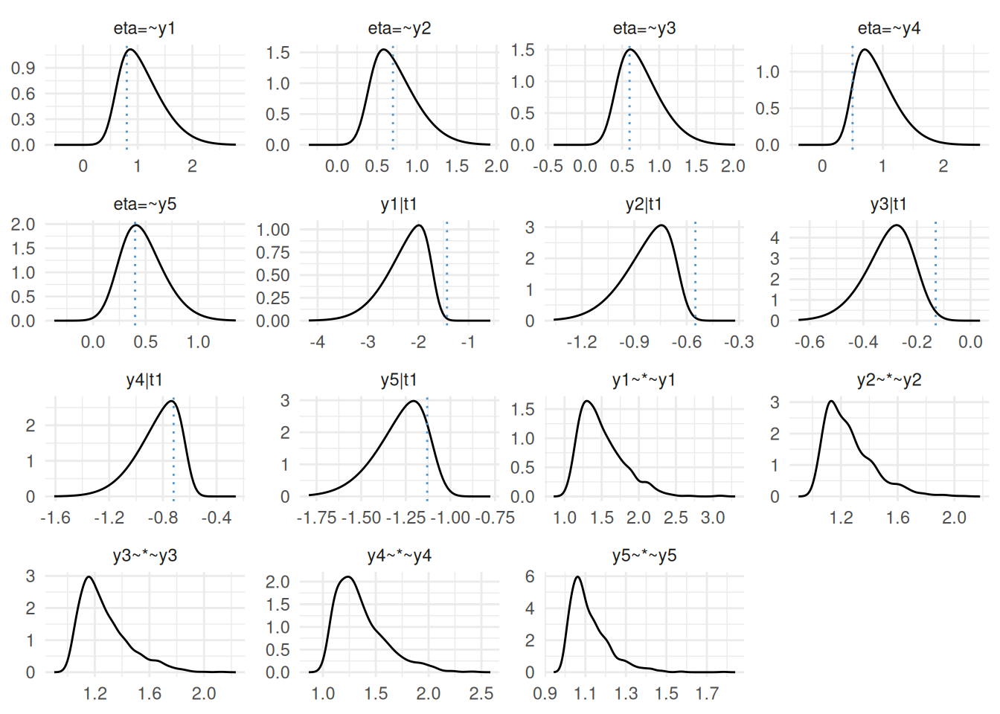

# Binary CFA

As of version 0.2.1.9000, [INLAvaan](https://inlavaan.haziqj.ml/)
supports the fitting of binary data for CFA using the pairwise
likelihood function available from [lavaan](https://lavaan.ugent.be).
This is an experimental feature which needs further research and
testing. Some notes:

- Using PML is considered a “limited-information” approach, due to
  pairwise likelihood contributions not utilising the fully joint
  information in the data.
- The scale of the PML function will significantly be different, since
  the total pairwise log-likelihood adds up contributions in pairs.
  Following the literature on spatial models using composite
  likelihoods, [INLAvaan](https://inlavaan.haziqj.ml/) adjusts this by a
  factor of $1/\sqrt{p}$.
- It is proabably unwise to use the Laplace-approximated marginal
  likelihood for model comparison. The ppp also may not be suitable for
  ordinal data and needs a rethink.
- Bayesian estimation of CFA favours the `parameterization = "theta"`
  option, since the priors on residual variances are more intuitive to
  specify. [INLAvaan](https://inlavaan.haziqj.ml/) switches to this by
  default.
- For binary models, normal priors for the thresholds should be fine.
  But looking ahead for ordinal models, the priors for thresholds should
  be specified in such a way that the ordering is preserved
  $\tau_{0} < \tau_{1} < \tau_{2} < \cdots < \tau_{k}$. This is not yet
  implemented in [INLAvaan](https://inlavaan.haziqj.ml/).

Having said that, let’s take a look at how binary CFA can be implemented
in [INLAvaan](https://inlavaan.haziqj.ml/).

``` r
library(INLAvaan)
library(blavaan)
#> Loading required package: Rcpp
#> This is blavaan 0.5-10
#> On multicore systems, we suggest use of future::plan("multicore") or
#>   future::plan("multisession") for faster post-MCMC computations.
set.seed(161)

# Generate data
n <- 250
truval <- c(0.8, 0.7, 0.6, 0.5, 0.4, -1.43, -0.55, -0.13, -0.72, -1.13)
dat <- lavaan::simulateData(
  "eta =~ 0.8*y1 + 0.7*5y2 + 0.6*y3 + 0.5*y4 + 0.4*y5
   y1 | -1.43*t1
   y2 | -0.55*t1
   y3 | -0.13*t1
   y4 | -0.72*t1
   y5 | -1.13*t1",
  ordered = TRUE,
  sample.nobs = n
)
head(dat)
#>   y1 y2 y3 y4 y5
#> 1  2  2  1  2  2
#> 2  2  1  1  1  2
#> 3  2  2  2  1  2
#> 4  1  1  1  1  2
#> 5  2  2  1  2  2
#> 6  2  2  1  1  1

# Fit INLAvaan model
mod <- "eta  =~ y1 + y2 + y3 + y4 + y5"
fit <- acfa(mod, dat, ordered = TRUE, std.lv = TRUE, estimator = "PML")
#> ℹ Finding posterior mode.
#> ✔ Finding posterior mode. [171ms]
#> 
#> ℹ Computing the Hessian.
#> ✔ Computing the Hessian. [80ms]
#> 
#> ℹ Performing VB correction.
#> ✔ VB correction; mean |δ| = 0.403σ. [441ms]
#> 
#> ⠙ Fitting 0/10 skew-normal marginals.
#> ⠹ Fitting 7/10 skew-normal marginals.
#> ✔ Fitting 10/10 skew-normal marginals. [721ms]
#> 
#> ℹ Adjusting copula correlations (NORTA).
#> ✔ Adjusting copula correlations (NORTA). [54ms]
#> 
#> ⠙ Posterior sampling and summarising.
#> ✔ Posterior sampling and summarising. [1s]
#> 
summary(fit)
#> INLAvaan 0.2.4.9000 ended normally after 37 iterations
#> 
#>   Estimator                                      BAYES
#>   Optimization method                           NLMINB
#>   Number of model parameters                        10
#> 
#>   Number of observations                           250
#> 
#> Model Test (User Model):
#> 
#>    Marginal log-likelihood                   -1094.328 
#>    PPP (Chi-square)                              0.000 
#> 
#> Information Criteria:
#> 
#>    Deviance (DIC)                             2126.012 
#>    Effective parameters (pD)                     7.420 
#> 
#> Parameter Estimates:
#> 
#>    Parameterization                              Theta
#>    Marginalisation method                     SKEWNORM
#>    VB correction                                  TRUE
#> 
#> Latent Variables:
#>                    Estimate       SD     2.5%    97.5%     NMAD    Prior     
#>   eta =~                                                                     
#>     y1                0.825    0.329    0.302    1.576    0.049  normal(0,10)
#>     y2                0.640    0.248    0.244    1.205    0.025  normal(0,10)
#>     y3                0.627    0.237    0.235    1.157    0.011  normal(0,10)
#>     y4                1.121    0.442    0.473    2.154    0.013  normal(0,10)
#>     y5                0.520    0.225    0.149    1.025    0.017  normal(0,10)
#> 
#> Thresholds:
#>                    Estimate       SD     2.5%    97.5%     NMAD    Prior     
#>     y1|t1            -2.195    0.353   -3.018   -1.670    0.030 normal(0,1.5)
#>     y2|t1            -0.795    0.127   -1.087   -0.600    0.061 normal(0,1.5)
#>     y3|t1            -0.300    0.083   -0.482   -0.155    0.013 normal(0,1.5)
#>     y4|t1            -0.994    0.222   -1.514   -0.673    0.034 normal(0,1.5)
#>     y5|t1            -1.239    0.153   -1.592   -1.006    0.072 normal(0,1.5)
#> 
#> Variances:
#>                    Estimate       SD     2.5%    97.5%     NMAD    Prior     
#>    .y1                1.000                                                  
#>    .y2                1.000                                                  
#>    .y3                1.000                                                  
#>    .y4                1.000                                                  
#>    .y5                1.000                                                  
#>     eta               1.000                                                  
#> 
#> Scales y*:
#>                    Estimate       SD     2.5%    97.5%     NMAD    Prior     
#>     y1                1.325    0.217    1.047    1.832                       
#>     y2                1.203    0.137    1.031    1.532                       
#>     y3                1.194    0.127    1.030    1.511                       
#>     y4                1.519    0.337    1.104    2.383                       
#>     y5                1.141    0.110    1.012    1.429
plot(fit, truth = truval)
```


