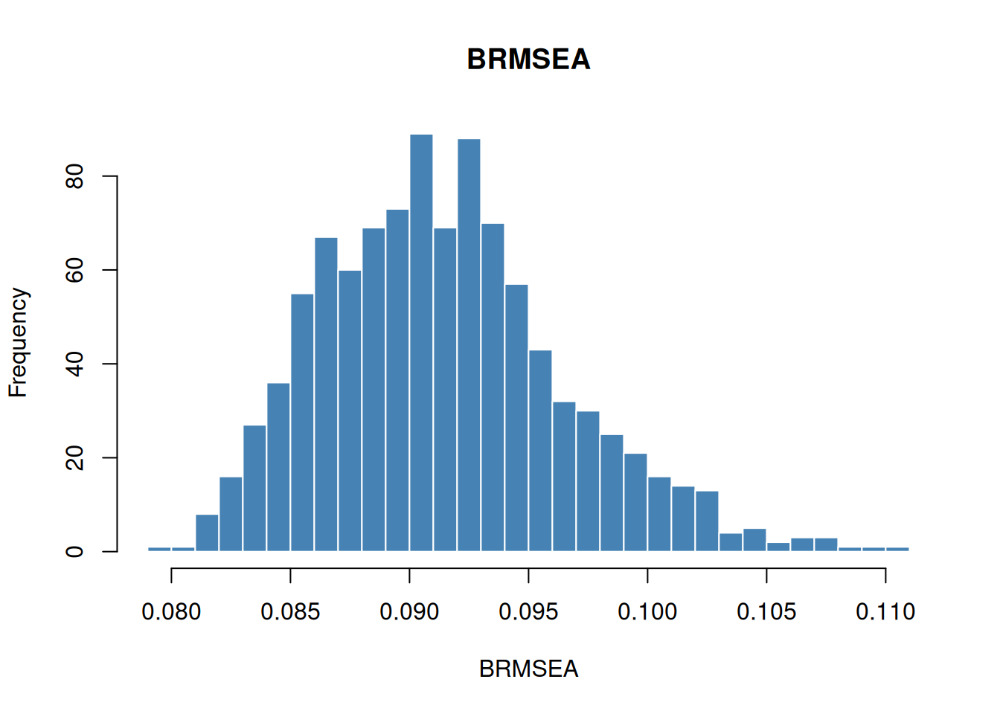

# Bayesian Fit Indices

## Introduction

Classical SEM fit indices (RMSEA, CFI, TLI, etc.) are computed from a
single maximum-likelihood chi-square statistic. In Bayesian SEM, the
parameters are random, so **each posterior draw** yields a different
chi-square value and, therefore, a different set of fit indices.
INLAvaan provides Bayesian analogues of the most common indices,
following the framework of Garnier-Villarreal and Jorgensen
([2020](#ref-garnier2021bayesian)) (as implemented in
[blavaan](https://ecmerkle.github.io/blavaan/)).

This vignette covers:

1.  Mathematical definitions of the Bayesian fit indices.
2.  The two rescaling methods (`"devM"` and `"MCMC"`).
3.  A worked example with the Holzinger–Swineford data.
4.  Comparison with a baseline model (incremental indices).
5.  Differences between INLAvaan and blavaan.

## Mathematical background

### Deviance and chi-square

Let ${\mathbf{θ}}^{(s)}$ denote the $s$-th posterior draw of the model
parameters ($s = 1,\ldots,S$). The per-sample deviance chi-square is
$$\chi_{s}^{2} = 2\left\lbrack \ell_{\text{sat}} - \ell({\mathbf{θ}}^{(s)}) \right\rbrack,$$
where $\ell_{\text{sat}}$ is the log-likelihood of the saturated model
(sample moments equal model moments) and $\ell({\mathbf{θ}}^{(s)})$ is
the log-likelihood evaluated at the $s$-th draw. This equals
$N\, F_{\text{ML}}({\mathbf{θ}}^{(s)})$, where $F_{\text{ML}}$ is the ML
discrepancy function.

### Rescaling

INLAvaan supports two rescaling methods, controlled by the `rescale`
argument:

**`"devM"` (default).** Uses the DIC-based effective number of
parameters $p_{D}$.
$$d_{s} = \chi_{s}^{2} - p_{D},\qquad{df} = p - p_{D},\qquad N_{adj} = N.$$
If $p_{D}$ is unreasonable ($p_{D} \leq 0$ or $p_{D} \geq p$), INLAvaan
falls back to using $p_{D} = q$ (the number of free parameters).

**`"MCMC"`.** Uses the classical chi-square with $N - 1$ scaling.
$$d_{s} = \frac{N - 1}{N}\chi_{s}^{2},\qquad{df} = p - q,\qquad N_{adj} = N - G,$$
where $q$ is the number of free parameters and $G$ is the number of
groups.

In both cases the per-sample noncentrality parameter is
${\widehat{\lambda}}_{s} = {\max}(d_{s} - {df},\, 0)$.

### Absolute fit indices

The following indices are computed at **each** posterior draw $s$,
generating a posterior distribution.

**BRMSEA (Bayesian RMSEA).**
$$\text{BRMSEA}_{s} = \sqrt{\frac{{\widehat{\lambda}}_{s}}{{df} \cdot N_{\text{adj}}}} \cdot \sqrt{G}.$$

**BGammaHat.**
$$\text{BGammaHat}_{s} = \frac{v}{v + 2{\widehat{\lambda}}_{s}/N_{\text{adj}}},$$
where $v = \sum_{g}p_{g}$ is the total number of observed variables
across groups.

**Adjusted BGammaHat.**
$$\text{adjBGammaHat}_{s} = 1 - \frac{p}{df}\left( 1 - \text{BGammaHat}_{s} \right).$$

**BMc (McDonald’s centrality index).**
$$\text{BMc}_{s} = {\exp}\!\left( - \frac{1}{2}{\widehat{\lambda}}_{s}/N_{\text{adj}} \right).$$

### Incremental fit indices

Incremental indices compare the target model against a **baseline**
(null) model. Let $d_{s}^{(0)}$, ${df}^{(0)}$, and
${\widehat{\lambda}}_{s}^{(0)}$ denote the corresponding quantities for
the baseline model.

**BCFI (Bayesian CFI).**
$$\text{BCFI}_{s} = 1 - \frac{{\widehat{\lambda}}_{s}}{{\widehat{\lambda}}_{s}^{(0)}}.$$

**BTLI (Bayesian TLI).**
$$\text{BTLI}_{s} = \frac{d_{s}^{(0)}/{df}^{(0)} - d_{s}/{df}}{d_{s}^{(0)}/{df}^{(0)} - 1}.$$

**BNFI (Bayesian NFI).**
$$\text{BNFI}_{s} = \frac{d_{s}^{(0)} - d_{s}}{d_{s}^{(0)}}.$$

The posterior expectations (EAP), standard deviations, quantile-based
credible intervals, and modes of these distributions are reported by the
[`summary()`](https://rdrr.io/r/base/summary.html) method.

## Example: three-factor CFA

We fit a three-factor CFA on the Holzinger–Swineford (1939) data.

``` r
HS.model <- "
  visual  =~ x1 + x2 + x3
  textual =~ x4 + x5 + x6
  speed   =~ x7 + x8 + x9
"

fit <- acfa(HS.model, HolzingerSwineford1939, verbose = FALSE)
```

### Scalar fit measures

`fitMeasures()` returns the posterior mean (EAP) of each Bayesian fit
index alongside the marginal log-likelihood, ppp, DIC, and gradient
diagnostics.

``` r
fitMeasures(fit)
#>         npar   margloglik          ppp          dic        p_dic       BRMSEA 
#>           21    -3823.429        0.000     7517.172       20.620        0.091 
#>    BGammaHat adjBGammaHat          BMc 
#>        0.957        0.920        0.903
```

### Posterior distributions of fit indices

To inspect the full posterior distribution of each index, use
[`bfit_indices()`](https://inlavaan.haziqj.ml/reference/bfit_indices.md).
This returns an S3 object of class `"bfit_indices"`.

``` r
bfi <- bfit_indices(fit)
bfi
#> Posterior summary of devM-based Bayesian fit indices (nsamp = 1000): 
#> 
#>       BRMSEA    BGammaHat adjBGammaHat          BMc 
#>        0.091        0.957        0.920        0.903
```

Calling [`summary()`](https://rdrr.io/r/base/summary.html) provides a
table of posterior summaries (Mean, SD, 2.5%, 50%, 97.5%, Mode) for each
index.

``` r
summary(bfi)
#> 
#> Posterior summary of devM-based Bayesian fit indices (nsamp = 1000):
#> 
#>               Mean    SD X2.5.  X25.  X50.  X75. X97.5.  Mode
#> BRMSEA       0.091 0.005 0.083 0.088 0.091 0.094  0.102 0.091
#> BGammaHat    0.957 0.005 0.946 0.954 0.957 0.960  0.964 0.957
#> adjBGammaHat 0.920 0.009 0.901 0.915 0.921 0.926  0.934 0.921
#> BMc          0.903 0.010 0.880 0.897 0.904 0.911  0.920 0.904
```

You can also access the raw per-sample vectors for custom analysis:

``` r
hist(bfi$indices$BRMSEA, breaks = 30, main = "BRMSEA", xlab = "BRMSEA",
     col = "steelblue", border = "white")
```



Posterior distribution of BRMSEA

## Comparison with a baseline model

Incremental indices (BCFI, BTLI, BNFI) require a **baseline model**. A
common choice is the independence (uncorrelated) model.

``` r
null.model <- "
  x1 ~~ x1
  x2 ~~ x2
  x3 ~~ x3
  x4 ~~ x4
  x5 ~~ x5
  x6 ~~ x6
  x7 ~~ x7
  x8 ~~ x8
  x9 ~~ x9
"

fit_null <- acfa(null.model, HolzingerSwineford1939, verbose = FALSE)
```

Now pass the baseline model to `fitMeasures()` or
[`bfit_indices()`](https://inlavaan.haziqj.ml/reference/bfit_indices.md):

``` r
fitMeasures(fit, baseline.model = fit_null)
#>         npar   margloglik          ppp          dic        p_dic       BRMSEA 
#>           21    -3823.429        0.000     7517.172       20.620        0.091 
#>    BGammaHat adjBGammaHat          BMc         BCFI         BTLI         BNFI 
#>        0.957        0.920        0.903        0.931        0.898        0.907
```

``` r
bfi_inc <- bfit_indices(fit, baseline.model = fit_null)
summary(bfi_inc)
#> 
#> Posterior summary of devM-based Bayesian fit indices (nsamp = 1000):
#> 
#>               Mean    SD X2.5.  X25.  X50.  X75. X97.5.  Mode
#> BRMSEA       0.091 0.005 0.083 0.088 0.091 0.094  0.101 0.092
#> BGammaHat    0.957 0.004 0.948 0.954 0.957 0.960  0.964 0.956
#> adjBGammaHat 0.920 0.008 0.903 0.916 0.921 0.926  0.934 0.920
#> BMc          0.904 0.010 0.883 0.898 0.904 0.910  0.920 0.903
#> BCFI         0.931 0.007 0.915 0.927 0.931 0.936  0.943 0.930
#> BTLI         0.898 0.011 0.875 0.892 0.899 0.906  0.916 0.897
#> BNFI         0.907 0.007 0.892 0.903 0.907 0.912  0.919 0.906
```

## Rescaling: `"devM"` vs `"MCMC"`

The `rescale` argument controls how the chi-square and degrees of
freedom are computed. The default is `"devM"`, which subtracts the
DIC-based $p_{D}$ from the deviance. To use the classical $N - 1$
scaling instead, set `rescale = "MCMC"`:

``` r
bfi_mcmc <- bfit_indices(fit, rescale = "MCMC")
summary(bfi_mcmc)
#> 
#> Posterior summary of MCMC-based Bayesian fit indices (nsamp = 1000):
#> 
#>               Mean    SD X2.5.  X25.  X50.  X75. X97.5.  Mode
#> BRMSEA       0.107 0.004 0.100 0.103 0.106 0.109  0.116 0.105
#> BGammaHat    0.943 0.004 0.933 0.940 0.943 0.946  0.950 0.945
#> adjBGammaHat 0.893 0.008 0.874 0.888 0.894 0.899  0.905 0.897
#> BMc          0.872 0.010 0.850 0.866 0.873 0.880  0.887 0.877
```

The two methods will generally produce different results, especially
with informative priors or when $p_{D}$ deviates substantially from $q$.

## Differences from blavaan

INLAvaan’s Bayesian fit indices follow the same mathematical framework
as [blavaan](https://ecmerkle.github.io/blavaan/) ([Merkle et al.
2021](#ref-merkle2021blavaan)), with a few implementation differences:

| Feature                        | INLAvaan                         | blavaan                                                                          |
|:-------------------------------|:---------------------------------|:---------------------------------------------------------------------------------|
| Posterior samples              | INLA-based (Sobol/NORTA)         | MCMC draws from Stan/JAGS                                                        |
| Rescaling methods              | `"devM"`, `"MCMC"`               | `"devM"`, `"MCMC"`, `"ppmc"`                                                     |
| Effective parameters ($p_{D}$) | DIC-based $p_{D}$ only           | DIC-based $p_{D}$, LOOIC-based $p_{\text{loo}}$, or WAIC-based $p_{\text{waic}}$ |
| HPD intervals                  | Not currently computed           | Computed via `{coda}`                                                            |
| Summary statistics             | Mean, SD, 2.5%, 50%, 97.5%, Mode | EAP, Median, MAP, SD, HPD                                                        |
| Return class                   | S3 `"bfit_indices"`              | S4 `"blavFitIndices"`                                                            |

Currently, INLAvaan only supports $p_{D}$ from the DIC (i.e., `p_dic`).
The `"ppmc"` rescaling method (which computes replicated data under the
posterior predictive) is not yet available.

## References

Garnier-Villarreal, Mauricio, and Terrence D. Jorgensen. 2020. “Bayesian
Structural Equation Modeling with Cross-Loadings and Residual
Covariances: Comments on Asparouhov and Muthén.” *Journal of Educational
and Behavioral Statistics* 45 (2): 198–223.
<https://doi.org/10.3102/1076998619877529>.

Merkle, Edgar C., Ellen Fitzsimmons, James Uanhoro, and Ben Goodrich.
2021. “Blavaan: Bayesian Structural Equation Models via Parameter
Expansion.” *Journal of Statistical Software* 100 (6): 1–33.
<https://doi.org/10.18637/jss.v100.i06>.
