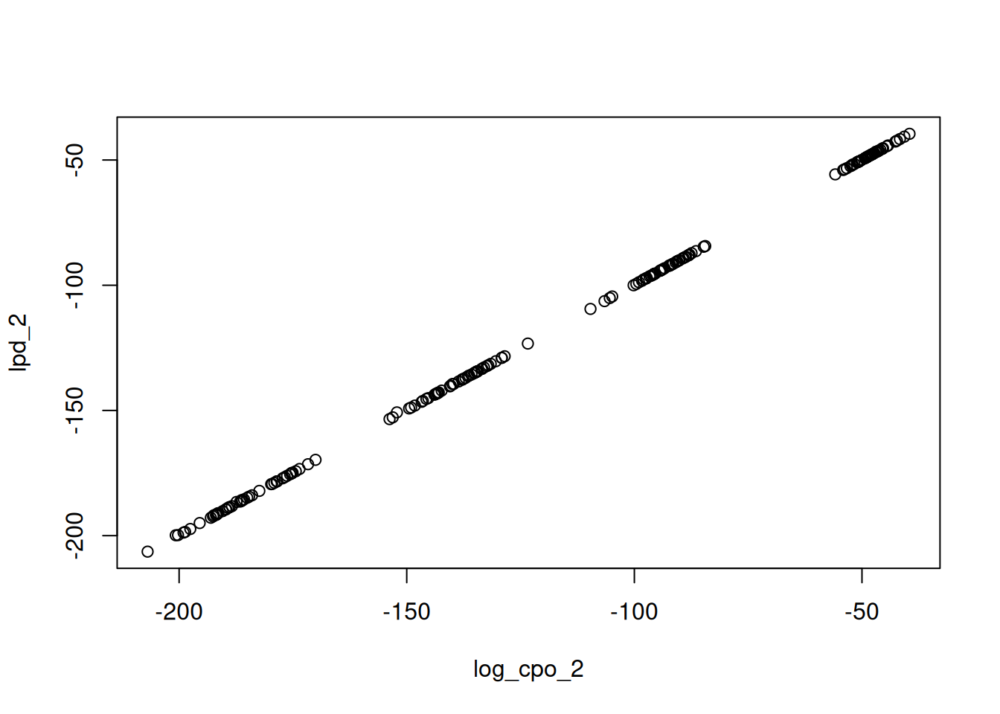

# Leave-One-Out Cross-Validation

## Introduction

How well would my model predict *new* data? Leave-one-out (LOO)
cross-validation answers this by holding out one unit at a time,
refitting the model to the remaining data, and scoring the held-out unit
under the refitted posterior. The total score is the expected log
predictive density,
``` math
  \mathrm{elpd}_{\mathrm{loo}} = \sum_{u=1}^n \log p(y_u \mid y_{-u}),
```
which rewards models that predict well and automatically penalises
overfitting, making it a natural criterion for comparing models.

Computed naively, LOO needs $`n`$ refits. MCMC-based packages such as
[blavaan](https://blavaan.org) avoid this by importance-sampling over
posterior draws ([Vehtari et al. 2017](#ref-vehtari2017practical)), but
this still requires the full set of MCMC draws. INLAvaan instead
exploits its Laplace machinery:
[`loo()`](https://inlavaan.haziqj.ml/reference/loo.md) approximates each
case-deletion posterior by a Taylor expansion around the full-data
posterior summary, so **the entire LOO is computed from a single fit**,
with no refitting and no sampling.

Two unit types are scored, resolved automatically from the model:

- **LOSO** (leave-one-*subject*-out): single-level models, one unit per
  row.
- **LOCO** (leave-one-*cluster*-out): two-level models, one unit per
  cluster – the relevant predictive question is “how well would the
  model predict a new cluster?”.

## Technical details in brief

[`loo()`](https://inlavaan.haziqj.ml/reference/loo.md) computes
everything from the fit’s Laplace summary
$`\mathcal{N}(\theta^*, \Omega)`$. An exact identity turns each held-out
predictive density into an expectation under the *full-data* posterior,
evaluated in closed form by Taylor-expanding the unit’s log-likelihood
$`\ell_u(\theta) = \log p(y_u \mid \theta)`$ about $`\theta^*`$. With
$`s_u`$ and $`H_u`$ the gradient and Hessian of $`\ell_u`$ there, the
two orders are
``` math
\begin{aligned}
  \log \mathrm{CPO}_u^{(1)} &= \ell_u - \tfrac12 s_u^\top \Omega\, s_u, \\
  \log \mathrm{CPO}_u^{(2)} &= \ell_u
    - \tfrac12 s_u^\top (\Omega^{-1} + H_u)^{-1} s_u
    + \tfrac12 \log \lvert I + \Omega H_u \rvert ,
\end{aligned}
```
the second order additionally handing back the information the unit
itself lent to the posterior. The headline `elpd_loo` is the sum of the
second-order terms, with standard error
$`\sqrt{n \, \widehat{\mathrm{var}}(\log \mathrm{CPO}_u)}`$; `looic`
$`= -2\,\mathrm{elpd}_{\mathrm{loo}}`$, and `p_loo` (the **loo**
package’s effective number of parameters, matching
[`loo::loo()`](https://mc-stan.org/loo/reference/loo.html)) comes from
the analogous expansion of the pointwise predictive density.

Two checks, both free with the result, tell you whether to trust the
expansion. The first is an existence condition and is enforced
automatically: $`\log \mathrm{CPO}_u^{(2)}`$ exists exactly when
$`\Omega^{-1} + H_u \succ 0`$, equivalently when the unit’s *leverage*
`k_max` (the largest eigenvalue of $`-\Omega H_u`$, reported in
`per_unit`) stays below 1. A unit at or above 1 carries as much
curvature as the whole posterior in some direction, so its true LOO term
genuinely is extreme. In such cases, the whole result then reverts to
first order, with a warning naming the units to inspect.

The second is a gap check, printed with every second-order result. The
first- and second-order totals of a settled expansion differ by
$`p_D/2`$, approached *from above*, so the printout reports the gap, the
reference $`p_D/2`$ (`pd_trace`, the trace form
$`\operatorname{tr}(-\Omega \sum_u H_u)`$), and the excess of one over
the other. A large positive excess says the expansion has not settled
over the sample. No threshold is applied, and the reading is left to the
user, but in our validation the gap was always within a few elpd units
of zero for well-behaved models.

## A first example

We fit the classic three-factor CFA to the Holzinger–Swineford data.

``` r

HS.model <- "
  visual  =~ x1 + x2 + x3
  textual =~ x4 + x5 + x6
  speed   =~ x7 + x8 + x9
"
fit <- acfa(HS.model, HolzingerSwineford1939, meanstructure = TRUE,
            verbose = FALSE)

(res <- loo(fit))
#> ── Leave-one-subject-out ───────────────────────── 301 subjects, second-order ──
#> 
#>          Estimate   SE
#> elpd_loo  -3769.2 43.0
#> p_loo        32.6  2.2
#> looic      7538.3 86.0
#> 
#> ── Curvature check ─────────────────────────────────────────────────────────────
#> 
#>   first-to-second-order gap        15.5
#>   pD/2 (trace)                     14.6
#>   excess over pD/2 (trace)        +6.1%
#> 
#> ℹ The gap approaches pD/2 (trace) from above. A large excess says the
#>   second-order expansion has not settled over the sample.
```

The printout ends with the gap check described above. The pointwise
contributions are available for inspection as well. E.g. a large
`score_norm` or an unusually low `log_cpo_2` flags a unit the model
predicts poorly, and `k_max` is the unit’s leverage:

``` r

head(res$per_unit)
#>   unit nobs    l_star score_norm     lpd_1     lpd_2 log_cpo_1 log_cpo_2
#> 1    1    1 -17.28684   6.635476 -17.17217 -17.21893 -17.40151 -17.45192
#> 2    2    1 -13.78478   5.434572 -13.70197 -13.77222 -13.86760 -13.94246
#> 3    3    1 -11.11607   3.794352 -11.08014 -11.17135 -11.15201 -11.24565
#> 4    4    1 -10.25394   2.583283 -10.23987 -10.28655 -10.26801 -10.31573
#> 5    5    1 -10.70222   2.973350 -10.68877 -10.73572 -10.71567 -10.76369
#> 6    6    1 -13.38440   5.003680 -13.32254 -13.41005 -13.44627 -13.53799
#>      det_term      k_max        k_min      k_sum       k_ssq   ok
#> 1 -0.04877800 0.03771003 -0.041158433 0.09406725 0.006957204 TRUE
#> 2 -0.07227935 0.05815722 -0.049561144 0.14011057 0.008783305 TRUE
#> 3 -0.09292559 0.04160895 -0.009708889 0.18341460 0.004783929 TRUE
#> 4 -0.04763963 0.02980145 -0.010455924 0.09422994 0.002071943 TRUE
#> 5 -0.04796120 0.03028302 -0.011319956 0.09484053 0.002135644 TRUE
#> 6 -0.08983577 0.06559532 -0.023306856 0.17549082 0.008120885 TRUE
```

Because elpd differences between models fitted to the *same* data are
paired, their standard errors should be computed from the pointwise
differences rather than the marginal SEs. `compare(..., loo = TRUE)`
does this automatically:

``` r

one.factor <- "g =~ x1 + x2 + x3 + x4 + x5 + x6 + x7 + x8 + x9"
fit1f <- acfa(one.factor, HolzingerSwineford1939, meanstructure = TRUE,
              verbose = FALSE)
#> Warning: Fit diagnostics flagged 1 potential issue:
#> ✖ The VB correction shifted `g=~x5` by 1.02 posterior SDs; the Gaussian
#>   approximation at the mode may be inaccurate.
#> ℹ Inspect with `diagnostics(fit)` and `diagnostics(fit, type = "param")`.

compare(fit, fit1f, loo = TRUE)
#> Bayesian Model Comparison (INLAvaan)
#> Models ordered by ELPD (Taylor LOO, second-order)
#> elpd_diff/se_diff are paired differences vs the best model
#> 
#>  Model npar Marg.Loglik   logBF      DIC     pD      ELPD     SE  p_loo
#>    fit   30   -3885.112    0.00 7534.429 29.288 -3769.163 42.996 32.597
#>  fit1f   27   -3990.302 -105.19 7757.135 26.927 -3878.041 46.738 27.377
#>  elpd_diff se_diff
#>      0.000   0.000
#>   -108.878  17.009
```

Models are sorted by descending elpd, and `elpd_diff` and `se_diff` are
relative to the best model. A common heuristic is that a difference
smaller than a couple of `se_diff` units is not practically meaningful
([Vehtari et al. 2017](#ref-vehtari2017practical)). Here the
three-factor model is preferred by a wide margin.

## Two-level models

For models fitted with a `cluster` argument,
[`loo()`](https://inlavaan.haziqj.ml/reference/loo.md) automatically
switches to per-cluster scoring (LOCO). Here the covariates are modelled
jointly (`fixed.x = FALSE`) though the default `fixed.x = TRUE` is also
supported. See the practical considerations below for a discussion of
the two flavours.

``` r

model2l <- "
  level: 1
    fw =~ y1 + y2 + y3
    fw ~ x1 + x2 + x3
  level: 2
    fb =~ y1 + y2 + y3
    fb ~ w1 + w2
"
fit2l <- asem(model2l, Demo.twolevel, cluster = "cluster",
              meanstructure = TRUE, fixed.x = FALSE, verbose = FALSE)
(loco <- loo(fit2l))  # type = "loco" is automatic
#> ── Leave-one-cluster-out ───────────────────────── 200 clusters, second-order ──
#> 
#>          Estimate     SE
#> elpd_loo -23344.2  731.4
#> p_loo        34.6    2.1
#> looic     46688.4 1462.9
#> 
#> ── Curvature check ─────────────────────────────────────────────────────────────
#> 
#>   first-to-second-order gap        17.5
#>   pD/2 (trace)                     16.7
#>   excess over pD/2 (trace)        +4.3%
#> 
#> ℹ The gap approaches pD/2 (trace) from above. A large excess says the
#>   second-order expansion has not settled over the sample.
```

With the per unit dataframe stored, we can perform additional
diagnostics, such as to query the relationship between the second-order
log predictive density and the second-order log CPO. A unit sitting
above the diagonal in the plot below is one the full-data posterior
flatters, since its in-sample density exceeds its held-out one. The
vertical gap is exactly its contribution to `p_loo`.

``` r

plot(lpd_2 ~ log_cpo_2, loco$per_unit)
```



There is no need to score every unit each time. The `units` argument
restricts the pass to a chosen subset, given as cluster positions for
LOCO and case numbers for LOSO, and the reported totals then cover that
subset alone. This is useful when a full pass is expensive, or to
revisit the units the diagnostics above single out. Here we rescore the
three worst-predicted clusters:

``` r

worst <- with(loco$per_unit, unit[order(log_cpo_2)][1:3])
loo(fit2l, units = worst)
#> ── Leave-one-cluster-out ─────────────────────────── 3 clusters, second-order ──
#> 
#>          Estimate   SE
#> elpd_loo   -607.9  6.4
#> p_loo         1.9  0.4
#> looic      1215.8 12.9
#> 
#> ── Curvature check ─────────────────────────────────────────────────────────────
#> 
#>   first-to-second-order gap         0.5
#>   pD/2 (trace)                      0.5
#>   excess over pD/2 (trace)       +11.9%
#> 
#> ℹ The gap approaches pD/2 (trace) from above. A large excess says the
#>   second-order expansion has not settled over the sample.
```

## Storing the result with the fit

`loo(fit)` never modifies the fitted object – but under the default
`test = "standard"`, the fit itself already computes and stores both the
full LOO and the WAIC whenever the model is supported, has a mean
structure, and (for LOO) the predicted serial cost is within a 10-second
budget. The prediction is calibrated at run time by timing a single
score evaluation, so on typical single-level models – where the full LOO
costs a fraction of the fit itself – you simply get `loo(fit)` and
`waic(fit)` for free. The WAIC reuses the very draws the fit produced
for its posterior summaries, so it costs only one casewise pass.

For expensive cases you can force the LOO regardless of the budget at
fit time,

``` r

fit <- acfa(HS.model, HolzingerSwineford1939, meanstructure = TRUE,
            test = c("standard", "loo"))
```

or store it afterwards with an explicit reassignment:

``` r

fit <- add_loo(fit)
```

A stored result is returned instantly by `loo(fit)` and reused by
[`fitmeasures()`](https://inlavaan.haziqj.ml/reference/fitMeasures.md)
(where the blavaan-style names appear) and `compare(..., loo = TRUE)`:

``` r

fitmeasures(fit, c("elpd_loo", "se_loo", "p_loo", "looic"))
#>  elpd_loo     p_loo     looic    se_loo 
#> -3769.163    32.597  7538.327    85.992
```

## Scoring submodels without refitting

The `theta` and `Omega` arguments evaluate the LOO at an *arbitrary*
Gaussian posterior summary $`(\theta^*, \Omega)`$ instead of the fit’s
own. Combined with Gaussian conditioning, this scores a constrained
submodel from the encompassing fit alone. For example, to score the
submodel with the `visual ~~ speed` covariance fixed to zero, condition
the summary on that parameter and re-evaluate:

``` r

int <- get_inlavaan_internal(fit)
theta <- int$theta_star
Omega <- int$Sigma_theta

p <- which(names(coef(fit)) == "visual~~speed")
theta_c <- theta - Omega[, p] * (theta[p] / Omega[p, p])
Omega_c <- Omega - tcrossprod(Omega[, p]) / Omega[p, p]

loo(fit, theta = theta_c, Omega = Omega_c)
#> ── Leave-one-subject-out ───────────────────────── 301 subjects, second-order ──
#> 
#>          Estimate   SE
#> elpd_loo  -3786.3 45.0
#> p_loo        34.2  2.5
#> looic      7572.6 90.1
#> 
#> ℹ Evaluated at a user-supplied (theta, Sigma) summary.
#> 
#> ── Curvature check ─────────────────────────────────────────────────────────────
#> 
#>   first-to-second-order gap        16.4
#>   pD/2 (trace)                     15.4
#>   excess over pD/2 (trace)        +6.6%
#> 
#> ℹ The gap approaches pD/2 (trace) from above. A large excess says the
#>   second-order expansion has not settled over the sample.
```

No refit took place: the conditioned summary has the covariance locked
at zero (its row and column of `Omega_c` vanish), and the LOO machinery
automatically restricts to the remaining parameters. This pair of
arguments is the building block for custom model-search strategies –
screen many candidate restrictions by conditioning, score each with
[`loo()`](https://inlavaan.haziqj.ml/reference/loo.md), and only refit
the winners. INLAvaan deliberately provides just this evaluation API;
the search logic is yours to design.

## Practical considerations

- **Compare models at second order only** (the default). The first-order
  score overstates the elpd by $`p_D/2`$, which grows with model
  dimension; in our validation the second-order score tracks brute-force
  refits to within about one elpd unit, while first order can be off by
  tens. [`compare()`](https://inlavaan.haziqj.ml/reference/compare.md)
  scores every model at one common order and states it.
- **Joint and conditional scores never mix.** With exogenous covariates
  the score follows the fitted likelihood: under `fixed.x = FALSE` a
  unit is scored by the joint predictive density of its outcomes *and*
  covariates, while under `fixed.x = TRUE` (lavaan’s default) it is
  scored by the density of its outcomes *given* its covariates, the
  familiar regression cross-validation convention. The two estimate
  different quantities, so `compare(..., loo = TRUE)` refuses to put
  them in one table. Within the conditional flavour, models with
  *different* covariate sets are directly comparable as long as the
  outcomes match (the covariate-selection setting); joint scores require
  identical variable sets across models.
- **Fit with `meanstructure = TRUE`**, otherwise absolute elpd values
  are biased (same-data comparisons remain valid either way).
- **LOCO and LOSO answer different questions.** On two-level fits the
  default `type = "loco"` is the marginal predictive (a *new* cluster);
  `type = "loso"` scores the conditional one (a new row in an *observed*
  cluster) and warns, since the two are easily conflated ([Merkle et al.
  2019](#ref-merkle2019bayesian)).
- **Missing data.** FIML fits are scored on the observed entries, so two
  such fits are comparable only when they share the same data *and* the
  same holes; see the [missing-data
  article](https://inlavaan.haziqj.ml/articles/missing.md).
- **Scope and cost.** Supported are continuous-indicator `ML` fits,
  single- or two-level, single-group or multigroup (not ordinal PML, not
  multigroup two-level). Parallelism is opt-in via `cores`, and `units`
  scores a subset.

## References

Merkle, Edgar C., Daniel Furr, and Sophia Rabe-Hesketh. 2019. “Bayesian
Comparison of Latent Variable Models: Conditional Versus Marginal
Likelihoods.” *Psychometrika* 84 (3): 802–29.
<https://doi.org/10.1007/s11336-019-09679-0>.

Vehtari, Aki, Andrew Gelman, and Jonah Gabry. 2017. “Practical Bayesian
Model Evaluation Using Leave-One-Out Cross-Validation and WAIC.”
*Statistics and Computing* 27 (5): 1413–32.
<https://doi.org/10.1007/s11222-016-9696-4>.
