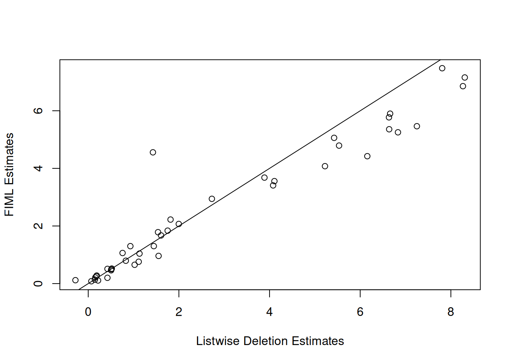

# Missing Values

[INLAvaan](https://inlavaan.haziqj.ml/) handles missing data in one of
two ways: listwise deletion (default, i.e. uses all complete cases) or
Full Information Maximum Likelihood (FIML; `missing = "ML"`).

## Simulate Data

``` r
library(INLAvaan)
mod <- "
    # Latent variable definitions
    ind60 =~ x1 + x2 + x3
    dem60 =~ y1 + y2 + y3 + y4
    dem65 =~ y5 + y6 + y7 + y8

    # Latent regressions
    dem60 ~ ind60
    dem65 ~ ind60 + dem60

    # Residual correlations
    y1 ~~ y5
    y2 ~~ y4 + y6
    y3 ~~ y7
    y4 ~~ y8
    y6 ~~ y8
  "
dat <- lavaan::PoliticalDemocracy

# Simulate missingness (MCAR)
set.seed(221)
mis <- matrix(rbinom(prod(dim(dat)), 1, 0.99), nrow(dat), ncol(dat))
datmiss <- dat * mis
datmiss[datmiss == 0] <- NA
```

## Listwise Deletion

``` r
fit1 <- asem(mod, datmiss, meanstructure = TRUE)
#> ℹ Finding posterior mode.
#> ✔ Finding posterior mode. [124ms]
#> 
#> ℹ Computing the Hessian.
#> ✔ Computing the Hessian. [437ms]
#> 
#> ℹ Performing VB correction.
#> ✔ VB correction; mean |δ| = 0.065σ. [386ms]
#> 
#> ⠙ Fitting skew normal to 0/42 marginals.
#> ⠹ Fitting skew normal to 8/42 marginals.
#> ✔ Fitting skew normal to 42/42 marginals. [3.1s]
#> 
#> ℹ Sampling covariances and defined parameters.
#> ✔ Sampling covariances and defined parameters. [191ms]
#> 
#> ⠙ Computing ppp and DIC.
#> ⠹ Computing ppp and DIC.
#> ✔ Computing ppp and DIC. [587ms]
#> 
fit1@Data@nobs[[1]] == nrow(datmiss[complete.cases(datmiss), ])
#> [1] TRUE
print(fit1)
#> INLAvaan 0.2.3.9003 ended normally after 71 iterations
#> 
#>   Estimator                                      BAYES
#>   Optimization method                           NLMINB
#>   Number of model parameters                        42
#> 
#>                                                   Used       Total
#>   Number of observations                            35          75
#> 
#> Model Test (User Model):
#> 
#>    Marginal log-likelihood                    -818.105 
#>    PPP (Chi-square)                              0.102
coef(fit1)
#>    ind60=~x2    ind60=~x3    dem60=~y2    dem60=~y3    dem60=~y4    dem65=~y6 
#>        1.804        1.762        0.964        0.816        1.583        1.100 
#>    dem65=~y7    dem65=~y8  dem60~ind60  dem65~ind60  dem65~dem60       y1~~y5 
#>        0.754        1.425        0.954        0.534        1.113        0.187 
#>       y2~~y4       y2~~y6       y3~~y7       y4~~y8       y6~~y8       x1~~x1 
#>        0.406        0.501        0.198       -0.285        0.191        0.070 
#>       x2~~x2       x3~~x3       y1~~y1       y2~~y2       y3~~y3       y4~~y4 
#>        0.142        0.420        1.566        7.760        4.077        2.625 
#>       y5~~y5       y6~~y6       y7~~y7       y8~~y8 ind60~~ind60 dem60~~dem60 
#>        1.478        6.614        1.969        3.648        0.502        1.352 
#> dem65~~dem65         x1~1         x2~1         x3~1         y1~1         y2~1 
#>        0.154        5.424        5.534        4.107        7.250        6.634 
#>         y3~1         y4~1         y5~1         y6~1         y7~1         y8~1 
#>        8.306        6.833        6.639        5.223        8.266        6.156
```

## Full Information Maximum Likelihood (FIML)

``` r
fit2 <- asem(mod, datmiss, missing = "ML", meanstructure = TRUE)
#> ℹ Finding posterior mode.
#> ✔ Finding posterior mode. [258ms]
#> 
#> ℹ Computing the Hessian.
#> ✔ Computing the Hessian. [724ms]
#> 
#> ℹ Performing VB correction.
#> ✔ VB correction; mean |δ| = 0.044σ. [470ms]
#> 
#> ⠙ Fitting skew normal to 0/42 marginals.
#> ⠹ Fitting skew normal to 7/42 marginals.
#> ⠸ Fitting skew normal to 31/42 marginals.
#> ✔ Fitting skew normal to 42/42 marginals. [5.4s]
#> 
#> ℹ Sampling covariances and defined parameters.
#> ✔ Sampling covariances and defined parameters. [186ms]
#> 
#> ⠙ Computing ppp and DIC.
#> ✔ Computing ppp and DIC. [808ms]
#> 
print(fit2)
#> INLAvaan 0.2.3.9003 ended normally after 93 iterations
#> 
#>   Estimator                                      BAYES
#>   Optimization method                           NLMINB
#>   Number of model parameters                        42
#> 
#>   Number of observations                            75
#>   Number of missing patterns                        19
#> 
#> Model Test (User Model):
#> 
#>    Marginal log-likelihood                   -1414.910 
#>    PPP (Chi-square)                              0.000
coef(fit2)
#>    ind60=~x2    ind60=~x3    dem60=~y2    dem60=~y3    dem60=~y4    dem65=~y6 
#>        2.211        1.844        0.650        0.791        0.957        1.025 
#>    dem65=~y7    dem65=~y8  dem60~ind60  dem65~ind60  dem65~dem60       y1~~y5 
#>        1.055        1.301        1.305        0.530        0.757        0.253 
#>       y2~~y4       y2~~y6       y3~~y7       y4~~y8       y6~~y8       x1~~x1 
#>        0.192        0.490        0.101        0.108        0.284        0.083 
#>       x2~~x2       x3~~x3       y1~~y1       y2~~y2       y3~~y3       y4~~y4 
#>        0.129        0.510        1.668        7.436        3.405        2.907 
#>       y5~~y5       y6~~y6       y7~~y7       y8~~y8 ind60~~ind60 dem60~~dem60 
#>        1.773        5.887        2.057        3.646        0.459        4.476 
#> dem65~~dem65         x1~1         x2~1         x3~1         y1~1         y2~1 
#>        0.207        5.060        4.791        3.557        5.462        5.768 
#>         y3~1         y4~1         y5~1         y6~1         y7~1         y8~1 
#>        7.153        5.241        5.354        4.069        6.849        4.414
```

``` r
plot(
  coef(fit1), 
  coef(fit2), 
  xlab = "Listwise Deletion Estimates", 
  ylab = "FIML Estimates"
)
abline(0, 1)
```


