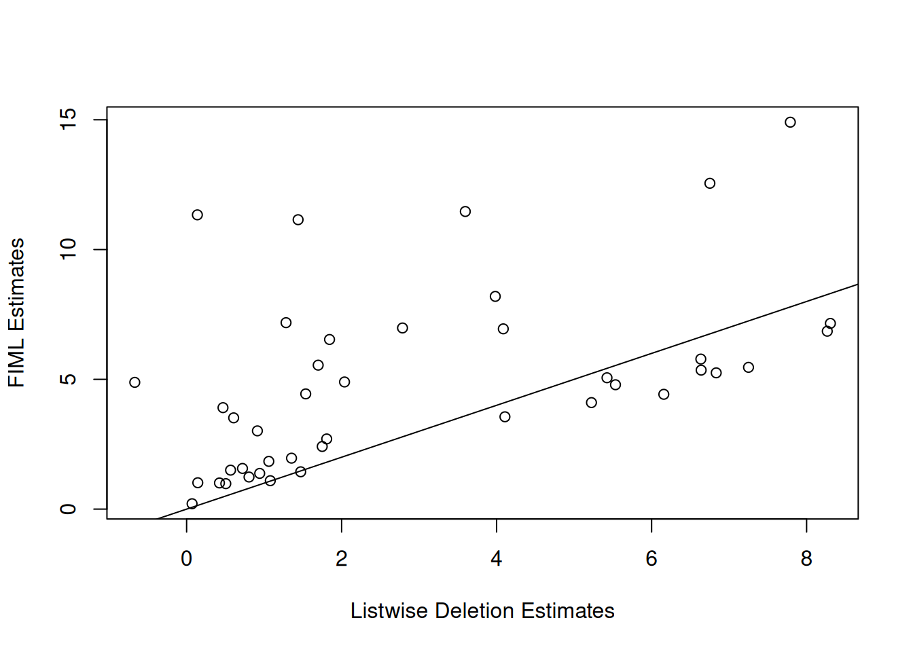

# Missing Values

[INLAvaan](https://inlavaan.haziqj.ml/) handles missing data in one of
two ways: listwise deletion (default, i.e. uses all complete cases) or
Full Information Maximum Likelihood (FIML; `missing = "ML"`).

## Simulate Data

``` r
library(INLAvaan)
mod <- "
    # Latent variable definitions
    ind60 =~ x1 + x2 + x3
    dem60 =~ y1 + y2 + y3 + y4
    dem65 =~ y5 + y6 + y7 + y8

    # Latent regressions
    dem60 ~ ind60
    dem65 ~ ind60 + dem60

    # Residual correlations
    y1 ~~ y5
    y2 ~~ y4 + y6
    y3 ~~ y7
    y4 ~~ y8
    y6 ~~ y8
  "
dat <- lavaan::PoliticalDemocracy

# Simulate missingness (MCAR)
set.seed(221)
mis <- matrix(rbinom(prod(dim(dat)), 1, 0.99), nrow(dat), ncol(dat))
datmiss <- dat * mis
datmiss[datmiss == 0] <- NA
```

## Listwise Deletion

``` r
fit1 <- asem(mod, datmiss, meanstructure = TRUE)
#> ℹ Finding posterior mode.
#> ✔ Finding posterior mode. [137ms]
#> 
#> ℹ Computing the Hessian.
#> ✔ Computing the Hessian. [162ms]
#> 
#> ℹ Performing VB correction.
#> ✔ VB correction; mean |δ| = 0.079σ. [472ms]
#> 
#> ⠙ Fitting 0/42 skew-normal marginals.
#> ⠹ Fitting 24/42 skew-normal marginals.
#> ✔ Fitting 42/42 skew-normal marginals. [3.1s]
#> 
#> ℹ Adjusting copula correlations (NORTA).
#> ✔ Adjusting copula correlations (NORTA). [387ms]
#> 
#> ⠙ Posterior sampling and summarising.
#> ✔ Posterior sampling and summarising. [901ms]
#> 
fit1@Data@nobs[[1]] == nrow(datmiss[complete.cases(datmiss), ])
#> [1] TRUE
print(fit1)
#> INLAvaan 0.2.3.9016 ended normally after 71 iterations
#> 
#>   Estimator                                      BAYES
#>   Optimization method                           NLMINB
#>   Number of model parameters                        42
#> 
#>                                                   Used       Total
#>   Number of observations                            35          75
#> 
#> Model Test (User Model):
#> 
#>    Marginal log-likelihood                    -818.478 
#>    PPP (Chi-square)                              0.499
coef(fit1)
#>    ind60=~x2    ind60=~x3    dem60=~y2    dem60=~y3    dem60=~y4    dem65=~y6 
#>        1.808        1.750        0.943        0.805        1.472        1.061 
#>    dem65=~y7    dem65=~y8  dem60~ind60  dem65~ind60  dem65~dem60       y1~~y5 
#>        0.721        1.354        0.913        0.567        1.080        0.255 
#>       y2~~y4       y2~~y6       y3~~y7       y4~~y8       y6~~y8       x1~~x1 
#>        0.399        0.497        0.208       -0.227        0.222        0.071 
#>       x2~~x2       x3~~x3       y1~~y1       y2~~y2       y3~~y3       y4~~y4 
#>        0.144        0.424        1.698        7.790        4.086        2.786 
#>       y5~~y5       y6~~y6       y7~~y7       y8~~y8 ind60~~ind60 dem60~~dem60 
#>        1.537        6.752        2.038        3.983        0.506        1.439 
#> dem65~~dem65         x1~1         x2~1         x3~1         y1~1         y2~1 
#>        0.139        5.424        5.533        4.107        7.250        6.634 
#>         y3~1         y4~1         y5~1         y6~1         y7~1         y8~1 
#>        8.306        6.833        6.639        5.223        8.266        6.156
```

## Full Information Maximum Likelihood (FIML)

``` r
fit2 <- asem(mod, datmiss, missing = "ML", meanstructure = TRUE)
#> ℹ Finding posterior mode.
#> ✔ Finding posterior mode. [260ms]
#> 
#> ℹ Computing the Hessian.
#> ✔ Computing the Hessian. [251ms]
#> 
#> ℹ Performing VB correction.
#> ✔ VB correction; mean |δ| = 0.040σ. [519ms]
#> 
#> ⠙ Fitting 0/42 skew-normal marginals.
#> ⠹ Fitting 16/42 skew-normal marginals.
#> ⠸ Fitting 39/42 skew-normal marginals.
#> ✔ Fitting 42/42 skew-normal marginals. [5.4s]
#> 
#> ℹ Adjusting copula correlations (NORTA).
#> ✔ Adjusting copula correlations (NORTA). [463ms]
#> 
#> ⠙ Posterior sampling and summarising.
#> ✔ Posterior sampling and summarising. [1.4s]
#> 
print(fit2)
#> INLAvaan 0.2.3.9016 ended normally after 93 iterations
#> 
#>   Estimator                                      BAYES
#>   Optimization method                           NLMINB
#>   Number of model parameters                        42
#> 
#>   Number of observations                            75
#>   Number of missing patterns                        19
#> 
#> Model Test (User Model):
#> 
#>    Marginal log-likelihood                   -1414.868 
#>    PPP (Chi-square)                              0.005
coef(fit2)
#>    ind60=~x2    ind60=~x3    dem60=~y2    dem60=~y3    dem60=~y4    dem65=~y6 
#>        2.214        1.835        0.650        0.791        0.954        1.026 
#>    dem65=~y7    dem65=~y8  dem60~ind60  dem65~ind60  dem65~dem60       y1~~y5 
#>        1.050        1.287        1.299        0.524        0.756        0.252 
#>       y2~~y4       y2~~y6       y3~~y7       y4~~y8       y6~~y8       x1~~x1 
#>        0.192        0.490        0.103        0.110        0.277        0.084 
#>       x2~~x2       x3~~x3       y1~~y1       y2~~y2       y3~~y3       y4~~y4 
#>        0.136        0.511        1.699        7.448        3.408        2.945 
#>       y5~~y5       y6~~y6       y7~~y7       y8~~y8 ind60~~ind60 dem60~~dem60 
#>        1.794        5.910        2.073        3.682        0.462        4.558 
#> dem65~~dem65         x1~1         x2~1         x3~1         y1~1         y2~1 
#>        0.206        5.060        4.791        3.557        5.462        5.787 
#>         y3~1         y4~1         y5~1         y6~1         y7~1         y8~1 
#>        7.158        5.253        5.356        4.092        6.855        4.422
```

``` r
plot(
  coef(fit1), 
  coef(fit2), 
  xlab = "Listwise Deletion Estimates", 
  ylab = "FIML Estimates"
)
abline(0, 1)
```


