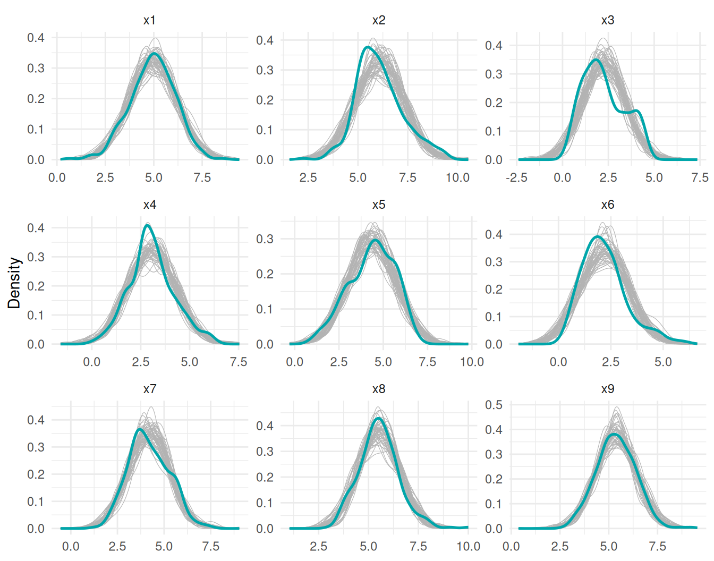
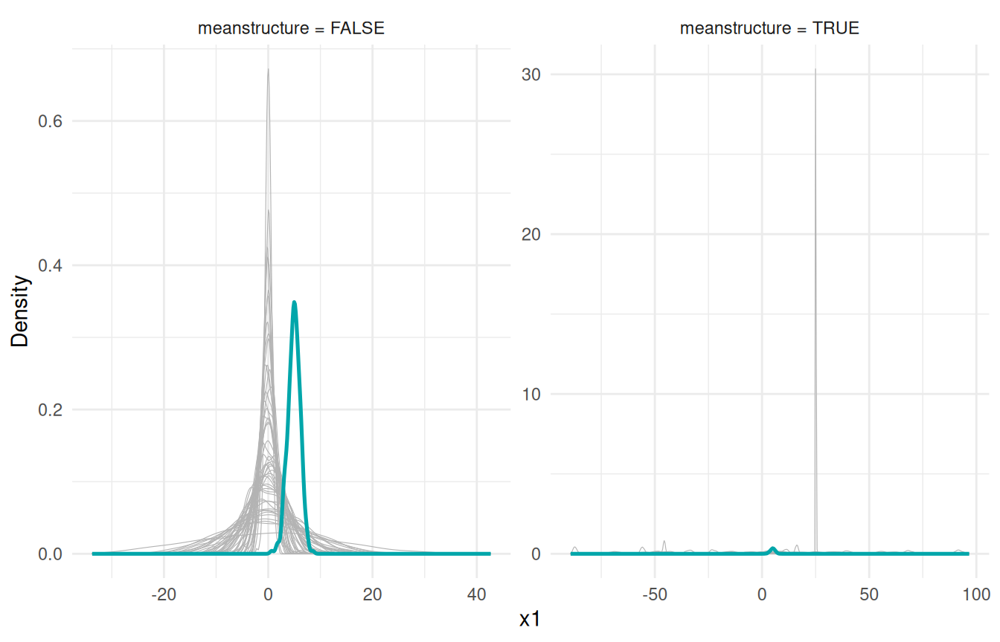
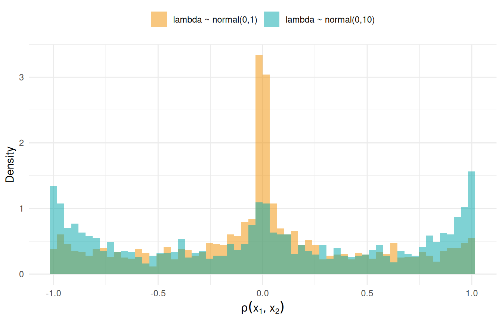

# Prior and Posterior Predictive Checks

A predictive check asks a simple question: **does data generated by the
model look like data I have (or expect)?** With parameters drawn from
the posterior this is a *posterior* predictive check (PPC)—a
goodness-of-fit tool. With parameters drawn from the prior it is a
*prior* predictive check—a way to see what your priors actually imply
before the data have any say.

## Which function?

A predictive check compares the observed *dataset* against replicate
datasets, so it calls for
[`simulate()`](https://inlavaan.haziqj.ml/reference/simulate.md): each
replicate holds one parameter draw $`\boldsymbol\theta^{(s)}`$ fixed
across its $`n`$ rows, which is what makes the observed data
exchangeable with the replicates. Its sibling
[`sampling()`](https://inlavaan.haziqj.ml/reference/sampling.md)
refreshes $`\boldsymbol\theta`$ at every draw—the right tool for
distributions of *quantities* (parameters, model-implied moments) rather
than data, and we use it that way in the last section. Both accept
`prior = TRUE`; the [sampling
article](https://inlavaan.haziqj.ml/articles/sampling.md) compares the
two functions in detail and documents the generative chain.

## Posterior predictive checks

We fit the classic three-factor Holzinger–Swineford model and draw 50
replicate datasets from the posterior predictive distribution.

``` r

dat <- lavaan::HolzingerSwineford1939
mod <- "
  visual  =~ x1 + x2 + x3
  textual =~ x4 + x5 + x6
  speed   =~ x7 + x8 + x9
"
fit <- acfa(mod, dat, verbose = FALSE)
yrep <- simulate(fit, nsim = 50)
```

Each element of `yrep` is a data frame with the same dimensions as the
original data. We overlay the density of every replicate (grey) on the
observed density (teal), for all nine indicators:

``` r

vars <- paste0("x", 1:9)
rep_df <- do.call(rbind, lapply(seq_along(yrep), function(s) {
  d <- yrep[[s]][vars]
  data.frame(sim = s, var = rep(vars, each = nrow(d)),
             value = unlist(d, use.names = FALSE))
}))
obs_df <- data.frame(var = rep(vars, each = nrow(dat)),
                     value = unlist(dat[vars], use.names = FALSE))

ggplot() +
  geom_density(data = rep_df, aes(value, group = sim),
               colour = "grey70", linewidth = 0.2) +
  geom_density(data = obs_df, aes(value),
               colour = "#00A6AA", linewidth = 0.9) +
  facet_wrap(~var, scales = "free") +
  labs(x = NULL, y = "Density") +
  theme_minimal(base_size = 11)
```



Figure 1: Posterior predictive check: densities of 50 replicate datasets
(grey) against the observed data (teal) for all nine indicators.

Most indicators sit comfortably inside the replicate envelope. The
clearest misfit is `x3`: the observed density has a second bump on the
right that no Gaussian replicate reproduces—a feature of the data the
model cannot generate. This is what a PPC is for: it points at *where*
the model fails, not just *whether* it fails. For a single-number
summary of the same idea (the posterior predictive $`p`$-value), see the
[Bayesian fit indices
article](https://inlavaan.haziqj.ml/articles/fit-indices.md).

## Prior predictive checks

Setting `prior = TRUE` draws each parameter from its prior instead of
the posterior—the data play no role, so this is a check of the *priors*.
We compare replicates from the covariance-only fit above with a refit
that models the means:

``` r

fit_ms <- acfa(mod, dat, meanstructure = TRUE, verbose = FALSE)

yp_f <- simulate(fit,    nsim = 50, prior = TRUE, silent = TRUE)
yp_t <- simulate(fit_ms, nsim = 50, prior = TRUE, silent = TRUE)
```

``` r

prior_df <- rbind(
  data.frame(ms = "meanstructure = FALSE",
             sim = rep(seq_along(yp_f), each = nrow(dat)),
             x1 = unlist(lapply(yp_f, `[[`, "x1"), use.names = FALSE)),
  data.frame(ms = "meanstructure = TRUE",
             sim = rep(seq_along(yp_t), each = nrow(dat)),
             x1 = unlist(lapply(yp_t, `[[`, "x1"), use.names = FALSE))
)
obs1_df <- data.frame(ms = unique(prior_df$ms), x1 = rep(dat$x1, each = 2))

ggplot() +
  geom_density(data = prior_df, aes(x1, group = sim),
               colour = "grey70", linewidth = 0.2) +
  geom_density(data = obs1_df, aes(x1),
               colour = "#00A6AA", linewidth = 0.9) +
  facet_wrap(~ms, scales = "free") +
  labs(x = "x1", y = "Density") +
  theme_minimal(base_size = 11)
```



Figure 2: Prior predictive replicates of x1 (grey) against the observed
density (teal), without and with a mean structure. Note the very
different x-axis scales.

Two things stand out, and **neither is a bug**:

- **Without a mean structure, replicates are centred at zero while the
  data sit around 5.** The model has no intercept parameters; INLAvaan
  treats the saturated means as having an improper flat prior that is
  integrated out analytically (see the [mean structures
  article](https://inlavaan.haziqj.ml/articles/meanstructure.md)). An
  improper prior cannot be sampled from, so the prior predictive simply
  has no location—replicates are placed at zero by convention. Compare
  **shape, scale, and correlation only**, not location. (Posterior
  replicates do not have this issue: there the means have a proper
  posterior $`N(\bar{\mathbf{y}}, \boldsymbol\Sigma/n)`$, and
  [`simulate()`](https://inlavaan.haziqj.ml/reference/simulate.md) and
  [`sampling()`](https://inlavaan.haziqj.ml/reference/sampling.md) draw
  from it to put replicates on the data scale.)

- **With a mean structure, replicates wander over roughly $`\pm 100`$.**
  The default intercept prior is `normal(0,32)`—deliberately vague so it
  barely influences the posterior, but generatively very spread out. If
  a realistic prior predictive matters to you, tighten it, e.g.
  `acfa(mod, dat, meanstructure = TRUE, dp = priors_for(nu = "normal(0,10)"))`,
  or per parameter with `prior()` modifiers in the model string.

## Checking the implied covariance with `sampling()`

Sometimes the question is not “what does replicate *data* look like” but
“what does the model-implied $`\boldsymbol\Sigma(\boldsymbol\theta)`$
look like under the prior?”—a quantity, so this is a job for
[`sampling()`](https://inlavaan.haziqj.ml/reference/sampling.md). With
`type = "implied"` each draw returns the implied moments directly. Here
we look at the implied correlation between `x1` and `x2` under the
default loading prior `normal(0,10)` and a tighter `normal(0,1)`:

``` r

imp <- sampling(fit, type = "implied", nsamp = 2000, prior = TRUE)
rho_def <- vapply(imp, \(m) cov2cor(m$cov)["x1", "x2"], numeric(1))

fit_tight <- acfa(mod, dat, dp = priors_for(lambda = "normal(0,1)"),
                  verbose = FALSE)
imp <- sampling(fit_tight, type = "implied", nsamp = 2000, prior = TRUE)
rho_tight <- vapply(imp, \(m) cov2cor(m$cov)["x1", "x2"], numeric(1))
```

``` r

rho_df <- data.frame(
  rho = c(rho_def, rho_tight),
  prior = rep(c("lambda ~ normal(0,10)", "lambda ~ normal(0,1)"), each = 2000)
)

ggplot(rho_df, aes(rho, fill = prior)) +
  geom_histogram(aes(y = after_stat(density)), bins = 60,
                 alpha = 0.5, position = "identity") +
  scale_fill_manual(values = c("lambda ~ normal(0,10)" = "#00A6AA",
                               "lambda ~ normal(0,1)" = "#F18F00")) +
  labs(x = expression(rho(x[1], x[2])), y = "Density", fill = NULL) +
  theme_minimal(base_size = 11) +
  theme(legend.position = "top")
```



Figure 3: Prior distribution of the model-implied correlation between x1
and x2, under the default loading prior (teal) and a tighter one
(orange).

The vague default piles prior mass at $`\pm 1`$: a `normal(0,10)`
loading is usually huge, and a huge loading forces the indicators it
connects into near-perfect correlation. The tighter prior concentrates
mass around zero with a much thinner tail at the extremes. Neither is
wrong—vague loading priors are a fine default when the data are
informative—but if you have real prior beliefs about the strength of an
indicator, this plot shows what they buy you. The same recipe works for
any implied quantity: implied variances from `diag(m$cov)`, or implied
means via `m$mean` when `meanstructure = TRUE`.

## Takeaways

- **PPC recipe:** `simulate(fit, nsim = 50)`, then overlay replicate
  densities on the data. Look for *where* the envelope misses.
- **Prior predictive recipe:** add `prior = TRUE`. Without a mean
  structure, ignore location (the flat mean prior is integrated out);
  with one, expect huge spread from the vague default intercept prior.
- **Quantities, not data:** use
  `sampling(type = "implied", prior = TRUE)` to see what your priors say
  about $`\boldsymbol\Sigma(\boldsymbol\theta)`$ itself.
