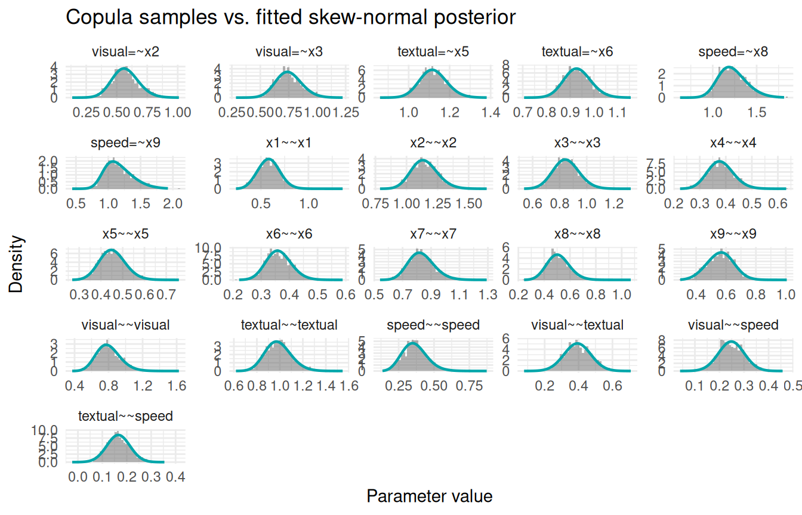
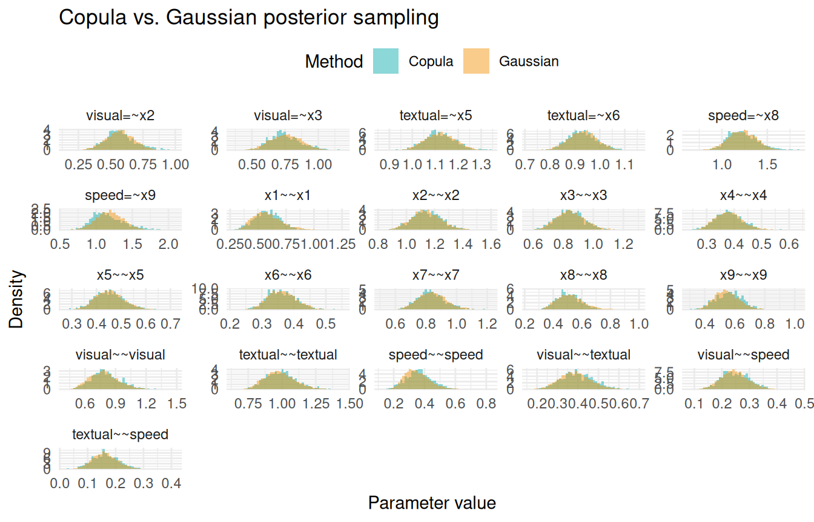
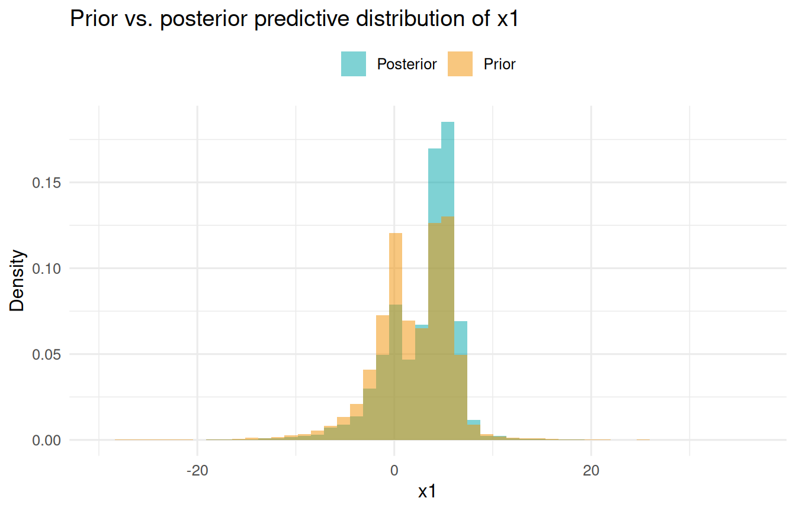

# Sampling from the Generative Model

## Purpose

After fitting a Bayesian SEM with INLAvaan, we often want to **draw
samples from the model** itself—either using posterior or prior
parameter values. The
[`sampling()`](https://inlavaan.haziqj.ml/reference/sampling.md)
function does exactly this: it propagates parameter draws through the
full generative chain

``` math
\underbrace{\boldsymbol\theta}_{\text{parameters}}
\;\longrightarrow\;
\underbrace{\boldsymbol\eta}_{\text{latent variables}}
\;\longrightarrow\;
\underbrace{\mathbf{y}^*}_{\text{observed variables}}
```

producing samples that are **not tied to any individual observation**.
This is distinct from
[`predict()`](https://inlavaan.haziqj.ml/reference/predict.md), which
returns individual-specific factor scores
$`\boldsymbol\eta \mid \mathbf{y}, \boldsymbol\theta`$.

Typical use cases include **posterior predictive checks** (PPCs) and
**prior predictive checks**.

## The generative model

Let $`\boldsymbol\theta^{(s)}`$ ($`s = 1, \dots, S`$) denote one
parameter draw. From this draw the SEM matrices $`\boldsymbol\Lambda`$,
$`\boldsymbol\Psi`$, $`\mathbf{B}`$, $`\boldsymbol\alpha`$,
$`\boldsymbol\nu`$, and $`\boldsymbol\Theta`$ are constructed. The
generative chain is:

**1. Latent variables.**
``` math
\boldsymbol\eta^{(s)}
\sim
\mathcal{N}\!\bigl(
  (\mathbf{I} - \mathbf{B})^{-1}\boldsymbol\alpha,\;
  \boldsymbol\Phi
\bigr),
\qquad
\boldsymbol\Phi
= (\mathbf{I} - \mathbf{B})^{-1}\boldsymbol\Psi\,
  [(\mathbf{I} - \mathbf{B})^{-1}]'.
```

**2. Observed variables.**
``` math
\mathbf{y}^{*(s)}
\sim
\mathcal{N}\!\bigl(
  \boldsymbol\Lambda\,\boldsymbol\eta^{(s)} + \boldsymbol\nu,\;
  \boldsymbol\Theta
\bigr).
```

When `prior = FALSE` (default), $`\boldsymbol\theta^{(s)}`$ comes from
the posterior; when `prior = TRUE`, each parameter is drawn
independently from its prior.

## Quick start

``` r

dat <- lavaan::HolzingerSwineford1939
mod <- "
  visual  =~ x1 + x2 + x3
  textual =~ x4 + x5 + x6
  speed   =~ x7 + x8 + x9
"
fit <- acfa(mod, dat, verbose = FALSE)
```

### Parameter samples

The default type `"lavaan"` returns an $`S \times p`$ matrix of
lavaan-side (constrained) parameter draws:

``` r

theta_post <- sampling(fit, type = "lavaan", nsamp = 2000)
dim(theta_post)
#> [1] 2000   21
head(theta_post[, 1:4])
#>      visual=~x2 visual=~x3 textual=~x5 textual=~x6
#> [1,]  0.6216553  0.9058102    1.124324   0.9962591
#> [2,]  0.5512186  0.8048597    1.213441   0.9163449
#> [3,]  0.5589617  0.7005065    0.980363   0.9248275
#> [4,]  0.5567215  0.7637923    1.141509   1.0359674
#> [5,]  0.5948079  1.0228482    1.073171   0.8665535
#> [6,]  0.3633649  0.7067464    1.089029   0.8697055
```

### Latent and observed samples

``` r

eta  <- sampling(fit, type = "latent",   nsamp = 1000)
ystar <- sampling(fit, type = "observed", nsamp = 1000)
dim(eta)    # 1000 x 3 (one per latent factor)
#> [1] 1000    3
dim(ystar)  # 1000 x 9 (one per observed indicator)
#> [1] 1000    9
```

### Everything at once

``` r

all_samps <- sampling(fit, type = "all", nsamp = 1000)
names(all_samps)
#> [1] "lavaan"   "theta"    "latent"   "observed" "implied"
```

## Comparing samples to the fitted marginals

INLAvaan approximates each marginal posterior with a skew-normal
density. We can overlay the
[`sampling()`](https://inlavaan.haziqj.ml/reference/sampling.md)
histogram (drawn via the copula method) on top of the fitted density
curve stored in `pdf_data` to verify that they agree.

``` r

# 1. Draw copula samples
samp_cop <- sampling(fit, type = "lavaan", nsamp = 1000, samp_copula = TRUE)

# 2. Retrieve the fitted skew-normal densities
int <- fit@external$inlavaan_internal
pdf_data <- int$pdf_data

# 3. Build a long data frame for ggplot
par_names <- colnames(samp_cop)
hist_df <- data.frame(
  param = rep(par_names, each = nrow(samp_cop)),
  value = as.vector(samp_cop)
)
hist_df$param <- factor(hist_df$param, levels = par_names)

curve_df <- do.call(rbind, Map(function(nm, df) {
  data.frame(param = nm, x = df$x, y = df$y)
}, par_names, pdf_data[par_names]))
curve_df$param <- factor(curve_df$param, levels = par_names)

# 4. Plot
ggplot(hist_df, aes(x = value)) +
  geom_histogram(aes(y = after_stat(density)), bins = 50,
                 fill = "grey40", alpha = 0.5) +
  geom_line(data = curve_df, aes(x = x, y = y),
            colour = "#00A6AA", linewidth = 0.8) +
  facet_wrap(~param, scales = "free") +
  labs(x = "Parameter value", y = "Density",
       title = "Copula samples vs. fitted skew-normal posterior") +
  theme_minimal(base_size = 11)
```



Figure 1: Copula samples (histogram) versus the fitted skew-normal
marginal (red curve) for all free parameters.

## Copula vs. Gaussian sampling

By default,
[`sampling()`](https://inlavaan.haziqj.ml/reference/sampling.md) uses
the copula method, which respects the skew-normal marginals. Setting
`samp_copula = FALSE` uses the multivariate Gaussian (Laplace)
approximation instead. The difference is most visible for parameters
with asymmetric posteriors, such as variance components.

``` r

samp_gauss <- sampling(fit, type = "lavaan", nsamp = 5000, samp_copula = FALSE)

cop_df <- data.frame(
  param = rep(par_names, each = nrow(samp_cop)),
  value = as.vector(samp_cop),
  method = "Copula"
)
gauss_df <- data.frame(
  param = rep(par_names, each = nrow(samp_gauss)),
  value = as.vector(samp_gauss),
  method = "Gaussian"
)
both_df <- rbind(cop_df, gauss_df)
both_df$param <- factor(both_df$param, levels = par_names)
both_df$method <- factor(both_df$method, levels = c("Copula", "Gaussian"))

ggplot(both_df, aes(x = value, fill = method)) +
  geom_histogram(aes(y = after_stat(density)), bins = 50,
                 alpha = 0.45, position = "identity") +
  facet_wrap(~param, scales = "free") +
  scale_fill_manual(values = c(Copula = "#00A6AA", Gaussian = "#F18F00")) +
  labs(x = "Parameter value", y = "Density", fill = "Method",
       title = "Copula vs. Gaussian posterior sampling") +
  theme_minimal(base_size = 11) +
  theme(legend.position = "top")
```



Figure 2: Comparison of marginal histograms from copula sampling (blue)
and Gaussian sampling (orange) for all parameters.

For symmetric posteriors (e.g., factor loadings), the two methods are
nearly identical. For positively-skewed posteriors (e.g., residual
variances), the copula method captures the asymmetry while the Gaussian
approximation is symmetric by construction.

## Prior predictive sampling

Setting `prior = TRUE` draws parameters from the prior distribution
(independently, ignoring the data) and propagates them through the
generative model. This is useful for checking whether the priors imply
sensible ranges for the observed data.

``` r

y_prior <- sampling(fit, type = "observed", nsamp = 10000, prior = TRUE)
#> Prior sampling: 6253 of 16253 draws (38.5%) rejected (non-PD model-implied
#> covariance).
y_post  <- sampling(fit, type = "observed", nsamp = 10000, prior = FALSE)
```

``` r

df_pp <- data.frame(
  x1 = c(y_prior[, "x1"], y_post[, "x1"]),
  source = rep(c("Prior", "Posterior"), each = 2000)
)

ggplot(df_pp, aes(x = x1, fill = source)) +
  geom_histogram(aes(y = after_stat(density)), bins = 50,
                 alpha = 0.5, position = "identity") +
  scale_fill_manual(values = c(Prior = "#F18F00", Posterior = "#00A6AA")) +
  labs(x = "x1", y = "Density", fill = NULL,
       title = "Prior vs. posterior predictive distribution of x1") +
  theme_minimal(base_size = 12) +
  theme(legend.position = "top")
```



Figure 3: Model-implied distribution of x1 under the prior (orange) and
posterior (blue).
