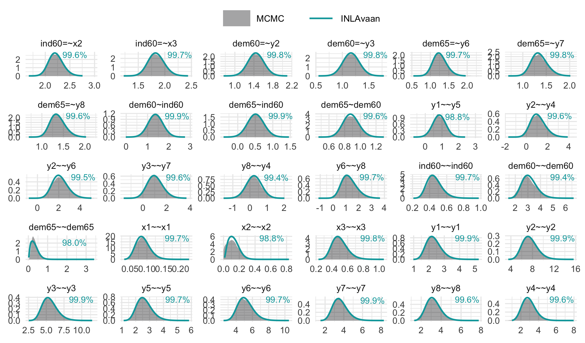

# INLAvaan

> Efficient approximate Bayesian inference for Structural Equation
> Models.

While Markov Chain Monte Carlo (MCMC) methods remain the gold standard
for exact Bayesian inference, they can be prohibitively slow for
iterative model development. [INLAvaan](http://inlavaan.haziqj.ml/)
offers a rapid alternative for ***la***tent ***va***riable
***an***alysis, delivering Bayesian results at (or near) the speed of
frequentist estimators. It achieves this through a custom, ground-up
implementation of the [Integrated Nested Laplace Approximation
(INLA)](https://www.r-inla.org), engineered specifically for the
[lavaan](https://lavaan.org) modelling framework.

## A familiar interface

[INLAvaan](http://inlavaan.haziqj.ml/) is designed to fit seamlessly
into your existing workflow. If you are familiar with the [(b)lavaan
syntax](https://lavaan.ugent.be/tutorial/syntax1.html), you can begin
using [INLAvaan](http://inlavaan.haziqj.ml/) immediately.

As a first impression of the package, consider the canonical example of
SEM applied to the Industrialisation and Political Democracy data set of
Bollen (1989)[¹](#fn1):

``` r
model <- "
  # Latent variable definitions
     ind60 =~ x1 + x2 + x3
     dem60 =~ y1 + y2 + y3 + y4
     dem65 =~ y5 + y6 + y7 + y8

  # Latent regressions
    dem60 ~ ind60
    dem65 ~ ind60 + dem60

  # Residual correlations
    y1 ~~ y5
    y2 ~~ y4 + y6
    y3 ~~ y7
    y4 ~~ y8
    y6 ~~ y8
  
  # Custom priors on latent variances
    ind60 ~~ prior('gamma(1, 1)')*ind60
    dem60 ~~ prior('gamma(1,.9)')*dem60
    dem65 ~~ prior('gamma(1,.5)')*dem65
"
utils::data("PoliticalDemocracy", package = "lavaan")

fit <- asem(model, PoliticalDemocracy)
#> ℹ Using MVN log-likelihood.
#> ℹ Finding posterior mode.
#> ✔ Finding posterior mode. [113ms]
#> 
#> ℹ Computing the Hessian.
#> ✔ Computing the Hessian. [336ms]
#> 
#> ℹ Using skew normal approximation.
#> ⠙ Fitting skew normal to 0/31 marginals.
#> ⠹ Fitting skew normal to 1/31 marginals.
#> ⠸ Fitting skew normal to 5/31 marginals.
#> ⠼ Fitting skew normal to 8/31 marginals.
#> ⠴ Fitting skew normal to 12/31 marginals.
#> ⠦ Fitting skew normal to 16/31 marginals.
#> ⠧ Fitting skew normal to 19/31 marginals.
#> ⠇ Fitting skew normal to 23/31 marginals.
#> ⠏ Fitting skew normal to 27/31 marginals.
#> ⠋ Fitting skew normal to 30/31 marginals.
#> ✔ Fitting skew normal to 31/31 marginals. [1.8s]
#> 
#> ℹ Sampling posterior covariances.
#> ✔ Sampling posterior covariances. [122ms]
#> 
#> ⠙ Computing ppp and DIC.
#> ⠹ Computing ppp and DIC.
#> ⠸ Computing ppp and DIC.
#> ✔ Computing ppp and DIC. [966ms]
#> 

summary(fit)
#> INLAvaan 0.2.0 ended normally after 77 iterations
#> 
#>   Estimator                                      BAYES
#>   Optimization method                           NLMINB
#>   Number of model parameters                        31
#> 
#>   Number of observations                            75
#> 
#> Model Test (User Model):
#> 
#>    Marginal log-likelihood                   -1641.277 
#>    PPP (Chi-square)                              0.504 
#> 
#> Information Criteria:
#> 
#>    Deviance (DIC)                             3158.284 
#>    Effective parameters (pD)                    30.999 
#> 
#> Parameter Estimates:
#> 
#>    Marginalisation method                     SKEWNORM
#> 
#> Latent Variables:
#>                    Estimate       SD     2.5%    97.5%    Prior       
#>   ind60 =~                                                            
#>     x1                1.000                                           
#>     x2                2.214    0.145    1.946    2.516    normal(0,10)
#>     x3                1.811    0.152    1.515    2.110    normal(0,10)
#>   dem60 =~                                                            
#>     y1                1.000                                           
#>     y2                1.355    0.206    0.975    1.784    normal(0,10)
#>     y3                1.113    0.156    0.816    1.430    normal(0,10)
#>     y4                1.348    0.163    1.039    1.681    normal(0,10)
#>   dem65 =~                                                            
#>     y5                1.000                                           
#>     y6                1.215    0.179    0.888    1.591    normal(0,10)
#>     y7                1.304    0.164    0.998    1.641    normal(0,10)
#>     y8                1.287    0.165    0.971    1.617    normal(0,10)
#> 
#> Regressions:
#>                    Estimate       SD     2.5%    97.5%    Prior       
#>   dem60 ~                                                             
#>     ind60             1.447    0.378    0.706    2.189    normal(0,10)
#>   dem65 ~                                                             
#>     ind60             0.553    0.241    0.076    1.022    normal(0,10)
#>     dem60             0.860    0.103    0.662    1.066    normal(0,10)
#> 
#> Covariances:
#>                    Estimate       SD     2.5%    97.5%    Prior       
#>  .y1 ~~                                                               
#>    .y5                0.297    0.367    0.048    1.485       beta(1,1)
#>  .y2 ~~                                                               
#>    .y4                0.246    0.696    0.110    2.824       beta(1,1)
#>    .y6                0.340    0.740    0.778    3.683       beta(1,1)
#>  .y3 ~~                                                               
#>    .y7                0.210    0.609   -0.195    2.195       beta(1,1)
#>  .y4 ~~                                                               
#>    .y8                0.103    0.446   -0.377    1.371       beta(1,1)
#>  .y6 ~~                                                               
#>    .y8                0.306    0.569    0.304    2.531       beta(1,1)
#> 
#> Variances:
#>                    Estimate       SD     2.5%    97.5%    Prior       
#>     ind60             0.472    0.094    0.320    0.687      gamma(1,1)
#>    .dem60             3.608    0.830    2.268    5.501     gamma(1,.9)
#>    .dem65             0.354    0.207    0.074    0.859     gamma(1,.5)
#>    .x1                0.086    0.021    0.052    0.133 gamma(1,.5)[sd]
#>    .x2                0.138    0.072    0.037    0.311 gamma(1,.5)[sd]
#>    .x3                0.495    0.098    0.335    0.718 gamma(1,.5)[sd]
#>    .y1                2.082    0.518    1.250    3.266 gamma(1,.5)[sd]
#>    .y2                7.886    1.517    5.405   11.329 gamma(1,.5)[sd]
#>    .y3                5.350    1.059    3.620    7.754 gamma(1,.5)[sd]
#>    .y4                3.349    0.843    2.000    5.281 gamma(1,.5)[sd]
#>    .y5                2.519    0.542    1.640    3.754 gamma(1,.5)[sd]
#>    .y6                5.268    1.004    3.627    7.548 gamma(1,.5)[sd]
#>    .y7                3.611    0.789    2.328    5.403 gamma(1,.5)[sd]
#>    .y8                3.452    0.778    2.197    5.228 gamma(1,.5)[sd]
```

## Validation against MCMC

Computation speed is valuable only when accuracy is preserved. Our
method yields posterior distributions that are visually and numerically
comparable to those obtained via MCMC (e.g., via
[blavaan](https://ecmerkle.github.io/blavaan/)/Stan), but at a fraction
of the computational cost.

The figure below illustrates the posterior density overlap for the
example above. The percentages refer to (one minus) the [Jensen-Shannon
divergence](https://en.wikipedia.org/wiki/Jensen%E2%80%93Shannon_divergence),
which gives a measure of similarity between two probability
distributions.

``` r
# install.packages("blavaan")
library(blavaan)
fit_blav <- bsem(model, PoliticalDemocracy)
res <- INLAvaan:::compare_mcmc(fit_blav, INLAvaan = fit)
print(res$p_compare)
```



## Installation

Install the development version of
[INLAvaan](http://inlavaan.haziqj.ml/) from GitHub using:

``` r
# install.packages("pak")
pak::pak("haziqj/INLAvaan")
```

*Optionally*[²](#fn2), you may wish to install
[INLA](https://www.r-inla.org). Following the official instructions
given [here](https://www.r-inla.org/download-install), install the
package by running this command in R:

``` r
install.packages(
  "INLA",
  repos = c(getOption("repos"), 
            INLA = "https://inla.r-inla-download.org/R/stable"), 
  dep = TRUE
)
```

## Citation

To cite package [INLAvaan](http://inlavaan.haziqj.ml/) in publications
use:

> Jamil, H (2025). *INLAvaan: Bayesian structural equation modelling
> with INLA* . R package version 0.2.0. URL:
> <https://inlavaan.haziqj.ml/>

A BibTeX entry for LaTeX users is:

``` bibtex
@Manual{,
    title = {INLAvaan: Bayesian structural equation modelling with INLA},
    author = {Haziq Jamil},
    year = {2025},
    note = {R package version 0.2.0},
    url = {https://inlavaan.haziqj.ml/},
  }
```

## License

The [INLAvaan](http://inlavaan.haziqj.ml/) package is licensed under the
[GPL-3](https://www.gnu.org/licenses/gpl-3.0.en.html).

``` plaintext
INLAvaan: Bayesian structural equation modelling with INLA
Copyright (C) 2025- Haziq Jamil

This program is free software: you can redistribute it and/or modify
it under the terms of the GNU General Public License as published by
the Free Software Foundation, either version 3 of the License, or
(at your option) any later version.

This program is distributed in the hope that it will be useful,
but WITHOUT ANY WARRANTY; without even the implied warranty of
MERCHANTABILITY or FITNESS FOR A PARTICULAR PURPOSE.  See the
GNU General Public License for more details.

You should have received a copy of the GNU General Public License
along with this program.  If not, see <http://www.gnu.org/licenses/>.
```

By using this package, you agree to comply with both licenses: the GPL-3
license for the software and the CC BY 4.0 license for the data.

------------------------------------------------------------------------

1.  Bollen, K. A. (1989). *Structural equations with latent variables*
    (pp. xiv, 514). John Wiley & Sons.
    <https://doi.org/10.1002/9781118619179>

2.  R-INLA dependency has been removed temporarily for v0.2-0.
