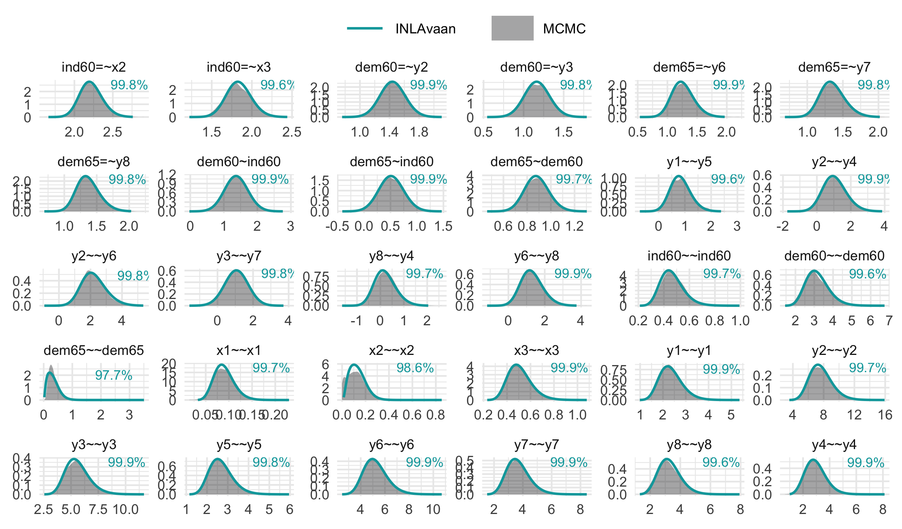

# INLAvaan

> Efficient approximate Bayesian inference for Structural Equation
> Models.

While Markov Chain Monte Carlo (MCMC) methods remain the gold standard
for exact Bayesian inference, they can be prohibitively slow for
iterative model development. [INLAvaan](https://inlavaan.haziqj.ml/)
offers a rapid alternative for ***la***tent ***va***riable
***an***alysis, delivering Bayesian results at (or near) the speed of
frequentist estimators. It achieves this through a custom, ground-up
implementation of the [Integrated Nested Laplace Approximation
(INLA)](https://www.r-inla.org), engineered specifically for the
[lavaan](https://lavaan.ugent.be) modelling framework.

## A familiar interface

[INLAvaan](https://inlavaan.haziqj.ml/) is designed to fit seamlessly
into your existing workflow. If you are familiar with the [(b)lavaan
syntax](https://lavaan.ugent.be/tutorial/syntax1.html), you can begin
using [INLAvaan](https://inlavaan.haziqj.ml/) immediately.

As a first impression of the package, consider the canonical example of
SEM applied to the Industrialisation and Political Democracy data set of
Bollen (1989)[^1]:

``` r

library(INLAvaan)
mod_poldem <- "
  # Latent variable definitions
     ind60 =~ x1 + x2 + x3
     dem60 =~ y1 + y2 + y3
     dem65 =~ y5 + y6 + y7 + y8

  # Latent regressions
    dem60 ~ ind60
    dem65 ~ ind60 + dem60

  # Residual correlations
    y1 ~~ y5
    y2 ~~ y4 + y6
    y3 ~~ y7
    y4 ~~ y8
    y6 ~~ y8
  
  # Fixed loading
    dem60 =~ 1.5*y4
  
  # Custom priors on latent variances
    ind60 ~~ prior('gamma(1, 1)')*ind60
    dem60 ~~ prior('gamma(2, 1)')*dem60
    dem65 ~~ prior('gamma(1,.5)')*dem65
"
utils::data("PoliticalDemocracy", package = "lavaan")

fit <- asem(model = mod_poldem, data = PoliticalDemocracy)
#> ℹ Mode finding and Hessian computation.
#> ✔ Posterior mode and Hessian. [88ms]
#> 
#> ℹ Performing VB correction.
#> ✔ VB correction; mean |δ| = 0.157σ. [119ms]
#> 
#> ⠙ Fitting 0/30 skew-normal marginals.
#> ✔ Fit 30/30 skew-normal marginals. [905ms]
#> 
#> ℹ Adjusting copula correlations (NORTA).
#> ✔ Adjust copula correlations (NORTA). [109ms]
#> 
#> ⠙ Posterior sampling and summarising.
#> ⠹ Computing fit indices (PPP/DIC).
#> ✔ Summarise 1000 posterior draws. [494ms]
#> 
#> ℹ Fit measures: PPP, DIC, LOO, WAIC.

summary(fit)
#> INLAvaan 0.3.0.9000 ended normally after 71 iterations
#> 
#>   Estimator                                      BAYES
#>   Optimization method                           NLMINB
#>   Number of model parameters                        30
#> 
#>   Number of observations                            75
#> 
#> Model Test (User Model):
#> 
#>    Marginal log-likelihood                   -1659.573 
#>    PPP (Chi-square)                              0.502 
#> 
#> Information Criteria:
#> 
#>    Deviance (DIC)                             3174.089 
#>    Effective parameters (pD)                    29.072 
#> 
#> Parameter Estimates:
#> 
#>    Marginalisation method                     SKEWNORM
#>    VB correction                                  TRUE
#> 
#> Latent Variables:
#>                    Estimate       SD     2.5%    97.5%     NMAD    Prior       
#>   ind60 =~                                                                     
#>     x1                1.000                                                    
#>     x2                2.217    0.147    1.948    2.527    0.007    normal(0,10)
#>     x3                1.838    0.155    1.547    2.156    0.004    normal(0,10)
#>   dem60 =~                                                                     
#>     y1                1.000                                                    
#>     y2                1.444    0.170    1.116    1.782    0.001    normal(0,10)
#>     y3                1.168    0.157    0.866    1.481    0.001    normal(0,10)
#>   dem65 =~                                                                     
#>     y5                1.000                                                    
#>     y6                1.260    0.187    0.925    1.659    0.007    normal(0,10)
#>     y7                1.355    0.174    1.046    1.729    0.008    normal(0,10)
#>     y8                1.367    0.177    1.054    1.750    0.008    normal(0,10)
#>   dem60 =~                                                                     
#>     y4                1.500                                                    
#> 
#> Regressions:
#>                    Estimate       SD     2.5%    97.5%     NMAD    Prior       
#>   dem60 ~                                                                      
#>     ind60             1.373    0.349    0.698    2.067    0.001    normal(0,10)
#>   dem65 ~                                                                      
#>     ind60             0.516    0.235    0.063    0.985    0.001    normal(0,10)
#>     dem60             0.882    0.103    0.688    1.091    0.011    normal(0,10)
#> 
#> Covariances:
#>                    Estimate       SD     2.5%    97.5%     NMAD    Prior       
#>  .y1 ~~                                                                        
#>    .y5                0.843    0.378    0.102    1.583    0.005       beta(1,1)
#>  .y2 ~~                                                                        
#>    .y4                1.071    0.722   -0.274    2.561    0.004       beta(1,1)
#>    .y6                2.159    0.746    0.797    3.727    0.011       beta(1,1)
#>  .y3 ~~                                                                        
#>    .y7                1.011    0.630   -0.180    2.293    0.005       beta(1,1)
#>  .y8 ~~                                                                        
#>    .y4                0.262    0.454   -0.573    1.213    0.003       beta(1,1)
#>  .y6 ~~                                                                        
#>    .y8                1.305    0.582    0.264    2.548    0.005       beta(1,1)
#> 
#> Variances:
#>                    Estimate       SD     2.5%    97.5%     NMAD    Prior       
#>     ind60             0.464    0.090    0.314    0.667    0.003      gamma(1,1)
#>    .dem60             3.169    0.615    2.135    4.534    0.001      gamma(2,1)
#>    .dem65             0.331    0.194    0.059    0.787    0.037     gamma(1,.5)
#>    .x1                0.090    0.022    0.053    0.137    0.006 gamma(1,.5)[sd]
#>    .x2                0.133    0.067    0.031    0.284    0.031 gamma(1,.5)[sd]
#>    .x3                0.509    0.101    0.342    0.735    0.003 gamma(1,.5)[sd]
#>    .y1                2.355    0.507    1.513    3.489    0.004 gamma(1,.5)[sd]
#>    .y2                7.652    1.461    5.189   10.894    0.003 gamma(1,.5)[sd]
#>    .y3                5.596    1.094    3.782    8.054    0.002 gamma(1,.5)[sd]
#>    .y5                2.677    0.561    1.744    3.934    0.005 gamma(1,.5)[sd]
#>    .y6                5.229    0.977    3.581    7.397    0.002 gamma(1,.5)[sd]
#>    .y7                3.678    0.801    2.337    5.463    0.007 gamma(1,.5)[sd]
#>    .y8                3.292    0.746    2.018    4.931    0.007 gamma(1,.5)[sd]
#>    .y4                2.951    0.776    1.628    4.656    0.012 gamma(1,.5)[sd]
```

## Validation against MCMC

Computation speed is valuable only when accuracy is preserved. Our
method yields posterior distributions that are visually and numerically
comparable to those obtained via MCMC (e.g., via
[blavaan](https://ecmerkle.github.io/blavaan/)/Stan), but at a fraction
of the computational cost.

The figure below illustrates the posterior density overlap for the
example above. The percentages refer to the one minus the
[Jensen-Shannon
distance](https://en.wikipedia.org/wiki/Jensen%E2%80%93Shannon_divergence),
which gives a measure of similarity between two probability
distributions.

``` r

# install.packages("blavaan")
library(blavaan)
fit_blav <- bsem(model = mod_poldem, data = PoliticalDemocracy, seed = 2026)
res <- INLAvaan:::compare_mcmc(fit_blav, INLAvaan = fit)
print(res$p_compare)
```



## Installation

Install the CRAN version of [INLAvaan](https://inlavaan.haziqj.ml/)
using:

``` r

install.packages("INLAvaan")
```

Alternatively, install the development version of
[INLAvaan](https://inlavaan.haziqj.ml/) from GitHub using:

``` r

# install.packages("pak")
pak::pak("haziqj/INLAvaan")
```

*Optionally*[^2], you may wish to install
[INLA](https://www.r-inla.org). Following the official instructions
given [here](https://www.r-inla.org/download/), install the package by
running this command in R:

``` r

install.packages(
  "INLA",
  repos = c(getOption("repos"), 
            INLA = "https://inla.r-inla-download.org/R/stable"), 
  dep = TRUE
)
```

## Citation

There are two papers related to [INLAvaan](https://inlavaan.haziqj.ml/)
and its underlying methodology. To cite
[INLAvaan](https://inlavaan.haziqj.ml/) in publications, consider citing
both.

To cite the methodological contribution exclusively, please use:

> Jamil, H., & Rue, H. (2026). *Approximate Bayesian inference for
> structural equation models using integrated nested Laplace
> approximations* (2603.25690 \[stat.ME\]). arXiv.
> <https://doi.org/10.48550/arXiv.2603.25690>

To cite the software implementation and workflows, please use:

> Jamil, H., & Rue, H. (2026). *Implementation and workflows for
> INLA-based approximate Bayesian structural equation modelling*
> (2604.00671 \[stat.CO\]). arXiv.
> <https://doi.org/10.48550/arXiv.2604.00671>

BibTeX entries for LaTeX users:

``` R
@Misc{jamil2026approximate,
  title = {Approximate Bayesian inference for structural equation models using integrated nested Laplace approximations},
  author = {Haziq Jamil and Håvard Rue},
  year = {2026},
  number = {2603.25690 [stat.ME]},
  eprint = {2603.25690},
  primaryclass = {stat.ME},
  publisher = {arXiv},
  doi = {10.48550/arXiv.2603.25690},
  archiveprefix = {arXiv},
  copyright = {Creative Commons Attribution Non Commercial Share Alike 4.0 International},
}

@Misc{jamil2026implementation,
  title = {Implementation and workflows for INLA-based approximate Bayesian structural equation modelling},
  author = {Haziq Jamil and Håvard Rue},
  year = {2026},
  number = {2604.00671 [stat.CO]},
  eprint = {2604.00671},
  primaryclass = {stat.CO},
  publisher = {arXiv},
  doi = {10.48550/arXiv.2604.00671},
  archiveprefix = {arXiv},
  copyright = {Creative Commons Attribution Non Commercial Share Alike 4.0 International},
}
```

## License

The [INLAvaan](https://inlavaan.haziqj.ml/) package is licensed under
the [GPL-3](https://www.gnu.org/licenses/gpl-3.0.en.html).

``` plaintext
INLAvaan: Bayesian Latent Variable Analysis using INLA
Copyright (C) 2026 Haziq Jamil

This program is free software: you can redistribute it and/or modify
it under the terms of the GNU General Public License as published by
the Free Software Foundation, either version 3 of the License, or
(at your option) any later version.

This program is distributed in the hope that it will be useful,
but WITHOUT ANY WARRANTY; without even the implied warranty of
MERCHANTABILITY or FITNESS FOR A PARTICULAR PURPOSE.  See the
GNU General Public License for more details.

You should have received a copy of the GNU General Public License
along with this program.  If not, see <http://www.gnu.org/licenses/>.
```

[^1]: Bollen, K. A. (1989). *Structural equations with latent variables*
    (pp. xiv, 514). John Wiley & Sons.
    <https://doi.org/10.1002/9781118619179>

[^2]: R-INLA dependency has been removed temporarily from v0.2.0.
